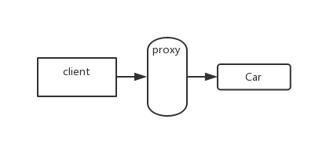

> #### 代理模式

应用场景：
​	– 安全代理：屏蔽对真实角色的直接访问。
​	– 远程代理：通过代理类处理远程方法调用(RMI)
​	– 延迟加载：先加载轻量级的代理对象，真正需要再加载真实对象。
​		比如你要开发一个大文档查看软件，大文档中有大的图片，有可能一个图片有100MB，在打开文件时不可能将所有的图片都显示出来，这样就可以使用代理模式，当需要查看图片时，用proxy来进行大图片的打开。

分类：
​	– 静态代理(静态定义代理类)
​	– 动态代理(动态生成代理类)
JDK自带的动态代理
​	javaassist字节码操作库实现

​	CGLIB

​	ASM(底层使用指令，可维护性较差)



> 静态代理的两种实现方式

> 车

```java
public class Car {

	public void run() {
		System.out.println("汽车运行");
	}
	
	public void start() {
		System.out.println("汽车启动");
	}
	
}
```

> 基于`extends`

```java
public class SuperCar extends Car {

	@Override
	public void run() {
		System.out.println("aop : start");
		super.run();
		System.out.println("aop : end");
	}

	@Override
	public void start() {
		System.out.println("aop : start");
		super.start();
		System.out.println("aop : end");
	}
	
}
```

> 基于组合

```java
public class GroupCar {

	private Car car;

	public GroupCar(Car car) {
		this.car = car;
	}

	public void start() {
		System.out.println("aop:start");
		car.start();
		System.out.println("aop:end");
	}

	public void run() {
		System.out.println("aop:start");
		car.run();
		System.out.println("aop:end");
	}

}
```

> 实现动态代理

> service 接口

```java
public interface Service {

	public void service();
	
}
```

> UserService Service 实现类

```java
public class UserService implements Service {

	@Override
	public void service() {
		System.out.println("UserService.service()");
	}

}
```

> 实现动态代理

```java
UserService userService = new UserService();
		
/** Proxy.newProxyInstance(loader, interfaces, h);
 * loader : 被代理类的类加载器
 * interfaces : 被代理类的接口
 * InvocationHandler : 代理类对象
 */
Service service = (Service) Proxy.newProxyInstance(Car.class.getClassLoader(), UserService.class.getInterfaces(), new InvocationHandler() {
    /**
	 * @desc <b>代理类</b>
	 * 
	 * @param proxy : 当前被代理的对象
	 * @param method : 当前执行的方法
	 * @param args : 当前执行的方法入参
	 */
    @Override
    public Object invoke(Object proxy, Method method, Object[] args) throws Throwable {
        System.out.println("aop:start");
        Object result = method.invoke(userService, args);
        System.out.println("aop:end");
        return result;
    }
});

service.service();
```

> 注意: 
>
> 1. Object result = method.invoke(userService, args); 传入的应该是没有被代理的对象
>    1. 若传入invoke方法入参中的当前被代理的对象, 就会出现死循环代理
> 2. 代理返回的对象应该是被代理的类的接口类型