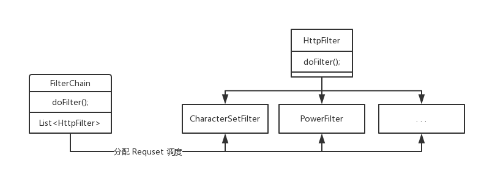

> #### 责任链模式

> 责任链的应用场景
>
> 1. Servlet API 中的 `Filter` 过滤器
> 2. MVC 框架中的拦截器
> 3. `. . .`



> 简单使用责任链模式拆分 Servlet API 中的过滤器

> 模拟 `Servlet` 中的 `Request` 对象

```java
/**
 * @desc <b>模拟 Servlet 中的 Request 对象</b>
 * 
 * @author jiang ru yi
 */
public class HttpServletRequest {

	private String requestContext;
	private Map<String, Object> requestParam = new HashMap<>();

	public String getRequestContext() {
		return requestContext;
	}

	public void setRequestContext(String requestContext) {
		this.requestContext = requestContext;
	}

	public void setRequestParam(Map<String, Object> requestParam) {
		this.requestParam = requestParam;
	}
	
	public Object setAttribute(String key, Object value) {
		return requestParam.put(key, value);
	}
	
	public Object getAttribute(String key) {
		return requestParam.get(key);
	}
	
	public Object removeAttribute(String key) {
		return requestParam.remove(key);
	}
	
}
```

>  模拟 `Servlet` 中的 `Response` 对象

```java
/**
 * @desc <b>模拟 Servlet 中的 Response 对象</b>
 * 
 * @author jiang ru yi
 */
public class HttpServletResponse {

	private String responseContext;

	public String getResponseContext() {
		return responseContext;
	}

	public void setResponseContext(String responseContext) {
		this.responseContext = responseContext;
	}

}
```

> 过滤器抽象层

```java
/**
 * @desc <b>公用的过滤器抽象层</b>
 * 
 * @author jiang ru yi
 */
public abstract class HttpFilter {
	
	public abstract void doFilter(HttpServletRequest request, HttpServletResponse response, FilterChain chain);

}
```

> 过滤器调度

```java
/**
 * @desc <b>过滤器的调度器</b>
 * 
 * @author jiang ru yi
 */
public class FilterChain {

	private List<HttpFilter> filters = new ArrayList<>();
	private int currFilter;

	public boolean addFilter(HttpFilter filter) {
		return filters.add(filter);
	}
	
	public boolean removeFilter(HttpFilter filter) {
		return filters.remove(filter);
	}
	
	public void doFilter(HttpServletRequest request, HttpServletResponse response) {
		if (currFilter++ == filters.size()) return;
		
		filters.get(currFilter - 1).doFilter(request, response, this);
	}

}
```

> Junit 测试

```java
public static void main(String[] args) {
    HttpServletRequest request = new HttpServletRequest();
    request.setRequestContext("<EvE>, Y(OvO)Y");
    request.setAttribute("user", "administrator");

    HttpServletResponse response = new HttpServletResponse();

    FilterChain chain = new FilterChain();
    chain.addFilter(new CharacterSetFilter());
    chain.addFilter(new PowerFilter());

    chain.doFilter(request, response);

    System.out.println(request.getRequestContext());
}
```

> 抽象层子类 : 字符过滤器

```java
/**
 * @desc <b>过滤请求中的危险符号( < > )</b>
 * 
 * @author jiang ru yi
 */
public class CharacterSetFilter extends HttpFilter {

	@Override
	public void doFilter(HttpServletRequest request, HttpServletResponse response, FilterChain chain) {
		String context = request.getRequestContext();
		String result = context.replaceAll("<", "&le;").replaceAll(">", "&lt;");
		request.setRequestContext(result);
		chain.doFilter(request, response);
	}

}
```

> 抽象层子类 : 校验用户是否登录

```java
/**
 * @desc <b>过滤用户是否登录</b>
 * 
 * @author jiang ru yi
 */
public class PowerFilter extends HttpFilter {

	@Override
	public void doFilter(HttpServletRequest request, HttpServletResponse response, FilterChain chain) {
		Object attribute = request.getAttribute("user");
		if (null != attribute) {
			chain.doFilter(request, response);
		} else {
			throw new RuntimeException("user not login");
		}
	}

}
```

