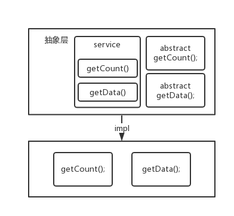

> #### 模板模式

> 什么时候用到模板方法模式:
>
> > 实现一个功能整体步骤一致, 实现方式可能不同这样就可以抽象成一个公共的父类提供子类去实现

> 实际开发场景:
>
> > 最典型的还是属于: `serlet` 中的 `service` 方法



> 模板模式实例`code`

> 分页封装类

```java
public class Page<T> {

	// 当前页
	private Integer curr;
	// 每页显示
	private Integer limit;
	// 总记录数
	private Integer count;
	// 分页后的数据
	private List<T> data;

    // getter(), setter(), toString();

}
```

> 抽象层

```java
public abstract class PageAware<T> {

	public abstract Integer getCount();
	
	public abstract List<T> getData(int curr, int limit);
	
	public final Page<T> service(Page<T> page) {
		page.setCount(getCount());
		page.setData(getData(page.getCurr(), page.getLimit()));
		return page;
	}
	
}
```

> 子类具体实现

```java
public class PageAwareImpl extends PageAware<String> {

	@Override
	public Integer getCount() {
		return 110;
	}

	@Override
	public List<String> getData(int curr, int limit) {
		return Arrays.asList(
					"data01", "data02", "data03",
					"data04", "data05", "data06",
					"data07", "data08", "data09"
				).subList(--curr, limit);
	}

}
```

> Junit 

```java
public static void main(String[] args) {
    PageAware<String> pageAware = new PageAwareImpl();
    Page<String> page = new Page<String>(1, 3);
    page = pageAware.service(page);

    System.out.println(page);
}
```

