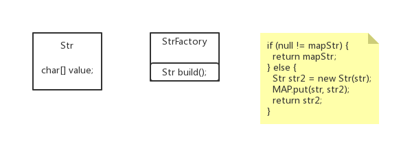

> #### 享元模式

> – FlyweightFactory享元工厂类
> • 创建并管理享元对象，享元池一般设计成键值对
> – FlyWeight抽象享元类
> • 通常是一个接口或抽象类，声明公共方法，这些方法可以向外界提供对象
> 的内部状态，设置外部状态。
> – ConcreteFlyWeight具体享元类
> • 为内部状态提供成员变量进行存储
> – UnsharedConcreteFlyWeight非共享享元类
> • 不能被共享的子类可以设计为非共享享元类

> 享元模式开发中应用的场景：
> – 享元模式由于其共享的特性，可以在任何“池”中操作，
> 比如：线程池、数据库连接池。
> – String类的设计也是享元模式

> • 优点
> ​	– 极大减少内存中对象的数量
> ​	– 相同或相似对象内存中只存一份，极大的节约资源，提高系统性能
> ​	– 外部状态相对独立，不影响内部状态
> • 缺点
> ​	– 模式较复杂，使程序逻辑复杂化
> ​	– 为了节省内存，共享了内部状态，分离出外部状态，而读取外部状态
> 使运行时间变长。用时间换取了空间。



> 享元模式`code`

```java
public class Str {

	private final char[] value;

	public Str() {
		this.value = new char[] {};
	}

	public Str(String str) {
		this.value = str.toCharArray();
	}

	@Override
	public String toString() {
		return "Str [value=" + Arrays.toString(value) + "]";
	}

}
```

> 池

```java
public class StrFactory {

	private static final Map<String, Str> MAP = new HashMap<>();
	
	public static Str build(String str) {
		Str mapStr = MAP.get(str);
		if (null != mapStr) {
			return mapStr;
		} else {
			Str str2 = new Str(str);
			MAP.put(str, str2);
			return str2;
		}
	}
	
}
```

