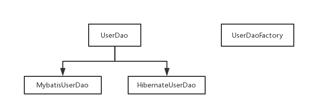
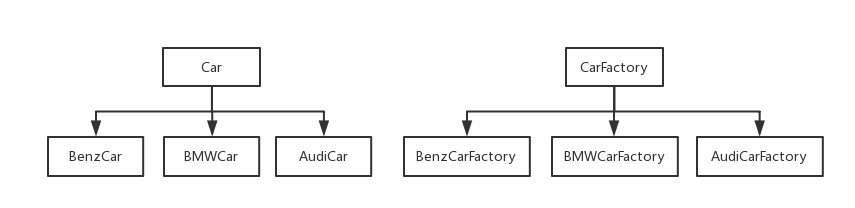
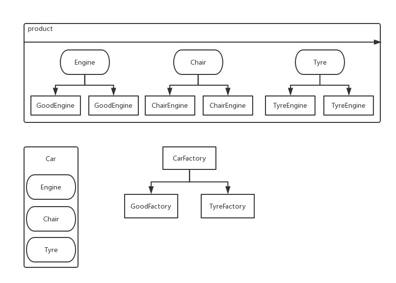

> #### 工厂设计模式

工厂模式要点：

​	– 简单工厂模式(静态工厂模式)

​		• 虽然某种程度不符合设计原则，但实际使用最多。

​	– 工厂方法模式

​		• 不修改已有类的前提下，通过增加新的工厂类实现扩展。

​	– 抽象工厂模式

​		• 不可以增加产品，可以增加产品族！

​		• 应用场景

​			– JDK中Calendar的getInstance方法

​			– JDBC中Connection对象的获取

​			– Hibernate中SessionFactory创建Session

​			– spring中IOC容器创建管理bean对象

​			– XML解析时的DocumentBuilderFactory创建解析器对象

​			– 反射中Class对象的newInstance

> 简单工厂

```java
public class UserDaoFactory {

	public static UserDao buildMybatis() {
		return new UserDaoMybatis();
	}
    
    public static UserDao buildHibernate() {
		return new UserDaoHibernate();
	}
	
}
```

> 简单工厂

```java
public class UserDaoFactory {

	public static UserDao build(String mark) {
		if ("mybatis".equals(mark)) return new UserDaoMybatis();
		if ("hibernate".equals(mark)) return new UserDaoHibernate();
	}
    
}
```



> 方法工厂




> 抽象工厂



> 抽象工厂`code`

> 座椅

```java
public interface Chair {

	public void sit();
	
}

class GoodChair implements Chair {

	@Override
	public void sit() {
		System.out.println("GoodChair");
	}

}

class LowChair implements Chair {

	@Override
	public void sit() {
		System.out.println("LowChair");
	}

}
```

> 发动机

```java
public interface Engine {

	public void start();
	
}

class GoodEngine implements Engine {

	@Override
	public void start() {
		System.out.println("Good Engine");
	}
	
}

class LowEngine implements Engine {
	
	@Override
	public void start() {
		System.out.println("Low Engine");
	}
	
}
```

> 轮胎

```java
public interface Tyre {

	void run();

}

class GoodTyre implements Tyre {

	@Override
	public void run() {
		System.out.println("GoodTyre");
	}

}

class LowTyre implements Tyre {

	@Override
	public void run() {
		System.out.println("LowTyre");
	}

}
```

> 车类

```java
public class Car {

	private Engine engine;

	private Chair chair;

	private Tyre tyre;

	// Getter(), Setter(), toString()
    
}
```

> 车抽象工厂

```java
public interface CarFactory {

	Car build();
	
}
```

> 好车工厂实现

```java
public class GoodCarFactory implements CarFactory {

	@Override
	public Car build() {
		return new Car(new LowEngine(), new LowChair(), new LowTyre());
	}

}
```

> 差车工厂实现

```java
public class LowCarFactory implements CarFactory {

	@Override
	public Car build() {
		return new Car(new GoodEngine(), new GoodChair(), new GoodTyre());
	}

}
```

