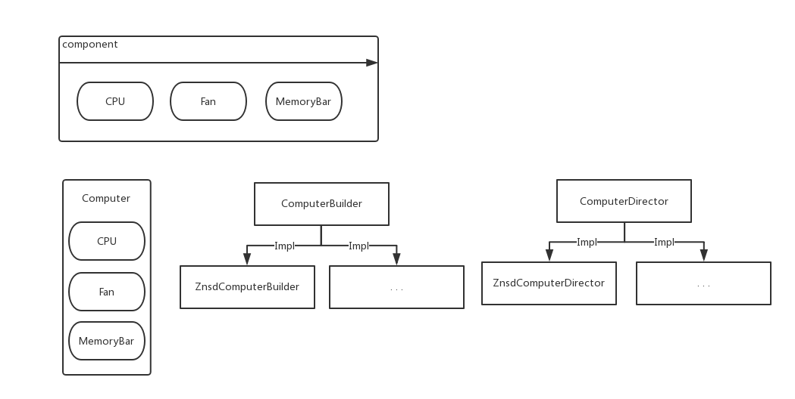

> #### 建造者模式

* 开发中应用场景：

​	– StringBuilder类的append方法

​	– SQL中的PreparedStatement 

​	– JDOM中，DomBuilder、SAXBuild



> 创作者模式`code`

> CPU

```java
public class CPU {

	private String name;

	// Getter(), Setter(), toString()

}
```

> 风扇

```java
public class Fan {

	private String name;

	// Getter(), Setter(), toString()

}
```

> 内存条

```java
public class MemoryBar {

	private String name;

	// Getter(), Setter(), toString()

}
```

> 电脑

```java
public class Computer {

	private CPU cpu;
	private MemoryBar memoryBar;
	private Fan fan;

	// Getter(), Setter(), toString()

}
```

> 构建者接口

```java
public interface ComputerBuilder {
	
	public CPU buildCpu();
	
	public Fan buildFan();
	
	public MemoryBar buildMemoryBar();
	
}
```

> 构建者实现类

```java
public class ZnsdComputerBuilder implements ComputerBuilder {

	@Override
	public CPU buildCpu() {
		System.out.println("构建 CPU");
		return new CPU();
	}

	@Override
	public Fan buildFan() {
		System.out.println("构建 Fan");
		return new Fan();
	}

	@Override
	public MemoryBar buildMemoryBar() {
		System.out.println("构建 MemoryBar");
		return new MemoryBar();
	}

}
```

> 组装者接口

```java
public interface ComputerDirector {

	Computer build();

}
```

> 组装者实现

```java
public class ZnsdComputerDirector implements ComputerDirector {
	
	private ComputerBuilder builder;
	
	public ZnsdComputerDirector(ComputerBuilder builder) {
		this.builder = builder;
	}

	@Override
	public Computer build() {
		CPU cpu = builder.buildCpu();
		MemoryBar memoryBar = builder.buildMemoryBar();
		Fan fan = builder.buildFan();
		
		Computer computer = new Computer(cpu, memoryBar, fan);
		return computer;
	}
	
}
```

> 用户体验

```java
public static void main(String[] args) {
		
    ComputerDirector director = new ZnsdComputerDirector(new ZnsdComputerBuilder());

    Computer computer = director.build();

    System.out.println(computer);

}
```

