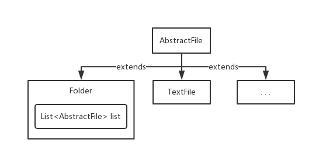

> #### 组合模式: Composite

>  使用组合模式的场景：
> ​	把部分和整体的关系用树形结构来表示，从而使客户端可以使用统一的方式处理部分对象和整体对象。
>
> * 组合模式核心：
>   – 抽象构件(`Component`)角色: 定义了叶子和容器构件的共同点
>   – 叶子(`Leaf`)构件角色：无子节点
>   – 容器(`Composite`)构件角色： 有容器特征，可以包含子节点

> 开发中的应用场景：
> ​	– 操作系统的资源管理器
> ​	– GUI中的容器层次图
> ​	– XML文件解析
> ​	– OA系统中，组织结构的处理
>
> * Junit单元测试框架
>
> * 底层设计就是典型的组合模式，TestCase(叶子)、TestUnite(容器)、Test接口(抽象)



> `Component` `=` `AbstractFile `: 抽象构件
>
> `Leaf` `=` `TextFile` : 叶子
>
> `Composite` `=` `Folder` : 容器

> 组合模式`code`

> 抽象构件

```java
public abstract class AbstractFile {

	public abstract void show();
	
}
```

> 叶子

```java
public class TextFile extends AbstractFile {
	
	private String dir;

	@Override
	public void show() {
		System.out.println("show: [" + dir + "]");
	}
	
}
```

> 容器

```java
public class Folder extends AbstractFile {

	private String name;

	private List<AbstractFile> list = new ArrayList<>();

	@Override
	public void show() {
		System.out.println("show(目录): " + name);
		for (AbstractFile abstractFile : list) {
			abstractFile.show();
		}
	}

}
```

> Junit

```java
public static void main(String[] args) {
    Folder file = new Folder("box");
    selectFile(new File("E:/咕泡学院"), file);
    file.show();
}


private static void selectFile(File file, Folder root) {
    if (file.isDirectory()) {
        Folder folder = new Folder(file.getPath());
        root.addFile(folder);
        File[] listFiles = file.listFiles();
        for (File f : listFiles) {
            selectFile(f, folder);
        }
    } else {
        root.addFile(new TextFile(file.getName()));
    }
}
```

