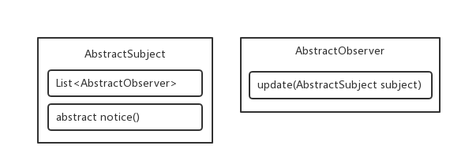

> #### 观察者模式

> 使用场景: 控屏软件 : 比如 , 红蜘蛛 , 等



> 通知者抽象层

```java
public abstract class AbstractSubject {
	
	protected List<AbstractObserver> observers = new ArrayList<>();
	
	public boolean addObserver(AbstractObserver observer) 
    { return observers.add(observer); }
	
	public boolean delObserver(AbstractObserver observer) 
    { return observers.remove(observer); }

	public abstract void notice();

}
```

> 通知者具体实现类

```java
public class AbstractSubjectImpl extends AbstractSubject {

	private String context;

	public String getContext() {
		return context;
	}

	public void setContext(String context) {
		this.context = context;
		this.notice();
	}

	@Override
	public void notice() {
		for (AbstractObserver o : observers) {
			o.update(this);
		}
	}

}
```

> 观察者抽象层

```java
public interface AbstractObserver {

	public void update(AbstractSubject subject);
	
}
```

> 观察者具体实现

```java
public class AbstractObserverImpl implements AbstractObserver {

	private String context;

	public String getContext() {
		return context;
	}

	public void setContext(String context) {
		this.context = context;
	}

	@Override
	public void update(AbstractSubject subject) {
		if (subject instanceof AbstractSubjectImpl) {
			AbstractSubjectImpl subjectImpl = (AbstractSubjectImpl) subject;
			String context = subjectImpl.getContext();
			this.context = context;
		}
	}

	@Override
	public String toString() {
		return "AbstractObserverImpl [context=" + context + "]";
	}

}
```

---

> 使用 `JDK` 自带的观察者模式

> `Observable` : 通知者

| 方法名                                            | 方法描述                               |
| ------------------------------------------------- | -------------------------------------- |
| `protected` `synchronized` `void` `setChanged`()  | 在通知观察者对象前调用                 |
| `public` `void` `notifyObservers`(`Object` `arg`) | 通知所有观察者将新值, 通过方法入口出入 |

> `Observer` : 观察者

| 方法名                                            | 方法描述                                             |
| ------------------------------------------------- | ---------------------------------------------------- |
| `void` `update`(`Observable` `o`, `Object` `arg`) | 观察者获取通知者的值(`o` : 通知者对象, `arg` : 新值) |

