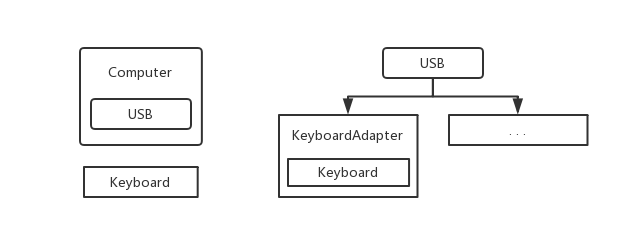

> #### 适配器模式

* 工作中的场景

  * 经常用来做旧系统改造和升级

  * 如果我们的系统开发之后再也不需要维护，那么很多模式都是没必要

    的，但是不幸的是，事实却是维护一个系统的代价往往是开发一个系
    统的数倍。

* 我们学习中见过的场景

  * java.io.InputStreamReader(InputStream)
  * java.io.OutputStreamWriter(OutputStream)



> 适配器模式`code`

> 电脑

```java
public class Computer {

	private USB[] usbs = new USB[3];
	private int usbsIndex;

    public void insertUSB(USB usb) {
		if (usbs[usbs.length - 1] == null) {
			usbs[usbsIndex++] = usb;
		} else {
			System.out.println("usb接口已满!");
		}
	}

	public void println(String text) {
		for (USB usb : usbs) {
			if (usb == null) continue;
			System.out.println(usb.out(text));
		}
	}

}
```

> USB 接口类

```java
public interface USB {

	public void in(String text);
	
	public String out(String text);

}
```

> 老式键盘 USB 实现类

```java
public class Keyboard {

	public void in(String text) {
		System.out.println("输入: " + text);
	}

	public String out(String text) {
		return text;
	}

}
```

> 老式键盘 : 适配器类

```java
public class KeyboardAdapter implements USB {

	private Keyboard keyboard;

	public KeyboardAdapter(Keyboard keyboard) {
		this.keyboard = keyboard;
	}

	@Override
	public void in(String text) {
		keyboard.in(text);
	}

	@Override
	public String out(String text) {
		return keyboard.out(text);
	}

}
```

> Junit 测试

```java
public static void main(String[] args) {

    Computer computer = new Computer();

    Keyboard keyboard = new Keyboard();

    computer.insertUSB(new KeyboardAdapter(keyboard));

    computer.println("Hell World!");

}
```

> 适配类也可以基于`extends`

```java
public class KeyboardAdapter extends Keyboard implements USB {

	@Override
	public void in(String text) {
		super.in(text);
	}

	@Override
	public String out(String text) {
		return super.out(text);
	}
	
}
```

