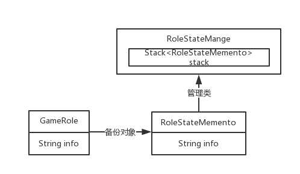

> #### 备忘录模式

> 开发中常见的应用场景：
> ​	– 棋类游戏中的，悔棋
> ​	– 普通软件中的，撤销操作
> ​	– 数据库软件中的，事务管理中的，回滚操作
> ​	– Photoshop软件中的，历史记录

> 结构：
> ​	– 源发器类Originator
> ​	– 备忘录类Memento
> ​	– 负责人类CareTaker



> `Stack` 常用方法

| 方法名 | 描述                               |
| ------ | ---------------------------------- |
| empty  | 判断堆栈是否为空                   |
| pop    | 出栈             |
| push   | 入栈                 |
| size   | 返回当前堆栈长度（即内部数据个数） |
| top    | 得到堆栈栈顶数据                   |

> 实现 `code`

> 元数据类

```java
package com.znsd.javase.meomory;

public class GameRole {

	private Integer vit;// 体力
	private Integer atk;// 攻击力

	public GameRole() {
		this.vit = 100;
		this.atk = 100;
	}

	public void show() {
		System.out.println("{体力: " + vit + ", 攻击力: " + atk + "}");
	}
	
	public void fightBoss(Integer vit, Integer atk) {
		this.vit = vit;
		this.atk = atk;
	}
	
	// ctrl + s
	public RoleStateMemento saveMemento(){
        return (new RoleStateMemento(vit, atk));
    }
    
	// ctrl + z
    public void recove(RoleStateMemento roleStateMemento){
        this.vit=roleStateMemento.getVit();
        this.atk=roleStateMemento.getAtk();
    }

}
```

> 备忘录类

```java
public class RoleStateMemento {

	private Integer vit;// 备忘录保存的 : 体力
	private Integer atk;// 备忘录保存的 : 攻击力

	public RoleStateMemento(Integer vit, Integer atk) {
		super();
		this.vit = vit;
		this.atk = atk;
	}

	public Integer getVit() {
		return vit;
	}

	public void setVit(Integer vit) {
		this.vit = vit;
	}

	public Integer getAtk() {
		return atk;
	}

	public void setAtk(Integer atk) {
		this.atk = atk;
	}

	public void show() {
		System.out.println("{体力: " + vit + ", 攻击力: " + atk + "}");
	}

}
```

> 负责人类

```java
public class RoleStateMange {

	private Stack<RoleStateMemento> stack = new Stack<>();

	public RoleStateMemento popMemento() {
		return stack.pop();
	}

	public RoleStateMemento pushMemento(RoleStateMemento memento) {
		return stack.push(memento);
	}

}
```

