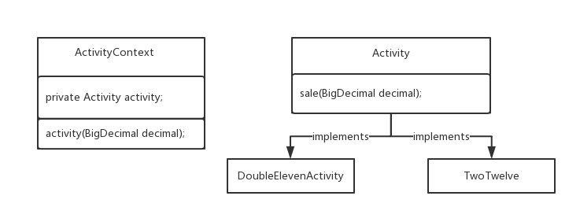

> #### 策略模式

> • 本质：
> ​	– 分离算法，选择实现。
> • 开发中常见的场景：
> ​	– JAVASE中GUI编程中，布局管理
> ​	– Spring框架中，Resource接口，资源访问策略
> ​	– javax.servlet.http.HttpServlet#service()



> 活动抽象层

```java
public interface Activity {

	public BigDecimal sale(BigDecimal decimal);
	
}
```

> 双十一活动实现类

```java
public class DoubleElevenActivity implements Activity {

	@Override
	public BigDecimal sale(BigDecimal decimal) {
		System.out.println("双十一打折优惠: 0.8");
		return decimal.multiply(new BigDecimal("0.8"));
	}

}
```

> 活动上下文

```java
public class ActivityContext {

	private Activity activity;
    
	/**
	 * @desc <b>执行打折方法</b>
	 * 
	 * @param decimal
	 * @return BigDecimal
	 * @author jiang ru yi
	 * @time 2018年12月13日 : 下午3:54:31
	 */
	public BigDecimal activity(BigDecimal decimal) {
		return activity.sale(decimal);
	}
	
}
```

> junit

```java
public static void main(String[] args) {
    Activity activity = new DoubleElevenActivity();

    ActivityContext context = new ActivityContext(activity);

    System.out.println(context.activity(new BigDecimal("999")));
}
```

