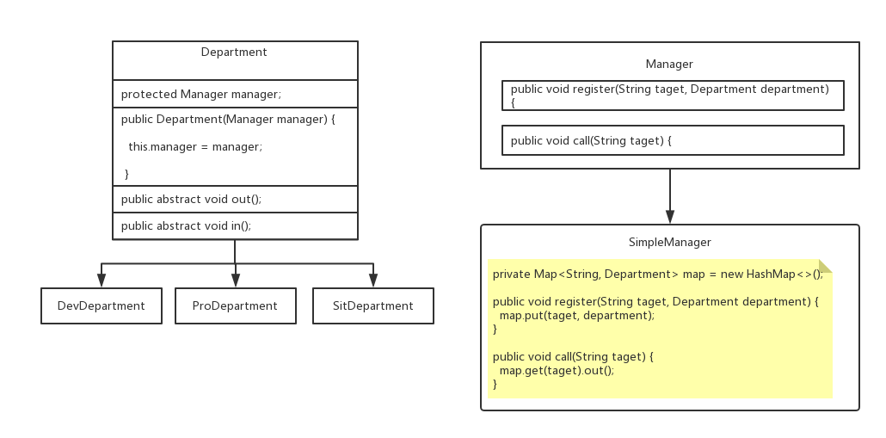

> #### 中介者模式

> 在程序 API 接口调用复杂化的时候可以使用中介模式对程序 API 接口进行管理



> 中介者接口

```java
public interface Manager {

	public void register(String taget, Department department);
	
	public void call(String taget);
	
}
```

> 中介者实现类

```java
public class SimpleManager implements Manager {

	private Map<String, Department> map = new HashMap<>();
	
	@Override
	public void register(String taget, Department department) {
		map.put(taget, department);
	}

	@Override
	public void call(String taget) {
		map.get(taget).out();
	}

}
```

> 部门公共的接口

```java
public abstract class Department {

	protected Manager manager;
	
	public Department(Manager manager) {
		this.manager = manager;
	}
	
	public abstract void out();
	
	public abstract void in();
	
}
```

> 测试部实现类

```java
public class SitDepartment extends Department {

	public SitDepartment(Manager manager) {
		super(manager);
		manager.register("sit", this);
	}

	@Override
	public void out() {
		System.out.println("SitDepartment.out() : 正在测试BUG");
	}

	@Override
	public void in() {
		System.out.println("SitDepartment.in() : 开发部的出现BUG了");
		manager.call("dev");
	}

}
```

