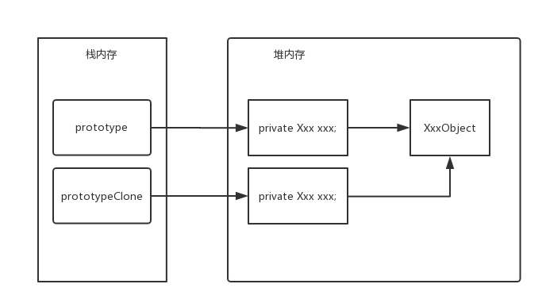
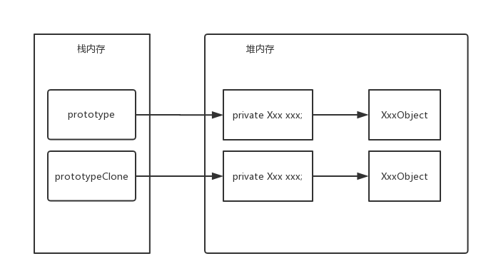

> #### 原型模式 prototype

```java
短时间大量创建对象时，原型模式和普通new方式效率测试

• 开发中的应用场景
	– 原型模式很少单独出现，一般是和工厂方法模式一起出现，通过clone的方法创建一个对象，然后由工厂方法提供给调用者。
• spring中bean的创建实际就是两种：单例模式和原型模式。（当然，原型模式需要和工厂模式搭配起来）
```

> clone 存在浅克隆和深克隆

> 浅克隆的内存引用
>
> 

> 深克隆的内存引用
>
> 

> 实现克隆的方式

1. 对象`bean`实现`Cloneable`接口
2. 重写`Object`类中的`clone()`方法
3. 创建源对象, 调用源对象的`clone()`方法进行对象克隆

> 实现浅克隆的`clone()`方法

```java
public Object clone() throws CloneNotSupportedException {
    return super.clone();
}
```

> 实现深克隆的`clone()`方法

```java
public Object clone() throws CloneNotSupportedException {
    Prototype clone = (Prototype)super.clone();// 克隆产生的对象

    Xxx xxx = (Xxx) this.xxx.clone();

    clone.setXxx(xxx);

    return clone;
}
```

