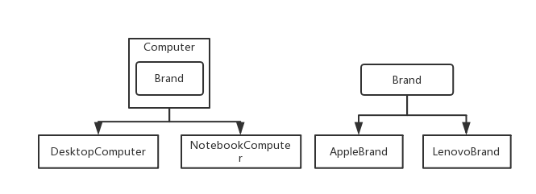

> #### 桥接设计模式.md

桥接模式实际开发中应用场景
​	– JDBC驱动程序
​	– AWT中的Peer架构
​	– 银行日志管理：
• 格式分类：操作日志、交易日志、异常日志
• 距离分类：本地记录日志、异地记录日志
​	– 人力资源系统中的奖金计算模块：
• 奖金分类：个人奖金、团体奖金、激励奖金。
• 部门分类：人事部门、销售部门、研发部门。
​	– OA系统中的消息处理：
• 业务类型：普通消息、加急消息、特急消息
• 发送消息方式：系统内消息、手机短信、邮件



> 由一个电脑对应一个品牌出现一个产品, 他们直接可以相互拼接组合

> 电脑抽象类

```java
public abstract class Computer {

	protected Brand brand;

	public Computer(Brand brand) {
		this.brand = brand;
	}

	public abstract void sale();

}
```

> 电脑下的: 笔记本电脑

```java
public class NotebookComputer extends Computer {

	public NotebookComputer(Brand brand) {
		super(brand);
	}

	@Override
	public void sale() {
		super.brand.sale();
		System.out.println("销售笔记本");
	}

}
```

> 电脑下的: 台式电脑

```java
public class DesktopComputer extends Computer {

	public DesktopComputer(Brand brand) {
		super(brand);
	}

	@Override
	public void sale() {
		System.out.println("台式电脑");
	}

}
```

> 产品接口

```java
public interface Brand {

	void sale();
	
}
```

> 苹果

```java
public class AppleBrand implements Brand {

	@Override
	public void sale() {
		System.out.println("销售苹果");
	}

}
```

> 联想

```java
public class LenovoBrand implements Brand {

	@Override
	public void sale() {
		System.out.println("联想电脑!");
	}

}
```

