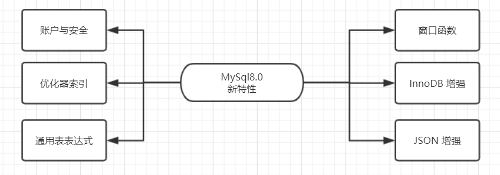

> ## MySql8 index

* ##### 默认字符集由latin1变为utf8mb4

* ##### AUTO_INCREMENT

  * AUTO_INCREMENT的值如果大于 `max(primary key) + 1`，在MySQL重启后，会重置这种现象在某些情况下会导致业务主键冲突或者其他难以发现的问题。
  * 自增主键重启重置的问题很早就被发现([https://bugs.mysql.com/bug.php?id=199](https://links.jianshu.com/go?to=https%3A%2F%2Fbugs.mysql.com%2Fbug.php%3Fid%3D199))，一直到8.0才被解决，8.0版本将会对AUTO_INCREMENT值进行持久化，MySQL重启后，该值将不会改变。

* 