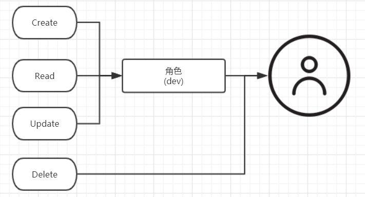

> ## 02 账户与安全

1. MySql8.0 中创建用户和授权的指令需要分开执行;

   1. 创建一个用户

      ```mysql
      CREATE user 'msql'@'%' identified by 'msql@pwd';
      ```

   2. 授权一个用户

      ```mysql
      GRANT ALL privileges on *.* to 'msql'@'%';
      ```

   3. mysql8.0以前的创建一个用户并且设置权限

      ```mysql
      grant all privileges on *.* to 'msql'@'localhost' identified by 'msql@pwd';
      ```


> ## 认证插件

* MySQL8.0 中默认身份认证插件是: caching_sha2_password 替换了之前的: mysql_native_password。

* 通过MySQL的系统变量来查看默认认证插件

```mysql
mysql> show variables like 'default_authentication%';
+-------------------------------+-----------------------+
| Variable_name                 | Value                 |
+-------------------------------+-----------------------+
| default_authentication_plugin | caching_sha2_password |
+-------------------------------+-----------------------+
1 row in set (0.01 sec)
```

* 通过MySQL系统用户表来查看

```mysql
mysql> select user, host, plugin from mysql.user;
+------------------+-----------+-----------------------+
| user             | host      | plugin                |
+------------------+-----------+-----------------------+
| msql             | %         | caching_sha2_password |
| root             | %         | mysql_native_password |
| mysql.infoschema | localhost | caching_sha2_password |
| mysql.session    | localhost | caching_sha2_password |
| mysql.sys        | localhost | caching_sha2_password |
| root             | localhost | caching_sha2_password |
+------------------+-----------+-----------------------+
6 rows in set (0.01 sec)
```

* 如何切换为老的认证插件

```mysql
alter user 'msql'@'%' identified with mysql_native_password by 'msql@pwdNew'
```

* 通过配置文件来修改认证插件

```mysql
# 找到配置文件中的 解开注释就行了
# default-authentication-plugin=mysql_native_password
```

> ## 密码强弱管理

* 在 MySQL8.0 开始允许限制重复使用以前的密码。

```mysql
# 密码不能与最近 3 次使用过的密码相同
password_history=3
# 密码不能和最近 90 天内使用过的密码相同
password_reuse_interval=90
# 修改密码时需要输入用户当前使用的密码
password_require_current=ON
```

* 查看这几个全局参数的值

```mysql
mysql> show variables like 'password%';
+--------------------------+-------+
| Variable_name            | Value |
+--------------------------+-------+
| password_history         | 0     |
| password_require_current | OFF   |
| password_reuse_interval  | 0     |
+--------------------------+-------+
3 rows in set (0.00 sec)
```

* 通过 `set persist <key>=<val>` 来修改，可以做到重启后也生效
* persist 是通过在mysql目录下新增了一个配置文件`mysqld-auto.cnf`来实现的, 在启动时顺便读取这个配置文件

```mysql
mysql> show variables like 'password%';
+--------------------------+-------+
| Variable_name            | Value |
+--------------------------+-------+
| password_history         | 0     |
| password_require_current | OFF   |
| password_reuse_interval  | 0     |
+--------------------------+-------+
3 rows in set (0.00 sec)

mysql> set persist password_history=2;
Query OK, 0 rows affected (0.01 sec)

mysql> show variables like 'password%';
+--------------------------+-------+
| Variable_name            | Value |
+--------------------------+-------+
| password_history         | 2     |
| password_require_current | OFF   |
| password_reuse_interval  | 0     |
+--------------------------+-------+
3 rows in set (0.01 sec)
```

* 也可以针对不同的用户来设置不同的复杂度

```mysql
# 在 user 表中新增了这些列
#Password_reuse_history
#Password_reuse_time
#Password_require_current

alter user 'msql'@'%' password history 5;

# 修改用户密码
alter user user() identified by 'new-pwd' replace 'old-pwd'
```

> ## 角色管理

* mysql8.0 提供了角色管理的新功能，角色是一组权限的集合。



* 实际上角色的实现也是在user表中创建了一个用户

```mysql
# 创建一个写入角色
mysql> create role 'write_role';
Query OK, 0 rows affected (0.00 sec)

# 给角色分配权限
grant insert,select,update on mydb.* to 'write_role';

# 创建一个用户并给他分配角色
create user 'dev' identified by 'dev@2019';
grant 'write_role' to 'dev';

# 查看用户的权限
show grants for 'dev';
select current_role();

# 设置当前用户的角色 
set role to 'write_role';
set default role to 'write_role';
set default all role to 'write_role';

# 这两张是用户权限相关的表
mysql> select * from role_edges;
mysql> select * from default_roles;;

# 收回角色权限
revoke insert, update on mydb.* from 'write_role';
```

