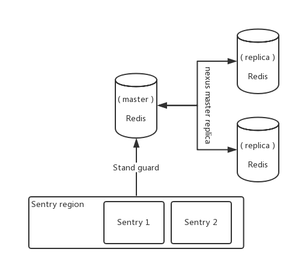

> ### Redis Sentry



> 关闭两端 Linux 的防火墙

```
service iptables stop
```

> 关闭两端 redis.conf 的受保护机制

```
protected-mode no
```

> 在`从` Redis 中配置

```xml
replicaof <masterip> <masterport>
- <masterip> 主 Redis IP
- <masterport> 端口
```

> 拷贝解压目录下的配置文件: `sentinel.conf`

```
[root@admin redis-5.0.3]$ cp sentinel.conf /usr/local/redis/
```

> 更改配置文件中的

```xm&#39;l
sentinel monitor <master-name> <ip> <redis-port> <quorum>
- <master-name> 	可以自定义
- <ip> 				哨兵检测的 IP , 但那 Redis 挂掉了给他从新选择 主
- <redis-port> 		检测的端口号
- <quorum> 			选择新主需要几个哨兵投票

sentinel monitor mymaster 192.168.238.130 6379 1
```

> 1. 将主从启动起来后验证能跑
> 2. 开启哨兵给主服务站岗
> 3. 将主服务`shutdown`掉
> 4. 默认等: 30 秒哨兵会投票选择新的主 Redis

> Redis 主从哨兵模式实际上会出现很多问题

* 脑裂: 就是说Redis哨兵模式出现了网络波动
  * 如果主机器与从机网络发生波动这个时候正好master机挂掉了
  * 那么这个时候哨兵从 replica 中选择了一个数据不完整的机器作为了 master
* 多脑: 
  * master 在哨兵选举的时候出现两个主，也就是说master与sentinel两两连接不通了
  * 这个时候可能会出现两两投票出现两个 master

> #### 从日志中可以看出主从同步数据的流程

```shell
5857:S 28 Sep 2019 18:47:48.127 * Ready to accept connections
5857:S 28 Sep 2019 18:47:48.128 * Connecting to MASTER 127.0.0.1:6380
5857:S 28 Sep 2019 18:47:48.128 * MASTER <-> REPLICA sync started
5857:S 28 Sep 2019 18:47:48.128 * Non blocking connect for SYNC fired the event.
5857:S 28 Sep 2019 18:47:48.129 * Master replied to PING, replication can continue...
5857:S 28 Sep 2019 18:47:48.129 * Trying a partial resynchronization (request cc1ef8d4c4f0b1b7a93a60bdfd1dad8446d04a4d:9403).
5857:S 28 Sep 2019 18:47:48.130 * Full resync from master: 58f189e6042cfd52bfd4c995d11c0efe0696467d:0
5857:S 28 Sep 2019 18:47:48.130 * Discarding previously cached master state.
5857:S 28 Sep 2019 18:47:48.249 * MASTER <-> REPLICA sync: receiving 194 bytes from master
5857:S 28 Sep 2019 18:47:48.249 * MASTER <-> REPLICA sync: Flushing old data
5857:S 28 Sep 2019 18:47:48.249 * MASTER <-> REPLICA sync: Loading DB in memory
5857:S 28 Sep 2019 18:47:48.250 * MASTER <-> REPLICA sync: Finished with success
```

> Trying a partial resynchronization : 正在尝试部分重新同步
>
> Full resync from master : 从主服务器完全重新同步
>
> 1. 先尝试部分同步部分同步
> 2. 接着就是全量复制

```shell
127.0.0.1:6380> info replication
# Replication
role:master
connected_slaves:1
slave0:ip=127.0.0.1,port=6381,state=online,offset=495,lag=0
master_replid:58f189e6042cfd52bfd4c995d11c0efe0696467d
master_replid2:0000000000000000000000000000000000000000
master_repl_offset:495
second_repl_offset:-1
repl_backlog_active:1
repl_backlog_size:1048576
repl_backlog_first_byte_offset:1
repl_backlog_histlen:495
```

> master_repl_offset 主节点backlog偏移量
>
> master_repl_offset**-offset  master_repl_offset与offset的差量为延迟backlog**

> SpringBoot 连接Redis配置哨兵


> 导入 starter

```xml
<dependency>
    <groupId>org.springframework.boot</groupId>
    <artifactId>spring-boot-starter-data-redis</artifactId>
</dependency>
```

> 配置Redis 与 哨兵

```properties
# Redis服务器地址
spring.redis.host=192.168.238.130
spring.redis.port=6379

# 哨兵
spring.redis.sentinel.master=mymaster#哨兵名字
spring.redis.sentinel.nodes=192.168.238.130:26379#哨兵地址:端口
```

> 注入`Template`

```java
@Autowired
private RedisTemplate<String, String> redisTemplate;

@Autowired
private StringRedisTemplate redisTemplate;
```