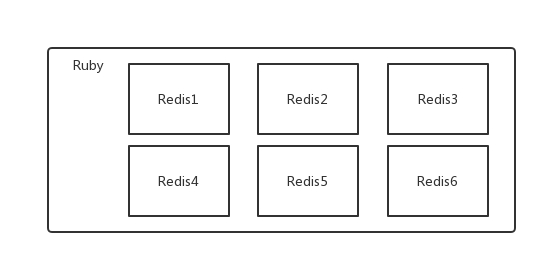

> ### Redis Colony



* 创建集群服务器存放目录

```shell
mkdir /usr/local/redis-cluster
```

* 将redis安装目录复制至新建目录下

```shell
cp -r redis/bin redis-cluster/redis1
```

* 将redis编译后的src目录下的redis-trib.rb复到制redis-cluster目录里面

```
cp /usr/local/src/redis-5.0.3/src/redis-trib.rb /usr/local/redis-cluster/ 
```

* 为复制的redis服务设置配置文件，每个服务都有一个配置文件

```shell
daemonize yes 
bind 127.0.0.1
Port 7001
logfile "./redis-7001.log"
databases 1
protected-mode no
pidfile /var/run/redis_7001.pid
cluster-enabled yes
```

* 安装 ruby ：redis集群运行的环境

```shell
# yum 安装需要联网
yum -y install ruby rubygems
#查看安装版本，centos6默认安装的ruby是1.8.7版本，执行以下命令更新ruby版本至2.2以上
ruby -v
#更新ruby版本至2.2以上
yum install centos-release-scl-rh　
#yum 安装ruby2.3
yum install rh-ruby23  -y
#
scl  enable  rh-ruby23 bash
# 安装redis
gem install redis
```

* 至每个redis服务目录下 逐个启动Redis

```shell
./redis-server redis_配置文件.conf
```

* 将所有redis服务集群

```shell
redis-cli --cluster create 127.0.0.1:7001 127.0.0.1:7002 127.0.0.1:7003 127.0.0.1:7004 127.0.0.1:7005 127.0.0.1:7006 --cluster-replicas 1
```

```
#使用 redis-trib.rb 命令搭建集群
./redis-trib.rb create --replicas 1 127.0.0.1:7001 127.0.0.1:7002 127.0.0.1:7003 127.0.0.1:7004 127.0.0.1:7005 127.0.0.1:7006
```

##### 常用命令

```
# 查看集群的信息
cluster info 
# 列出集群当前已知的所有节点
cluster nodes 
# 添加主节点
redis-trib.rb add-node 127.0.0.1:7008(新节点) 127.0.0.1:7001（任一老节点）
# 添加从节点
redis-trib.rb add-node --slave --master-id 主节点id 127.0.0.1:7008(新节点) 127.0.0.1:7001（任一老节点）
# 查看集群的信息
redis-trib.rb check 127.0.0.1：7001
```

---

> SpringBoot连接Redis集群

> 导入 starter

```xml
<dependency>
    <groupId>org.springframework.boot</groupId>
    <artifactId>spring-boot-starter-data-redis</artifactId>
</dependency>
```

> 配置

```yaml
spring:
  redis:
    database: 0
    jedis:
      pool:
        max-active: 8
        max-wait: -1
        max-idle: 8
        min-idle: 0
    timeout: 10000
    cluster:
      nodes:
      - 192.168.5.128:9001
      - 192.168.5.128:9002
      - 192.168.5.128:9003
      - 192.168.5.128:9004
      - 192.168.5.128:9005
      - 192.168.5.128:9005
```

> 注入`Template`

```java
@Autowired
private RedisTemplate<String, String> redisTemplate;

@Autowired
private StringRedisTemplate redisTemplate;
```

