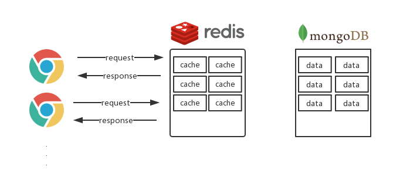
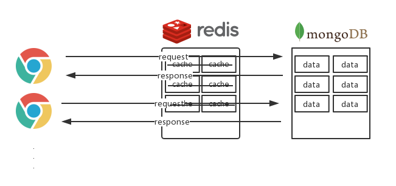

> ## Redis 缓存 雪崩 穿透

> ###### 正常情况下使用 Redis

> ###### 出现雪崩与穿透的情况

> 雪崩: 大量 cache 在同一时间失效

> 穿透: 大量请求到 Redis 中, 而 Redis 中没有缓存, 最后请求落到数据库中导致崩溃

> 解决雪崩与穿透:
>
> 雪崩:: 可以设置 Redis cache 的过期时间，让缓存失效的时间尽量均匀
>
> 穿透:: 将一份 key 作两次缓存, 双缓存策略。