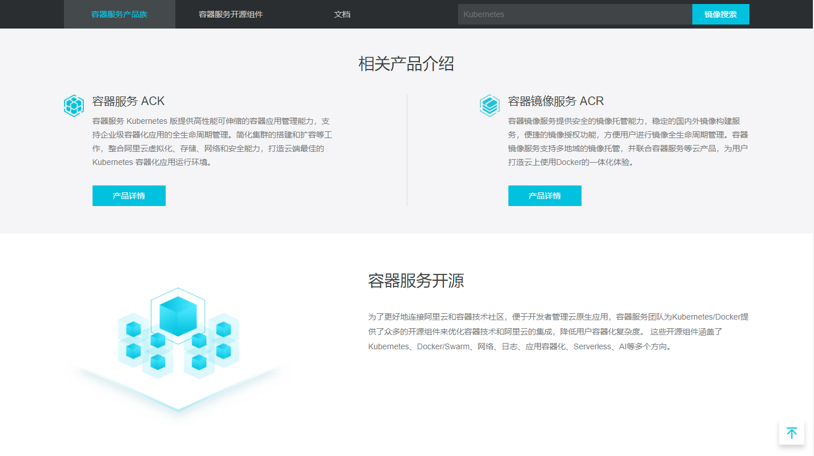
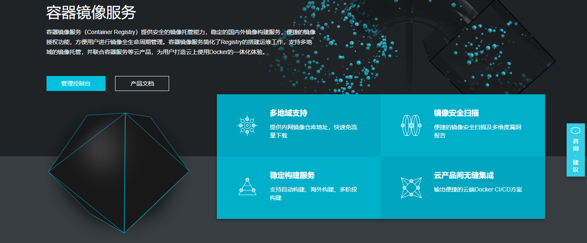
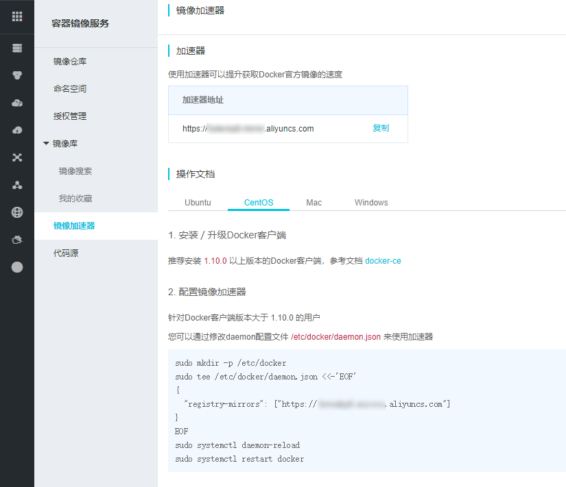

> ## 02 Docker Config aliyun.md

> 进入[阿里云生态](https://promotion.aliyun.com/ntms/act/kubernetes.html)



> 容器镜像服务 ACR



> 管理控制台 :: 找到自己的专属加速地址



> 找到`Docker`配置文件

```shell
vim /etc/sysconfig/docker
```

> 修改如下配置

```shell
# other_args=
other_args="--registry-mirror=https://xxxxxx.xxx.aliyuncs.com"
```

> 重启`Docker`容器

```shell
service docker restart
```

> 查看`Docker`进程

```shell
[root@localhost ~]# ps -ef | grep docker
root       3370      1  0 07:41 pts/1    00:00:04 /usr/bin/docker -d --registry-mirror=https://xxxxxx.xxx.aliyuncs.com
```

> #### Centos7

> 编辑`Docker`配置文件

```shell
vim /etc/docker/daemon.json
```

>  您可以通过修改daemon配置文件/etc/docker/daemon.json来使用加速器

```shell
sudo mkdir -p /etc/docker
###
sudo tee /etc/docker/daemon.json
{
  "registry-mirrors": ["https://xxxxxx.xxx.aliyuncs.com"]
}
###
sudo systemctl daemon-reload
###
sudo systemctl restart docker
```