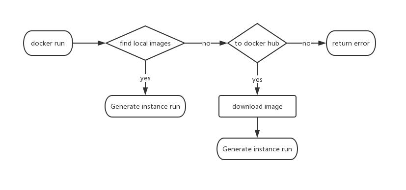
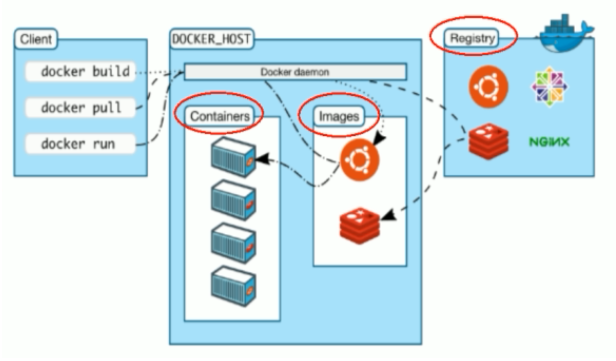

## 03 Docker Hello World.md

> 运行一个`hello-world`

```shell
docker run hello-world
```

> 执行结果

```shell
Unable to find image 'hello-world:latest' locally
latest: Pulling from hello-world

65b27d3bd74d: Pull complete
9f5834b25059: Pull complete
Digest: sha256:fb158b7ad66f4d58aa66c4455858230cd2eab4cdf29b13e5c3628a6bfc2e9f05
Status: Downloaded newer image for hello-world:latest

Hello from Docker!
This message shows that your installation appears to be working correctly.

To generate this message, Docker took the following steps:
 1. The Docker client contacted the Docker daemon.
 2. The Docker daemon pulled the "hello-world" image from the Docker Hub.
    (amd64)
 3. The Docker daemon created a new container from that image which runs the
    executable that produces the output you are currently reading.
 4. The Docker daemon streamed that output to the Docker client, which sent it
    to your terminal.

To try something more ambitious, you can run an Ubuntu container with:
 $ docker run -it ubuntu bash

Share images, automate workflows, and more with a free Docker ID:
 https://hub.docker.com/

For more examples and ideas, visit:
 https://docs.docker.com/get-started/
```

> 执行流程



| 单词                    | 意思         |
| ----------------------- | ------------ |
| `Generate instance run` | 生成实例运行 |
| `find local images`     | 查询本地镜像 |

> docker 架构



| docker    | 描述         |
| --------- | ------------ |
| image     | 镜像 :: 类   |
| container | 容器 :: 实例 |
| registry  | 中央仓库     |

