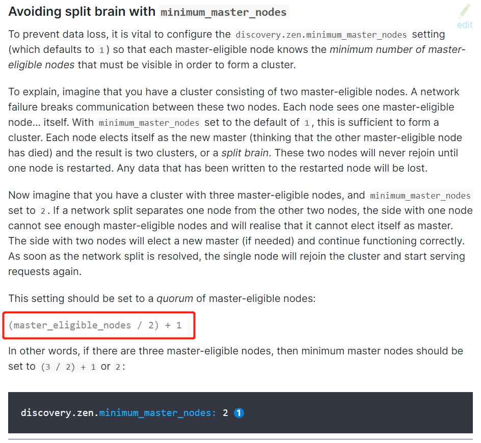

> ### 环境采用

* `wins10`操作系统
* `elasticsearch7.6.0`版本
* 本地三台集群

> ##### 解压三份 `elasticsearch-7.6.0-windows-x86_64.zip`

```shell
elasticsearch-7.6.0-node1
elasticsearch-7.6.0-node2
elasticsearch-7.6.0-node3
```

> ##### 找到 `config/elasticsearch.yml` 配置

```yaml
# 集群名称 集群内所有节点的名称必须一致
cluster.name: my-application
# 设置节点名称 集群内节点名称必须唯一
node.name: node-1
# elastic 的 http 端口 用于对外的es查询api
http.port: 9200
# elastic 的 tcp 端口 用于集群之间的互相通信
transport.tcp.port: 9300
# elastic 绑定到那台ip地址 0.0.0.0 标识所有ip地址都可以访问
network.host: 127.0.0.1
# 节点 ip:tcpPort 默认 tcpPort 为: 9300
discovery.seed_hosts: ["127.0.0.1","127.0.0.1:9301","127.0.0.1:9302"]
# 确定在第一次选举中计票的主要合格节点集
cluster.initial_master_nodes: ["node-1","node-2","node-3"]

# 配置跨域
http.cors.enabled: true
http.cors.allow-origin: "*"
```

* 其他本地节点需要修改
  * `node.name` 不同的节点名
  * `http.port` 本地的 http 端口号
  * `transport.tcp.port` 本地的 tcp 端口号
  * 维护好 `discovery.seed_hosts` 与 `cluster.initial_master_nodes`
  * **为什么不配置 discovery.zen.minimum_master_nodes 在老版本es官方文档中可以找到, 新版中没有了**
  * https://www.elastic.co/guide/en/elasticsearch/reference/6.8/modules-node.html





> ### 在docker中搭建es集群

```shell
# 去 dockerHub 上拉取 7.6.0 版本的 elasticsearch
docker pull elasticsearch:7.6.0
# 拉取 kibana
docker pull kibana:7.6.0

# 启动三个镜像
docker run 
	-e ES_JAVA_OPTS="-Xms1024m -Xmx1024m" 
	-d 
	-p 9200:9200 
	-p 9302:9300 
	-v /node1/config/elasticsearch.yml:/usr/share/elasticsearch/config/elasticsearch.yml 
	-v /node1/data:/usr/share/elasticsearch/data 
	-v /node1/plugins:/usr/share/elasticsearch/plugins
	-v /node1/logs:/usr/share/elasticsearch/logs 
	--name ES-node1 elasticsearch:7.6.0

# 启动 kibana
docker run -d -p 5601:5601 --name=kibana -e ELASTICSEARCH_HOSTS=http://192.168.30.3:9200 kibana:7.6.0
```
