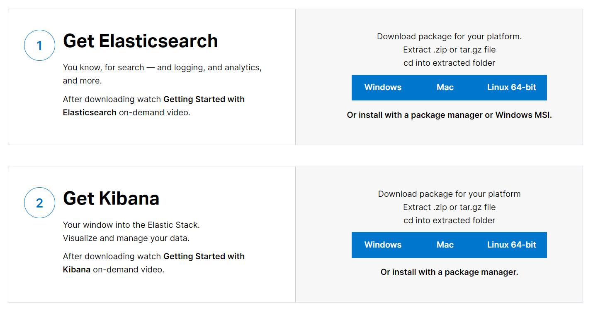

> ##  ElasticSearch Ik-Analyzer install

> 首先安装 git

```shell
sudo apt install git
```

> 下面分别是两个仓库的地址

```http
# ElasticSearch 
https://github.com/elastic/elasticsearch.git

# Ik-Analyzer 分词器
https://github.com/medcl/elasticsearch-analysis-ik.git
```

> 下载 ElasticSearch 源码

```shell
git clone https://github.com/elastic/elasticsearch.git
```

> #### 在启动 ElasticSearch 是需要注意

> > 创建一个 ElasticSearch 专用的用户

```shell
# 创建一个 elastic 用户
useradd elastic
# 给 elastic 用户设置密码
passwd elastic
# 删除 elastic 用户并删除目录
userdel elastic && rm -rf elastic
```

> > 接下来给用户权限并执行 ElasticSearch 

```shell
# 设置权限
chown -R elastic elasticsearch-X.x.X

# 切换用户
su elastic

# 启动 ElasticSearch
./bin/elasticsearch
```

> #### ElasticSearch 为什么不能使用 root 启动 ?

1. 这是出于系统安全考虑设置的条件。
2. 由于ElasticSearch可以接收用户输入的脚本并且执行
3. 为了系统安全考虑，建议创建一个单独的用户用来运行ElasticSearch

> ElasticSearch 启动成功后，访问地址得到返回就成功了。

```
[root@localhost opt]# curl -XGET http://127.0.0.1:9200/
{
"name" : "GED59jp",
"cluster_name" : "elasticsearch",
"cluster_uuid" : "PlWySDQ0SD2kYPCw9fxUlw",
"version" : {
 "number" : "5.6.14",
 "build_hash" : "f310fe9",
 "build_date" : "2018-12-05T21:20:16.416Z",
 "build_snapshot" : false,
 "lucene_version" : "6.6.1"
},
"tagline" : "You Know, for Search"
}
```

>  下面开始安装 Ik-Analyzer 分词器 

> 安装方式一(在线安装): 通过 elasticsearch-plugin  来安装 Ik-Analyzer 分词器 (网速不好不要轻易尝试)

```shell
./bin/elasticsearch-plugin install https://github.com/medcl/elasticsearch-analysis-ik/releases/download/v6.3.0/elasticsearch-analysis-ik-6.3.0.zip
```

> 安装方式二(离线安装): 

```shell
# 来到 ElasticSearch 的 plugins 目录创建一个目录  
cd elasticsearch/plugins/ && mkdir ik

# 下载 ik 文件当然，也可以先下载好后传入 linux 中
wget https://github.com/medcl/elasticsearch-analysis-ik/releases/download/v7.3.1/elasticsearch-analysis-ik-7.3.1.zip

# 解压文件
unzip elasticsearch-analysis-ik-7.3.1.zip

# 在启动 ElasticSearch 时看到如下日志说明 ik 加载成功
loaded plugin [analusis-ik]
```

> ## windows install elasticsearch



* https://www.elastic.co/cn/start
* 下载 Windows 版本的 elasticsearch
* 到 bin 目录下找到 elasticsearch.bat 双击执行就行了
  * 如果需要安装 analusis-ik 则下载对应的版本
  * 解压到 plugins 目录下就行了