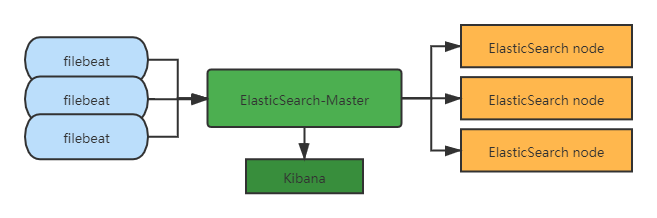
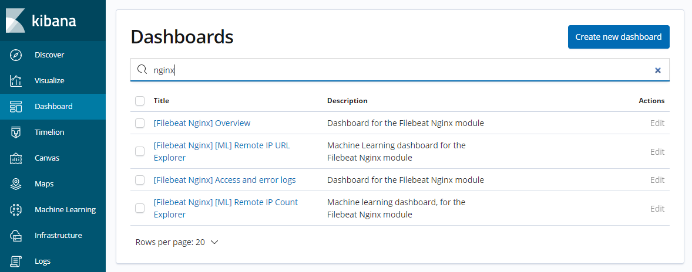
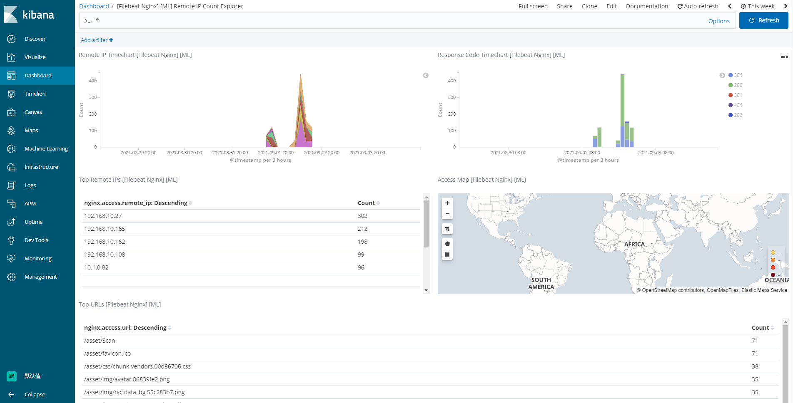
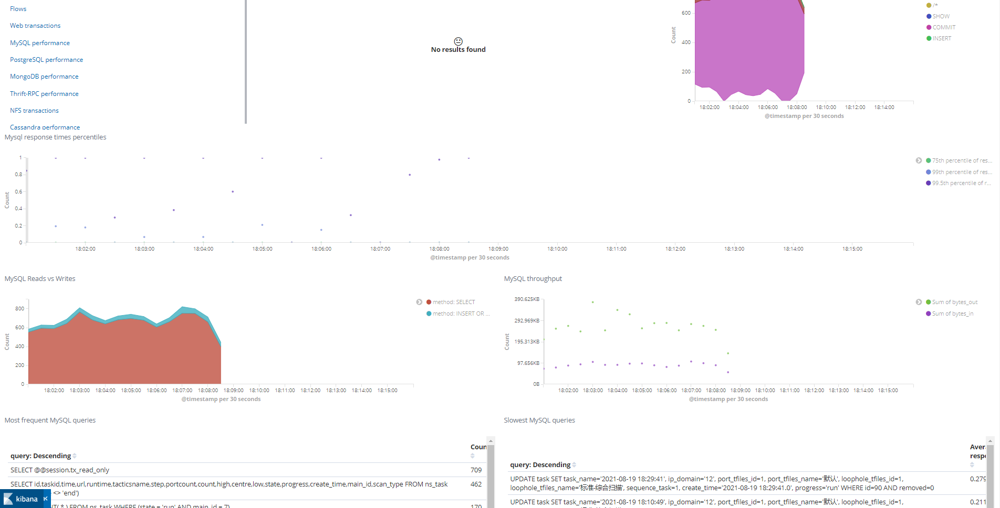
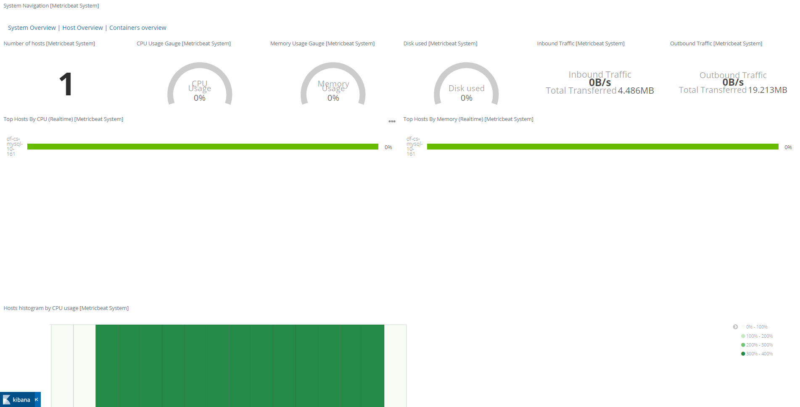
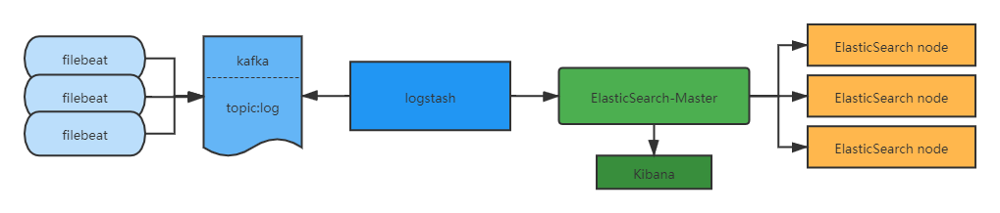
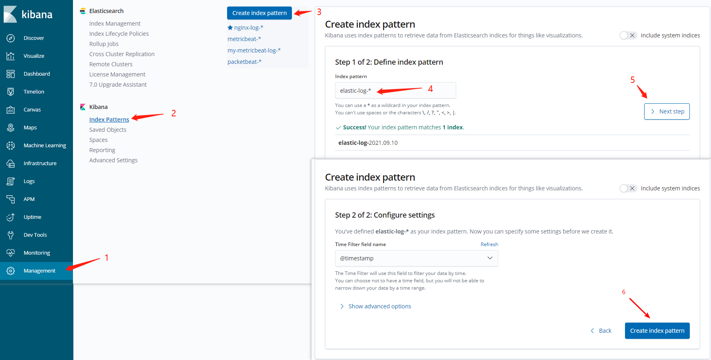
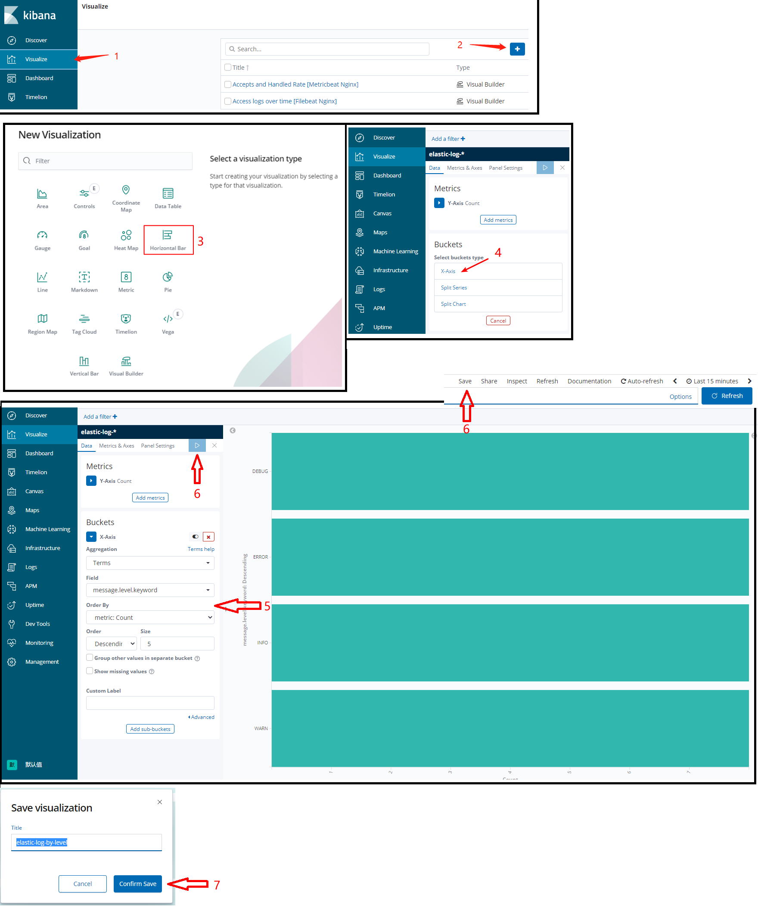
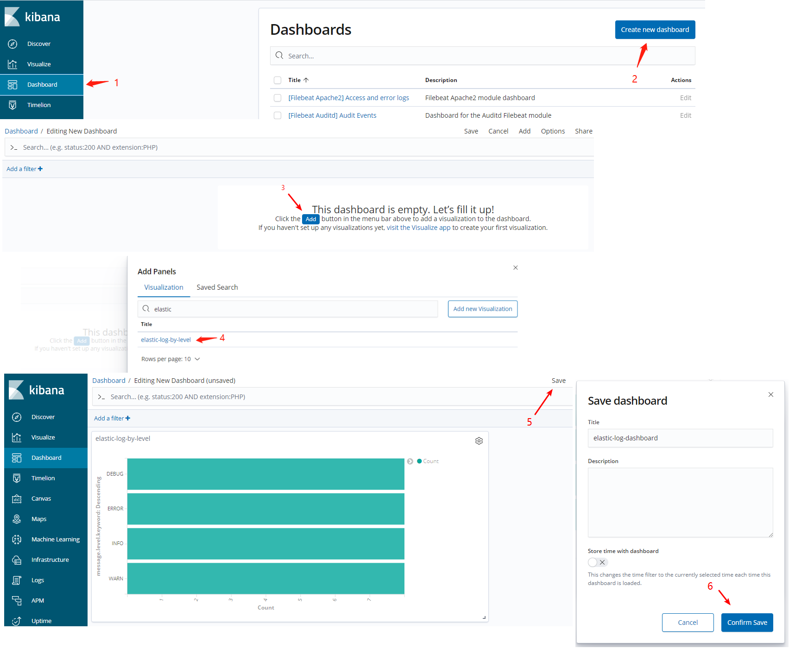

* 2021-09 目前Beats包含八种工具：
  * Filebeat：日志文件（收集文件数据）
  * Packetbeat：网络数据（收集网络流量数据）
  * Winlogbeat：Windows事件日志（收集Windows事件日志数据）
  * Metricbeat：指标（收集系统、进程和文件系统级别的CPU和内存使用情况等数据）
  * Heartbeat：运行时间监控（收集系统运行时的数据）
  * Auditbeat：审计数据（收集审计日志）
  * Functionbeat: 处理云数据Cloud data（让其直接将数据流从 Amazon Simple Queue Service (SQS) 传送至 Elastic Stack，便于您进行统一监测。）
  * Journalbeat: Systemd journals 读取journald日志（journalctl命令看到的日志都收集了）

> ## 简单版 filebeat 收集 nginx 日志 到 ElasticSearch



* 下载 并 解压 [filebeat](https://www.elastic.co/downloads/beats/filebeat) ( 实际使用建议 RPM 安装 )

```shell
wget https://artifacts.elastic.co/downloads/beats/filebeat/filebeat-7.14.0-linux-x86_64.tar.gz
tar -zxvf filebeat-7.14.0-linux-x86_64.tar.gz

mv filebeat-7.14.0-linux-x86_64 filebeat-7.14.0
cd filebeat-7.14.0
# 备份默认配置文件
mv filebeat.yml filebeat.yml.bak

# 创建新的配置文件
vim filebeat.yml
```

* 写入配置

```yaml
# 加载 filebeat modules.d 下的配置
filebeat.config.modules:
  path: /data/soft/filebeat-6.14.0/modules.d/*.yml
  reload.enabled: true
  reload.period: 10s
  
output.elasticsearch:
  hosts: ["172.15.10.163:9207","172.15.10.163:9208","172.15.10.163:9209"]
  index: "nginx-log-%{[beat.version]}-%{+yyyy.MM}"

setup.kibana:
  host: "172.16.10.163:5601"

# 指定分析索引为 ngnix-log- 开头的 *
setup.template.name: "ngnix-log-"
setup.template.pattern: "ngnix-log-*"
setup.dashboards.index: "nginx-log-*"
#覆盖一个已存在的模板
setup.template.overwrite: true
#禁用自动加载模板
setup.template.enabled: false
# filebeat 配置关闭 ILM 即可解决Index Pattern不生效的问题
setup.ilm.enabled: false

# 指定 ngnix-log 索引的 分片与副本
#setup.template.settings:
#  index.number_of_shards: 1
#  index.number_of_replicas: 1
```

* 配置 nginx 日志目录

```shell
# 查看并激活模块
./filebeat modules list
./filebeat modules enable nginx
./filebeat modules enable elasticsearch

vim modules.d/nginx.yml
```

* [写入配置](https://www.elastic.co/guide/en/beats/filebeat/current/filebeat-module-nginx.html#configuring-nginx-module)

```yaml
- module: nginx
  access:
    enabled: true
    var.paths: ["/var/log/nginx/access.log*"]
  error:
    enabled: true
    var.paths: ["/var/log/nginx/error.log*"]
```

* 启动 FileBeat

```shell
# 测试配置文件是否正确
./filebeat -c filebeat.yml test config
# 启动 filebeat 
sudo ./filebeat -e -c filebeat.yml > /dev/null &
# 在 kibana 中创建 index-pattern
./filebeat -c filebeat.yml setup
```

* https://www.elastic.co/guide/en/beats/filebeat/7.9/could-not-locate-index-pattern.html

* 访问项目让 nginx 产生日志
* 打开 kibana 查看视图



* 这几个视图都可以用, 我这里打开的是: `[Filebeat Nginx] [ML] Remote IP Count Explorer`



> Packetbeat,Metricbeat 这两个beat 操作也是差不多的, 其他的没测试了

> packetbeat 的视图



> metricbeat system 的视图



* 参考链接
* https://www.elastic.co/guide/en/beats/filebeat/7.9/could-not-locate-index-pattern.html
* https://www.elastic.co/guide/en/beats/filebeat/current/filebeat-module-nginx.html#configuring-nginx-module
* https://blog.csdn.net/weixin_43999932/article/details/106836786
* https://www.shuzhiduo.com/A/8Bz89mm1Jx/

> ## 企业级日志解决方案



> 收集Springboot logback日志

* 添加依赖, 使用 `logstash-logback-encoder` 将日志输出为 ElasticSearch 的格式

```xml
<dependency>
    <groupId>net.logstash.logback</groupId>
    <artifactId>logstash-logback-encoder</artifactId>
    <version>6.6</version>
</dependency>
```

* 在 `resources` 下创建 `logback-spring.xml` 并配置

```xml
<?xml version="1.0" encoding="UTF-8"?>
<configuration scan="true" scanPeriod="60 seconds" debug="false">

    <!-- 定义参数常量 -->
    <!-- TRACE<DEBUG<INFO<WARN<ERROR -->
    <!-- logger.trace("msg") logger.debug... -->
    <property name="log.level" value="debug"/>
    <property name="log.maxHistory" value="2"/>
    <!--修改此处-->
    <property name="log.filePath" value="./logs/demo"/>
    <property name="log.pattern" value="%d{yyyy-MM-dd HH:mm:ss.SSS} [%thread] %-5level %logger{50} - %msg%n"/>

    <appender name="stash" class="ch.qos.logback.core.rolling.RollingFileAppender">
        <file>${log.filePath}/elastic.log</file>
        <rollingPolicy class="ch.qos.logback.core.rolling.TimeBasedRollingPolicy">
            <fileNamePattern>${log.filePath}/elastic.%d{yyyy-MM-dd}.log.gz</fileNamePattern>
            <totalSizeCap>20GB</totalSizeCap>
        </rollingPolicy>
        <encoder class="net.logstash.logback.encoder.LogstashEncoder"/>
    </appender>

    <root name="com.example" level="${log.level}" additivity="true">
        <appender-ref ref="stash" />
    </root>

</configuration>
```

* 通过格式化后的日志会变成 `tail ./logs/demo/elastic.log`

```json
{"@timestamp":"2021-09-10T16:07:00.000+08:00","@version":"1","message":"debug.task: 59a52175-190c-46c0-af49-55fa293d6f12","logger_name":"com.example.elasticlog.task.LogTask","thread_name":"scheduling-1","level":"DEBUG","level_value":10000}
{"@timestamp":"2021-09-10T16:07:00.000+08:00","@version":"1","message":"info.task: 10cc0356-2831-4c1a-ab3b-af072c298e71","logger_name":"com.example.elasticlog.task.LogTask","thread_name":"scheduling-1","level":"INFO","level_value":20000}
{"@timestamp":"2021-09-10T16:07:00.000+08:00","@version":"1","message":"warn.task: 1ea1457f-9d3a-4782-ab80-bb21e5efa617","logger_name":"com.example.elasticlog.task.LogTask","thread_name":"scheduling-1","level":"WARN","level_value":30000}
```

> filebeat 配置 收集日志到 kafka

```yaml
#============================= Input ===============================
# 官方文档地址: https://www.elastic.co/guide/en/beats/filebeat/6.8/filebeat-input-log.html#filebeat-input-log
# tags: 给数据打个标签
# fields: 定义字段
# fields_under_root: 定义的字段是否为根(root)节点
filebeat.inputs:
- type: log
  enabled: true
  paths: ["/data/target/logs/demo/*.log"]
  tags: ["elastic-166"]
  fields:
    form: my-field
  fields_under_root: true

#================================ Processors =====================================
# 官方文档地址: https://www.elastic.co/guide/en/beats/filebeat/6.8/filtering-and-enhancing-data.html#filtering-and-enhancing-data
# include_fields 保留那些字段
# decode_json_fields: json解码
# drop_fields: 删除字段
# rename: 字段重命名

processors:
 - include_fields:
     fields: ["message", "form"]
 - decode_json_fields:
     fields: ["message", "logger_name", "thread_name", "level", "level_value"]
     process_array: false
     max_depth: 1
     target: "message"
     overwrite_keys: true
 - drop_fields:
     fields: ["message.@timestamp", "message.@version"]
# - rename:
#    fields:
#     - from: "a.g"
#       to: "e.d"
#    ignore_missing: false
#    fail_on_error: true

#================================ Outputs =====================================
# 官方文档地址: https://www.elastic.co/guide/en/beats/filebeat/6.8/kafka-output.html#kafka-output

output.kafka:
  hosts: ["172.16.10.164:9092"]
  topic: "elastic_log_topic"
  partition.round_robin:
    reachable_only: false
  required_acks: 1
  compression: gzip
  max_message_bytes: 1000000

#output.elasticsearch:
#  hosts: ["172.16.10.165:9200"]
#  username: "elastic"
#  password: "2ebc3134384fea0a162089b8d8e8e934"
#  indices:
#    - index: "elastic-log-error-%{+yyyy.MM.dd}"
#      when.equals:
#        message.level_value: 40000
#    - index: "elastic-log-%{+yyyy.MM.dd}"

# filebeat 配置关闭 ILM 即可解决Index Pattern不生效的问题
#setup.ilm.enabled: false
```

> logstash 配置 从kafka中拉取到 es `bin/logstash -f config/elastic.conf --config.reload.automatic`

```json
input {
  kafka {
    bootstrap_servers => "172.16.10.164:9092"
    topics => ["elastic_log_topic"]
    codec => "json"
    type => "logback"
    group_id => "elastic_log_group"
  }
}

filter {
  if [message][level_value] == 40000 {
    # period (以秒为单位) 内触发 before_count after_count 次在数据中添加 tag
    #throttle {
    #  before_count => -1
    #  after_count => 3
    #  period => 120
    #  max_age => 240
    #  key => "%{[message][message]}"
    #  add_tag => "throttled"
    #}
    throttle {
      before_count => 3
      after_count => 5
      period => 3600
      max_age => 7200
      key => "%{message}"
      add_tag => "throttled"
    }
  }
}

output {
  if [type]=="logback" {
    elasticsearch {
      hosts => ["172.16.10.163:9207","172.16.10.163:9208","172.16.10.163:9209"]
      index => "elastic-log-%{+YYYY.MM.dd}"
      #user => "elastic"
      #password => "changeme"
    }
  }
  # 判断tags内有throttled发送邮件预警
  if "throttled" in [tags] {
    email {
      port => 587
      address => "smtp.qq.com"
      username => "xxxx@qq.com"
      password => "xxxx"
      authentication => "plain"
      contenttype => ""
      from => "form_xxxx@qq.com"
      subject => "错误告警"
      to => "to_xxxx@qq.com"
      use_tls => true
      via => "smtp"
      domain => "smtp.qq.com"
      body => "错误告警: %{message}"
      debug => true
    }

    ## 钉钉机器人
    #http {
    #  url => "https://oapi.dingtalk.com/robot/send?access_token={你的token}"
    #  http_method => "post"
    #  content_type => "application/json; charset=utf-8"
    #  format => "message"
    #  message => '{"msgtype":"text","text":{"content":"错误告警：120秒内错误日志超过3条，请注意排查"}}'
    #}
  }
}
```

> 自定义 Dashboard

* 创建 index patterns



* 创建 visualization



* 创建 Dashboard 添加 Visualization



---

* 参考链接 ( 这套架构还需要加上监控预警才完美 ) 
* (Prometheus简介) https://xeblog.cn/articles/7
* (Logstash tcp) https://blog.csdn.net/weixin_41358004/article/details/106206200
* (ELK的监控工具Elastalert) https://blog.csdn.net/sdmei/article/details/89928964
* (Filebeat7自定义index的一个坑) https://www.jianshu.com/p/a3941dfa205c
* (kibana xpack) https://www.elastic.co/guide/en/security/7.14/detections-permissions-section.html
* (xpack进行安全认证) https://blog.csdn.net/zhoudatianchai/article/details/113045119
* (付费) https://www.elastic.co/cn/subscriptions
* (logback 格式) https://www.baeldung.com/java-application-logs-to-elastic-stack
* (logstash 钉钉) https://blog.csdn.net/qq330983778/article/details/106266974
* (logstash 钉钉) https://cloud.tencent.com/developer/article/1550989
* (logstash email) https://blog.csdn.net/qq330983778/article/details/106415105
* (logstash email) https://blog.csdn.net/Shyn_IT/article/details/76284307
* (logstash 自定义正则) https://www.elastic.co/guide/en/logstash/7.14/plugins-filters-grok.html#_custom_patterns
* (Prometheus + Grafana 监控 SpringBoot) https://zhuanlan.zhihu.com/p/106036485
* (Grafana Alert告警设置) https://blog.51cto.com/u_10874766/2518022
