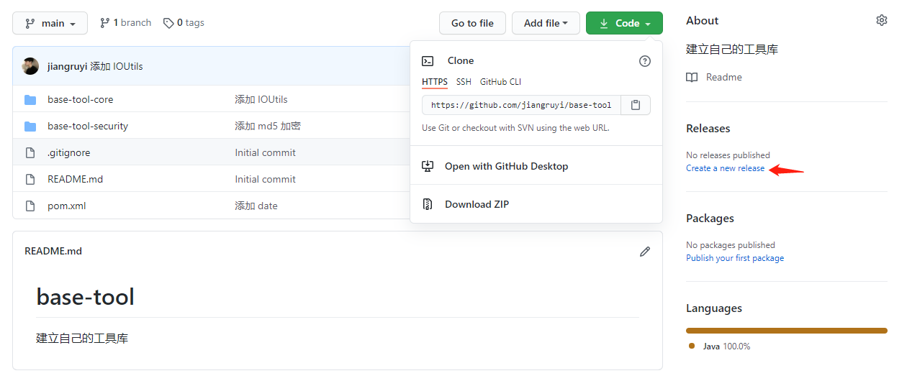
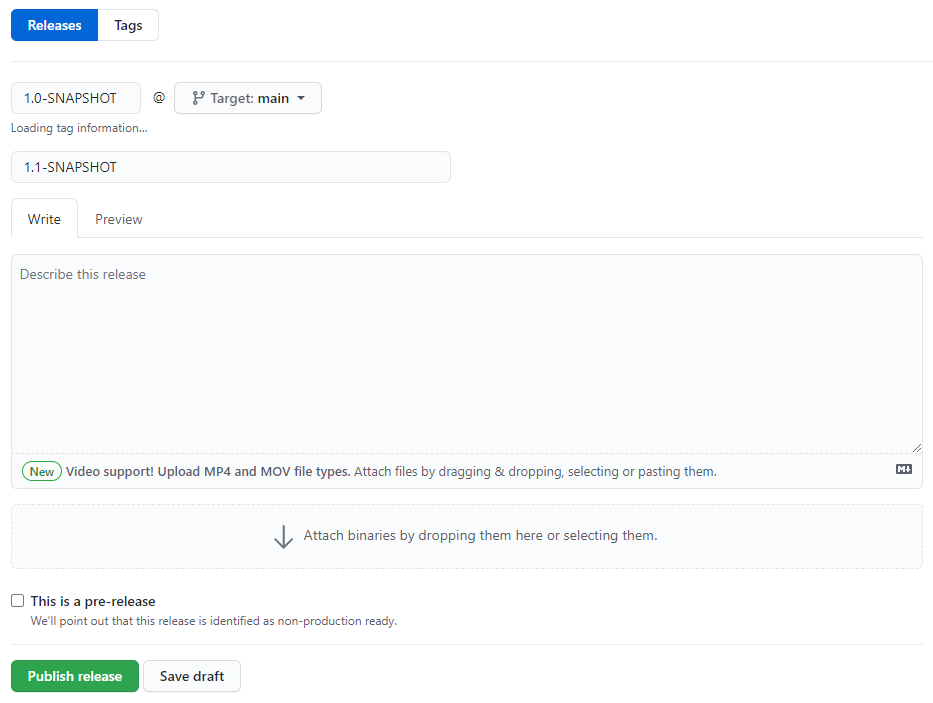
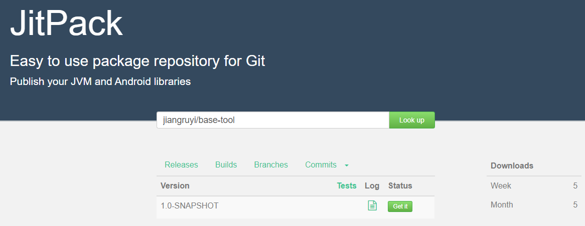
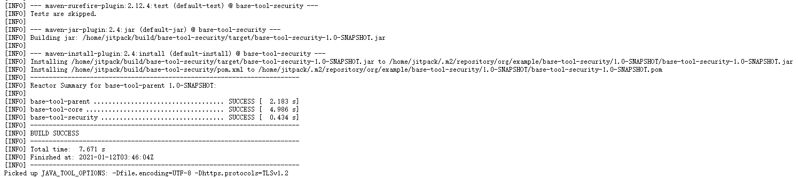

> #### 创建项目并确保编译通过



> #### 创建 Releases



> #### 在 [JitPack](https://jitpack.io/) 上编译打包 https://jitpack.io/



* `Look up` 选用 https://github.com/`jiangruyi/base-tool`

> #### 查看日志确认是否打包成功



> #### 打包成功后创建项目并引用

* **Step 1.** Add repositories `pom.xml` 文件中添加

```xml
<repositories>
	<repository>
        <id>jitpack.io</id>
        <url>https://jitpack.io</url>
    </repository>
</repositories>
```

* **Step 2.** Add the dependency

```xml
<dependency>
    <groupId>com.github.jiangruyi</groupId>
    <artifactId>base-tool</artifactId>
    <version>Tag</version>
</dependency>
```

