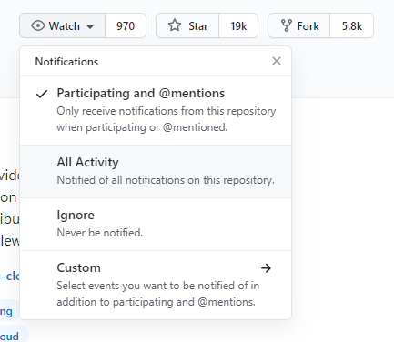

* Watch ( 订阅 )
* Star ( 点赞 )
* Fork ( 克隆一份 )

> 搜索

* in
  * `关键词` in:name,readme,description
    * in:name 项目名中包含xxx的
    * in:description 项目描述中包含xxx的
    * in:readme 项目的 readme 文件中包含xxx的
* 根据 star 数搜索
  * springboot stars:>=5000 , 搜索stars数大于等于5000的项目
  * springcloud forks:>500 , 搜索forks数大于500的springcloud 项目
  * springboot forks:100..200 stars:80..100 , 搜索 fork 在 100到200之间并 stars 数在80到100之间的springboot项目
* awesome 系列
  * 一般是用来收集学习工具书籍类相关的项目
  * awesome redis
* 高亮显示某段代码 , url后加#L
  * https://github.com/alibaba/nacos/blob/develop/config/src/main/java/com/alibaba/nacos/config/server/service/LongPollingService.java#L329L357
* 项目内搜索
  * `t`
  * [官方文档](https://docs.github.com/en/github/getting-started-with-github/using-github/keyboard-shortcuts)
* 搜索某个区域的大佬
  * location:地区
  * language:语言
  * 案例: location:beijing language:java