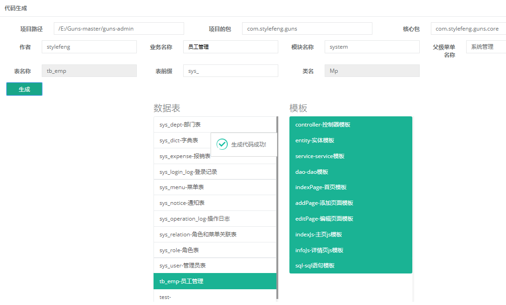
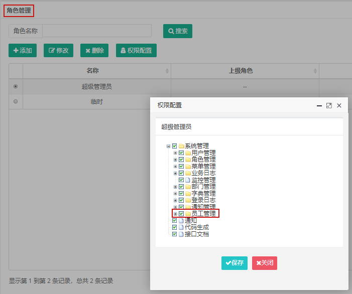

> ## Guns AutoTable

> 创建表结构

```sql
create table `tb_emp` (
  id int primary key auto_increment,
  name varchar(25) comment '员工姓名',
  gender char(1) comment '性别',
  age int comment '年龄'
) comment '员工管理';
```

> 在代码生成页面



> 停止项目在`guns`包下会生成一个`emp.sql`全部运行到数据库中

> 重启`启动`项目

> 为管理员分配管理权限



> 如果在生成的页面中没有按钮:: 然后退出重新登陆就可以看到了。