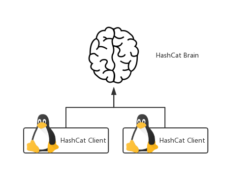

> ## HashCat 分布式破解

> ### HashCat 分布结构



> #### 官网参数如下

```shell
-S, --slow-candidates	Enable slower (but advanced) candidate generators
						| 启用较慢（但高级）的候选生成器
	--brain-server		Enable brain server
						| 启用BRAIN服务器
	
-z, --brain-client		Enable brain client, activates -S
						| 启用大脑客户端，激活-s
	--brain-client-features	Define brain client features, see below
						| 定义大脑客户端功能，见下文
	--brain-host		Brain server host (IP or domain)
						| BRAIN服务器主机（IP或域）
	--brain-port		Brain server port
						| BRAIN服务器端口
	--brain-password	Brain server authentication password
						| BRAIN服务器身份验证密码
	--brain-session		Overrides automatically calculated brain session
						| 覆盖自动计算的大脑会话
	--brain-session-whitelist	Allow given sessions only, separated with commas
						| 仅允许给定会话，用逗号分隔
```

> #### Brain Client Features 参数

```shell
- [ Brain Client Features ] -
  # | Features
 ===+========
  1 | Send hashed passwords /**发送哈希密码*/
  2 | Send attack positions /**发送攻击位置*/
  3 | Send hashed passwords and attack positions /**发送哈希密码和攻击位置*/
```

> 启动一个 HashCat 脑服务器

```shell
hashcat --brain-server --brain-host=<IP> --brain-port=<PORT> --brain-password=<PWD>
```

> 启动一个 Client 开始破解

```shell
hashcat -O --brain-client --brain-client-features=<Brain Client Features> --brain-host=<BRAIN-IP> --brain-port=<BRAIN-PORT> --brain-password=<BRAIN-PWD> -m <Attack Modes> -a <Hash modes> '<PASSWORD>' <Built-in Charsets | Dic Path> --force
```

> Client Demo 

```shell
hashcat -O --brain-client --brain-client-features=3 --brain-host=192.168.1.112 --brain-port=996110 --brain-password=hashpwd -m 0 -a 3 '0b8aff0438617c055eb55f0ba5d226fa' ?a?a?a --force
```

