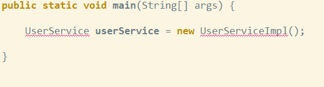
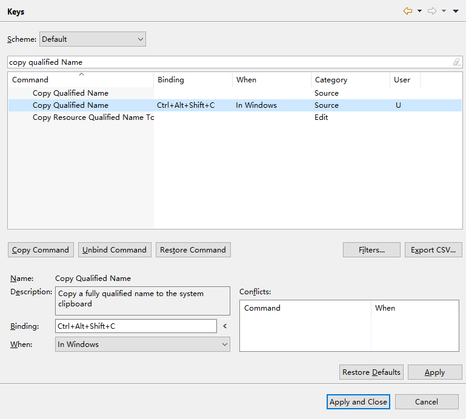

> ### eclipse高效编程

1. 掌握 eclipse 快捷键
2. 掌握 eclipse 中的编程技巧

| 快捷键                   | 说明                 |
| ------------------------ | -------------------- |
| alt + /                  | 内部补全             |
| ctrl + 1                 | 提示修复方案         |
| ctrl + .                 | 将光标跳转到报错点   |
| ctrl + shift + f         | 代码格式化           |
| alt + 上下方向键         | 移动代码             |
| alt + shift + 上下方向键 | 移动代码并复制       |
| ctrl + shift + x         | 转大写               |
| ctrl + /                 | 添加取消单行注释     |
| ctrl + d                 | 删除当前行代码       |
| shift + alt + r          | 操作相同对象名字     |
| chrl + 2 放手 + l        | 自动接住返回值       |
| shift + alt + m          | 封装选中的代码块     |
| ctrl + k                 | 在本页查询选中的单词 |

> 快捷键很多这里我例句几个我比较常用的

修改默认编码:
	windows --> perference --> workspace --> default

彻底修改项目的默认编码:
	在eclipse的安装目录下，在eclipse.ini文件里最后添加一行:
		-Dfile.encoding=utf-8

---

修改eclipse默认编程路径:

1. 连续打开两次eclipse第二次你会发现他让你更改目录了
2. file => switch Workspace => Other...

---

1. 高效编程方式一: `ctrl + .` `ctrl + 1`

   

2. 高效编程方式二: `ctrl + /` `ctrl + 2 : l`

   

---

> 将常用操作配置快捷键

> 还可以将常用操作设置快捷键: 
>
> 	将功能名称输入直接设置就行, 比如关闭项目等操作, eclipse 没有默认配置快捷键

