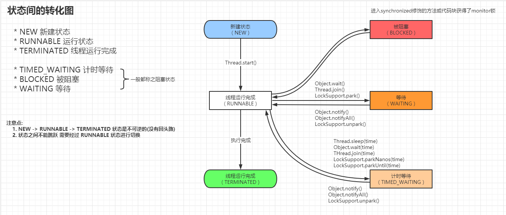

# 线程8大核心基础

1. 实现多线程的方法到底有1种还是2种还是4种
2. 这样才是正确的线程启动方式
3. **上山容易下山难, 如何正确停止线程**
4. **线程一生的6个状态**
5. Thread 和 Object 类中的重要方法详解
6. 线程的各个属性
7. 未捕获异常如何处理
8. 双刃剑 : 多线程会导致的问题

[TOC]

## 1. 实现多线程的方法到底有1种还是2种还是4种

* [官方文档](https://docs.oracle.com/javase/8/docs/api/) Thread 类的说明中: `There are two ways to create a new thread of execution.`
  * 方法一 : 继承Thread类
  * 方法二 : 实现Runnable接口 (更好)
* 从架构的方面去考虑 run 方法应该和 线程的创建与运行 的机制也就是 Thread 类 **解耦**
* Thread每次我们想创建一个任务只能创建一个独立的线程, 如果使用 Runnable 后续方便使用线程池
* Java 不支持多继承

> 方法一 : 继承Thread类

```java
/** 启动线程
PrimeThread p = new PrimeThread(143);
p.start();
*/
class PrimeThread extends Thread {
    long minPrime;
    PrimeThread(long minPrime) {
        this.minPrime = minPrime;
    }

    public void run() {
        // compute primes larger than minPrime
        . . .
    }
}
```

> 方法二 : 实现Runnable接口

```java
/** 启动线程
PrimeRun p = new PrimeRun(143);
new Thread(p).start();
*/
class PrimeRun implements Runnable {
    long minPrime;
    PrimeRun(long minPrime) {
        this.minPrime = minPrime;
    }

    public void run() {
        // compute primes larger than minPrime
        . . .
    }
}
```

> 思考题 : 同时用两种方法会怎么样 ? 

```java
/**
 * 执行结果为:
 *  Thread impl
 *
 * 1. 虽然通过Thread的构造方法给Runnable作为target传入了Thread内
 *     public void run() {
 *         if (target != null) {
 *             target.run();
 *         }
 *     }
 *
 * 2. 但是后面我们的匿名内部类中重写了父类的run方法, 最后导致的我们运行结果为: 
 *  Thread impl
 */
public static void main(String[] args) {
    new Thread(new Runnable() {
        @Override
        public void run() {
            System.out.println("Runnable impl");
        }
    }){
        @Override
        public void run() {
            System.out.println("Thread impl");
        }
    }.start();
}
```

> 总结 : 最精简的描述

* 通常我们可以分为两类 , Oracle 也是怎么说的
* 精确的说
  * 创建一个线程只有一种方式 那就是创建 Thread 类调用 start(); 
  * 实现 Runnable 接口重写 run 方法只是创建了线程执行的逻辑代码, 最终的还是需要创建一个 Thread 调用 start(); 

> 经典**错误观点**分享

* `线程池也算一种新建线程的方式`
  * `java.util.concurrent.Executors.DefaultThreadFactory#newThread`

```java
public Thread newThread(Runnable r) {
    Thread t = new Thread(group, r,
                          namePrefix + threadNumber.getAndIncrement(),
                          0);
    if (t.isDaemon())
        t.setDaemon(false);
    if (t.getPriority() != Thread.NORM_PRIORITY)
        t.setPriority(Thread.NORM_PRIORITY);
    return t;
}
```

* `通过Callable和FutureTask创建线程, 也算是一种新的创建线程的方式`
* `定时器/匿名内部类/Lambda表达式`
* 几点错误观点总结: 内部都是创建了一个 Thread 

> 推荐经典书籍: `Java并发编程实战` , `自顶向下计算机网络`

## start() 与 run() 方法的区别

* start() 是用来启动一个线程的
  * 调用start()就开启了一个线程
  * 如果调用两次start()方法会抛出异常 `throw new IllegalThreadStateException();`
  * start() 中的实现逻辑在一开始调用时就会检查 threadStatus 如果不等于 0 就抛出异常
* run() 方法只是线程执行中的逻辑
  * 手动调用run()就和调用了一个普通代码一样
  * 默认的run()会判断 Runnable 类型的 target 不为空就调用 run()

## 上山容易下山难, 如何正确停止线程

```java
public static void main(String[] args) throws InterruptedException {
    Thread thread = new Thread(() -> {
        try {
            for (int i = 0;!Thread.currentThread().isInterrupted() && i < Integer.MAX_VALUE; i++) {
                log.info("res: {}", i / 2);
            }
        } catch (Exception e) {
            Thread.currentThread().interrupt();
            log.error(e.getMessage(), e);
        }
    });

    thread.start();

    Thread.sleep(4000);
    thread.interrupt();
}
```

* 使用 interrupt(); 和 isInterrupted() 配合使用来停止线程

## **线程一生的6个状态**



> 状态获取演示

```java
public class New2ThreadStatus implements Runnable {

    public static void main(String[] args) throws InterruptedException {

        Thread thread = new Thread(() -> {
            for (int i = 0; i < 1000; i++) {
                System.out.println(Thread.currentThread().getName() + ":run:" + i);
            }
        });

        System.out.println("status::" + thread.getState());

        thread.start();

        Thread.sleep(10);

        System.out.println("status::" + thread.getState());

        Thread.sleep(100);

        System.out.println("status::" + thread.getState());

        New2ThreadStatus threadStatus = new New2ThreadStatus();

        Thread thread1 = new Thread(threadStatus);
        thread1.start();

        Thread thread2 = new Thread(threadStatus);
        thread2.start();

        Thread.sleep(10);

        System.out.println("thread1::" + thread1.getState());
        System.out.println("thread2::" + thread2.getState());

        Thread.sleep(1300);

        System.out.println("thread1::" + thread1.getState());
        System.out.println("thread2::" + thread2.getState());
    }

    @Override
    public void run() {
        syn();
    }

    private synchronized void syn() {
        try {
            Thread.sleep(1000);
            wait();
        } catch (InterruptedException e) {
            e.printStackTrace();
        }
    }

}

/**
运行结果
status::NEW
Thread-0:run:0
. . . 
Thread-0:run:481
status::RUNNABLE
Thread-0:run:482
. . .
Thread-0:run:999
status::TERMINATED
thread1::TIMED_WAITING
thread2::BLOCKED
thread1::WAITING
thread2::TIMED_WAITING
*/
```

## sleep,wait,yield,join 的区别

**sleep()方法** ::  在指定时间内让当前正在执行的线程暂停执行，但不会释放'锁标志'。

**wait()方法** :: 在其他线程调用对象的 notify 或 notifyAll 方法前，导致当前线程等待。线程会释放掉它所占有的“锁标志”，从而使别的线程有机会抢占该锁。

**yield方法** :: 

* yield()只是使当前线程重新回到可执行状态，所以执行yield()的线程有可能在进入到可执行状态后马上又被执行。
* yield()只能使同优先级或更高优先级的线程有执行的机会。 
* *调用yield方法并不会让线程进入阻塞状态，而是让线程重回就绪状态，它只需要等待重新获取CPU执行时间，这一点是和sleep方法不一样的。*

**join方法** ::

* 等待调用join方法的线程结束，再继续执行。如：t.join();//主要用于等待t线程运行结束，若无此句，main则会执行完毕，导致结果不可预测。
* 在很多情况下，主线程创建并启动了线程，如果子线程中药进行大量耗时运算，主线程往往将早于子线程结束之前结束。这时，如果主线程想等待子线程执行完成之后再结束，比如子线程处理一个数据，主线程要取得这个数据中的值，就要用到join()方法了。方法join()的作用是等待线程对象销毁。

## 线程的各个属性

* 线程 (ID) :: 标识不同的线程
* 线程名 (Name) :: 定位问题
  * 在默认 Thread 构造器中 线程名会根据 thread- 作为前缀 后面跟一个 自增的 id
  * `init(null, null, "Thread-" + nextThreadNum(), 0);`
* 线程优先级 (Priority) `10个级别 , 默认5`
  * 不同的操作系统有不同的分配规则, 不推荐设置
* 是否是守护线程 (isDaemon) :: 守护线程, 用户线程

## 未捕获异常如何处理

```java
Thread.setDefaultUncaughtExceptionHandler((thread, throwable) -> {
    log.error("thread: " + thread, throwable);
});
```

