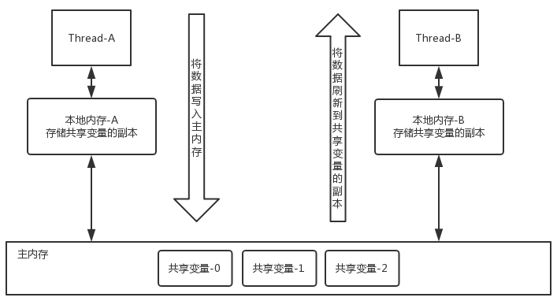
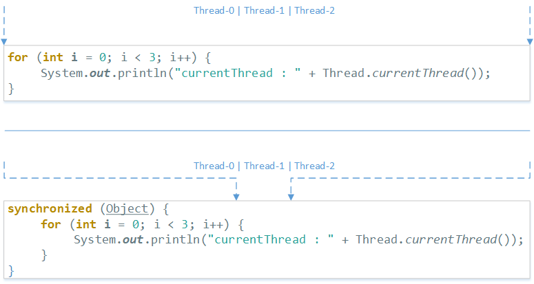
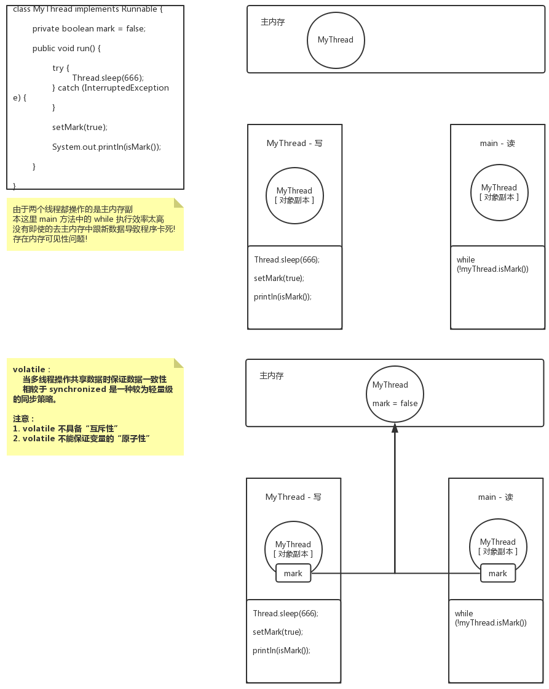

> ### volatileANDsynchronized

> 要了解 Java中的 volatile 首席要从线程间通讯开始



> 概念:

1. 对于声明了 volatile 的变量进行写的操作时, JVM 会向处理器(CPU) 发送一条 Lock 前缀的指令, 会将这个变量所在缓存行的数据写回到系统内存(`主内存`)
2. 在多处理器的情况下, 保持各个处理器缓存一致性的特点, 就会实现缓存一致性协议
3. 但是，就算写回到内存，如果其他处理器缓存的值还是旧的，再执行计算操作就会有问题。
4. 每个处理器通过嗅探在主内存上传播的数据来检查自己缓存的值是不是过期了
5. 当处理器发现自己缓存行对应的内存地址被修改，就会将当前处理器的缓存行设置成无效状态，当处理器对这个数据进行修改操作的时候，就会重新从系统内存中把数据读到处理器缓存里。
6. **总之 volatile 做的事情是: 在多线程执行中保证共享对象的一致性**


> synchronized



```java
public class Demo {
		
	private static int i = 0;	
	
	public static void main(String[] args) {
		synchronized(Demo.class) {
			i++;
		}
	}
	
}
```

> javap -c -v Demo.class	: 结果

```java
public static void main(java.lang.String[]);
    descriptor: ([Ljava/lang/String;)V
    flags: ACC_PUBLIC, ACC_STATIC
    Code:
      stack=2, locals=3, args_size=1
         0: ldc           #2                  // class Demo
         2: dup
         3: astore_1
         4: monitorenter
         5: getstatic     #3                  // Field i:I
         8: iconst_1
         9: iadd
        10: putstatic     #3                  // Field i:I
        13: aload_1
        14: monitorexit
        15: goto          23
        18: astore_2
        19: aload_1
        20: monitorexit
        21: aload_2
        22: athrow
        23: return
      Exception table:
         from    to  target type
             5    15    18   any
            18    21    18   any
      LineNumberTable:
        line 6: 0
        line 7: 5
        line 8: 13
        line 9: 23
      StackMapTable: number_of_entries = 2
        frame_type = 255 /* full_frame */
          offset_delta = 18
          locals = [ class "[Ljava/lang/String;", class java/lang/Object ]
          stack = [ class java/lang/Throwable ]
        frame_type = 250 /* chop */
          offset_delta = 4
```

```java
monitorenter	: 进入并获取对象监视器
monitorexit		: 释放并退出对象监视器
```

 1. synchronized获得并释放监视器, 如果两个线程使用了同一个对象锁，监视器能强制保证代码块同时只被一个线程所执行。

 2. volatile只是在线程内存和“主”内存间同步某个变量的值，而synchronized通过锁定和解锁某个监视器同步所有变量的值。

 3. 显然synchronized要比volatile消耗更多资源。

---

> #### volatile 的案例

```java
public class ThreadTest {

	public static void main(String[] args) {

		MyThread myThread = new MyThread();
		new Thread(myThread).start();
		
		while (!myThread.isMark()) {
		}
		
	}

}

class MyThread implements Runnable {

	private boolean mark = false;

	public void run() {

		try {
			Thread.sleep(666);
		} catch (InterruptedException e) {
		}

		setMark(true);
	
		System.out.println(isMark());
		
	}

}
```

> 解说:
>
> ​	由于两个线程都操作的是主内存副本, 这里 main 方法中的 while 执行效率太高
> ​	没有即使的去主内存中跟新数据导致程序卡死!	存在内存可见性问题!	



>  volatile : 
> ​    当多线程操作共享数据时保证数据一致性
> ​    相较于 synchronized 是一种较为轻量级的同步策略。

> 注意：

1. volatile 不具备“互斥性”
2. volatile 不能保证变量的“原子性”

