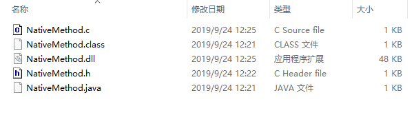
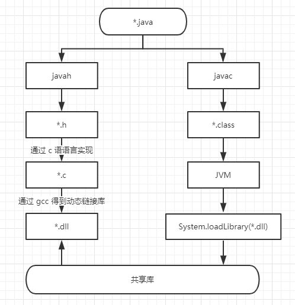

> ## java native jni 调用

> ##### 我们打开 java 源码进行查看时，常常可以看到有 native 修饰的方法

```java
@HotSpotIntrinsicCandidate
public final native Class<?> getClass();
```

* 以上方法是来自 jdk12 中的 Object 类中的实现
* 像 java 语言是不能直接获取到内存地址的，这个时候 java 开发者通过 native 关键字来调用到底层 C / C++
* 被@HotSpotIntrinsicCandidate标注的方法，在HotSpot中都有一套高效的实现，该高效实现基于CPU指令，运行时，HotSpot维护的高效实现会替代JDK的源码实现，从而获得更高的效率。

> ##### 下面我们来通过 native 来调用一下 java 底层吧

> 编写java入口程序

```java
public class NativeMethod {
    static {// 加载目录下的 NativeMethod.dll 文件
		System.loadLibrary("NativeMethod");
    }
	// 编写 Native 修饰的方法
    public static native void getMethod();
	// 直接在 main 方法中使用 Native 方法
	public static void main(String[] args) {
		new NativeMethod().getMethod();
    }
}
```

> 开始编译程序

```shell
javac NativeMethod.java
```

> 通过 javah 工具生成动态链接库头文件`*.h`

```shell
javah NativeMethod
```

> 通过 C 语言实现头文件

```c
#include "NativeMethod.h"
#include <jni.h>
#include <stdio.h>

JNIEXPORT void JNICALL Java_NativeMethod_getMethod (JNIEnv *env, jobject obj) {
	printf("Hello Native!\n");
	return;
}
```

> 最后通过 gcc 来编译 `*.c` 文件生成 `*.dll` 动态链接库

```shell
gcc -m64 -Wl,--add-stdcall-alias -I"C:\Program Files\Java\jdk1.8.0_201\include" -I"C:\Program Files\Java\jdk1.8.0_201\include\win32" -shared -o NativeMethod.dll NativeMethod.c
```

* C:\Program Files\Java\jdk1.8.0_201\include 可以看到在 `*.c` 文件中有引入 `#include <jni.h>`

> 开始运行程序就可以调用到底层了

```shell
$ java NativeMethod
Hello Native!
```

> 一共生成了哪些文件



> JNI 调用 C 流程图

