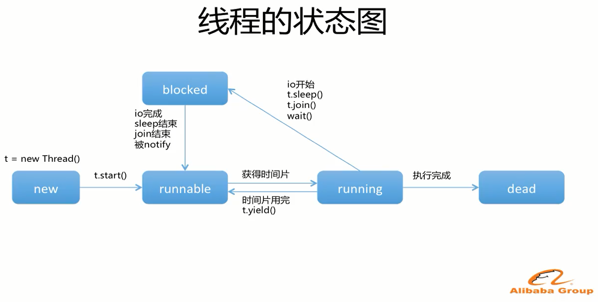

> ## 多线程


---



1. ###### 初始化( new ) : 创建线程对象

2. ###### 运行就绪( runnable ) : 获取执行资格, 但是无执行权

3. ###### 运行状态( running ) : 有执行资格, 有执行权

4. ###### 组赛状态( biocked ) : 没有执行资格也没有执行权

5. ###### 结束( dead ) : 对象无用等待垃圾回收


> ## 创建线程的三种方式

1. ##### 创建线程,方式一: 继承 Thread 类

   ​	步骤 : 
   ​		A: 自定义类,继承 Thread 类。
   ​		B: 重写 run()方法;
   ​			为什么是 run()方法呢?
   ​			不是类中的所有代码都需要被线程执行的。
   ​			而这个时候，为了区分哪些代码能够被线程执行
   ​			java 提供了 Thread 类中的 run()用来包含那些被线程执行的代码
   ​		C: 创建对象
   ​		D: 启动线程 调用 start()方法

``` java
public class MyThread extends Thread {
	@Override
	public void run() {
   		for (int i = 0; i < 3; i++) {
   			System.out.println("currentThread : " + Thread.currentThread());
   		}
   	}

   	public static void main(String[] args) {
   		MyThread myThread = new MyThread();
   		myThread.start();
	}
}
```

``` java
输出结果: 
	currentThread : Thread[Thread-0,5,main]
	currentThread : Thread[Thread-0,5,main]
	currentThread : Thread[Thread-0,5,main]
```

2. ##### 创建线程,方式二：实现 Runnable 接口 ( 推荐使用 )
    ​	步骤：
     ​           A:自定义类 MyRunnable 实现 Runnable 接口
     ​           B:重写 run()方法
     ​           C:创建 MyRunnable 类的对象
     ​           D:创建 Thread 类的对象，并把 C 步骤的对象作为构造参数传递

``` java
new Thread(() -> {
    for (int i = 0; i < 3; i++) {
        System.out.println("currentThread : " + Thread.currentThread());
    }
}).start();
```

```java
输出结果: 
    currentThread : Thread[Thread-0,5,main]
    currentThread : Thread[Thread-0,5,main]
    currentThread : Thread[Thread-0,5,main]
```

```java
两种实现线程的方法的区别：
		实现 Runnable 接口可以避免 java 中单一继承的局限性；
		适合多个相同程序的代码去处理同一个资源的情况，把线程同程序代码数据有效的分离
```

3. 创建线程的第三种方式: 实现 `Callable` 接口
   1. 定义类实现`Callable`接口
   2. 创建`FutureTask`定义好返回值
   3. 将`FutureTask`传入`Thread`类中
   4. 调用`Thread.start()`方法执行线程
   5. 线程执行完后调用`FutureTask.get()`方法获取到返回值

```java
public class TestCallable {

	public static void main(String[] args) {
		
		Call call = new Call();
		
		FutureTask<Integer> futureTask = new FutureTask<Integer>(call);
		
		new Thread(futureTask).start();// 多线程进行运算
		
		try {
			System.out.println("++");
			Integer sum = futureTask.get();// 等待futureTask线程执行后返回执行结果
			System.out.println(sum);
		} catch (Exception e) {
			e.printStackTrace();
		}
		
	}
	
}

class Call implements Callable<Integer> {

	public Integer call() throws Exception {
		Integer sum = 0;
		for (int i = 0; i < 9999; i++) {
			if (i % 2 == 0) sum += i;
		}
		return sum;
	}
	
}
```

> ### synchronized ( 同步 )

多线程安全问题的原因(也是我们以后判断一个程序是否有线程安全问题的依据)
​    A:是否有多线程环境
​    B:是否有共享数据
​    C:是否有多条语句操作共享数据

同步解决线程安全问题: 

```java
A:同步代码块
    synchronized(对象) {
    	// 需要被同步的代码;
    } 
	这里的锁对象可以是任意对象。 
B:同步方法
    把同步加在方法上。
    这里的锁对象是 this
C:静态同步方法
    把同步加在方法上。
    这里的锁对象是当前类的字节码文件对象(反射再讲字节码文件对象)
```
> #### 同步后的区别

---


> ### 计划任务 ( 了解 )

定时器 : 可以让我们在指定的时间作某一个事情 , 还可以重复的作, 定时任务 网上有三种这里举例 Timer 和 TimerTask 这两个类: 


```java
Timer timer = new Timer();// 创建定时器对象
timer.schedule(new TimerTask() {
    @Override
    public void run() {
        Runtime runtime = Runtime.getRuntime();
        try {
            runtime.exec("D:/FSC/FSCapture.exe");
        } catch (IOException e) {
            e.printStackTrace();
        }
    }
}, 3000, 2000); // 3000 : 三秒后执行, 2000 : 没隔两秒再次执行一次
```

> ### ThreadLocal

```java
ThreadLocal<String> threadLocal = new ThreadLocal<String>();

threadLocal.set("Thread-main-save()");

new Thread() {
    @Override
    public void run() {
        System.out.println(threadLocal.get() + "Thread:" + Thread.currentThread().getName());
    }
}.start();

System.out.println(threadLocal.get() + "Thread:" + Thread.currentThread().getName());
```

```java
输出结果为: 
    Thread-main-save() Thread:main
    null Thread:Thread-0
```

1. 一个底层由Map为数据结构的容器类: 该容器其特殊点在于 key : Thread, value : object


