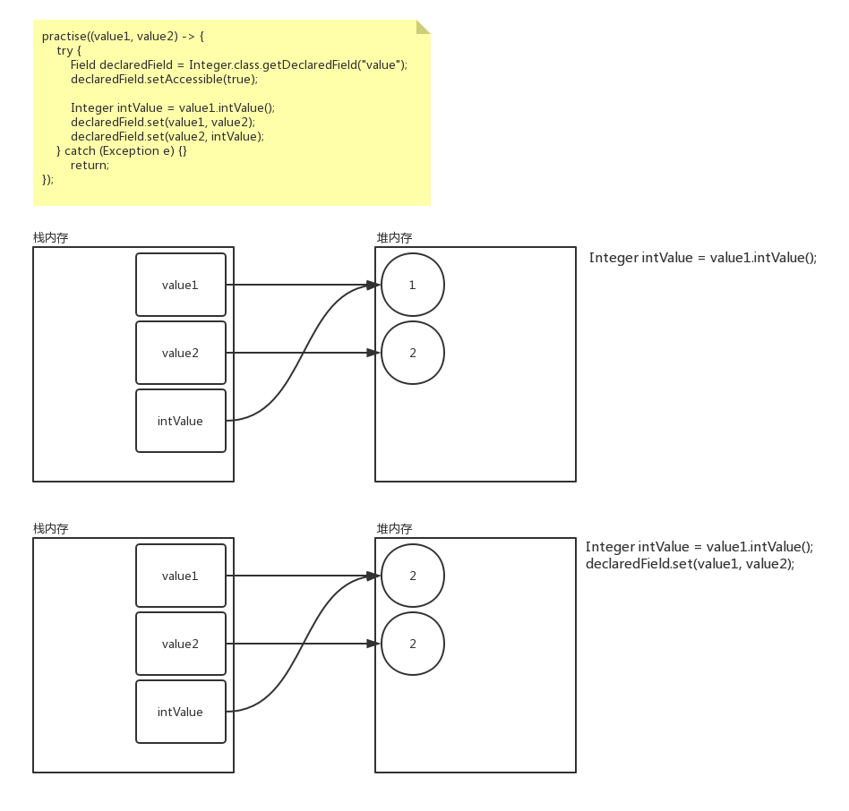

> ##### 题: 定义两个 Integer 对象传递给一个方法, 方法执行后两个 Integer 的值需要互相转换

```java
public static void practise(MyConsumer<Integer> consumer) {
	Integer value1 = 1;
	Integer value2 = 2;
	System.out.println("start: value1=" + value1 + ", value2=" + value2);
	consumer.accept(value1, value2);
	System.out.println("end: value1=" + value1 + ", value2=" + value2);
}
```

```java
@FunctionalInterface
public interface MyConsumer<T> {
	void accept (T value1, T value2);
}
```

---

> 编程方式一: 传值与传引用的区别

```java
practise((value1, value2) -> {
    Integer temp = value1;
    value1 = value2;
    value2 = temp;
    return;
});
```

```java
输入结果:
	start: value1=1, value2=2
	end: value1=1, value2=2
```

> 编程方式二: Integer 在 -127 ~ 128 之间的缓存

```java
practise((value1, value2) -> {
    try {
        Field declaredField = Integer.class.getDeclaredField("value");
        declaredField.setAccessible(true);

        Integer intValue = value1.intValue();
        declaredField.set(value1, value2);
        declaredField.set(value2, intValue);
    } catch (Exception e) {}
    return;
});
```

```java
输出结果: 
	start: value1=1, value2=2
	end: value1=2, value2=2
```



> 编程方式三: 清空缓存

```java
practise((value1, value2) -> {
    try {
        Field declaredField = Integer.class.getDeclaredField("value");
        declaredField.setAccessible(true);

        Integer intValue = new Integer(value1.intValue());
        declaredField.set(value1, value2);
        declaredField.set(value2, intValue);
    } catch (Exception e) {}
    return;
});
```

```java
输出结果: 
	start: value1=1, value2=2
	end: value1=2, value2=1
```

> #### 输出结果

```java
public static void main(String[] args) {
    int iVal = 1;
    double dVal = 1.0000000000000001;

    System.out.println("result:" + (iVal == dVal));
}
```

> 输出结果

```java
/**
 * int temp = i;
 * i = i + 1;
 * i = temp;
 */
int i = 0;
i = i++;
System.out.println(i);
```

* 这里存在的问题在于: `i++` 执行的操作是: `读` `-` `改` `-` `写`

---

> ### Arrays.asList(); 原理

```java
String[] aryString = {
    "JDK", "JRE", "JVM",
    "JavaME", "JavaSE", "JavaEE"
};

List<String> listString = Arrays.asList(aryString);

listString.forEach(System.out::println);

aryString[0] = "update";

listString.forEach(System.out::println);
```


