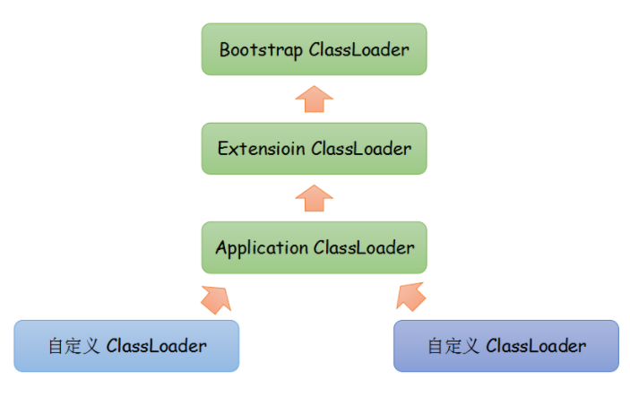

> ## java 类加载器 ( ClassLoader )


### JVM三种预定义类型类加载器

　　我们首先看一下JVM预定义的三种类型类加载器，当一个 JVM启动的时候，Java缺省开始使用如下三种类型类装入器：

```java
启动类加载器（Boostrap ClassLoader） 
	使用C++代码编写
	负责Java平台核心库的加载，如java.lang包
	无法直接获取

拓展类加载器（Extension ClassLoader） 
	负责将jdk_home/lib/ext目录下的jar包或-Djava.ext.dirs指定目录下的jar包装入工作库

系统类加载器（System ClassLoader） 
	负责classpath或-Djava.class.path所指的目录下的类与jar包装入工作

用户自定义加载器（User ClassLoader） 
	用户自己定义的加载器

除了以上列举的这几种类加载器，还有一种比较特殊的类型就是(线程上下文类加载器)，这个将在后面单独介绍。
```



> ### 我们先来获取这几个类加载器看看把

```java
/**
 * 获取 Bootstrap 加载器: 
 * 	像 String 类就属于 Bootstrap 加载器加载的,
 * 	? 之前学校有一个肖老师 , 我在问 Object 类中的 native 时他提到过 Java 是获取不了内存地址值的
 * 	要靠底层(C++)去实现
 */
private static void getBootstrap() {
	ClassLoader classLoader = String.class.getClassLoader();
	System.out.println(classLoader);		
}
```

``` java
输出结果: null
```

~~~ java
/**
 * 我们找到: Java\jdk1.8.0_112\jre\lib\ext\*.jar
 * 	随便找一个类去获取类加载器: 这里我找的是 >
 *	Java\jdk1.8.0_112\jre\lib\ext\sunec.jar\packageName\CurveDB.java
 */
private static void getExtension() {
	ClassLoader classLoader = CurveDB.class.getClassLoader();
	System.out.println(classLoader);
}
~~~

``` java
输出结果: sun.misc.Launcher$ExtClassLoader@28d93b30
```
``` java
/**
 * 获取系统加载器这里我们直接用自己写的类了
 */
private static void getAppClassLoader() {
	ClassLoader classLoader = ClassLoaderTest.class.getClassLoader();
	System.out.println(classLoader);		
}
```

``` java
输出结果: sun.misc.Launcher$AppClassLoader@2a139a55
```

> #### 线程上下文加载器

| 线程上下文加载器 | 在Thread类中有 SetGet 方法 |
| :-------------------------------------: | :-------------------------------: |
| ClassLoader getContextClassLoader() | 返回此Thread的上下文ClassLoader。 |
| setContextClassLoader(ClassLoader cl) | 设置此线程的上下文ClassLoader。   |

``` java
public class ThreadContextLoader extends Thread {
    @Override
	public void run() {
		System.out.println(getContextClassLoader());
	}
	public static void main(String args[]) throws Exception {
		ThreadContextLoader contextLoader = new ThreadContextLoader();
		contextLoader.start();
	}
}
```

``` java
输出结果: sun.misc.Launcher$AppClassLoader@2a139a55
```

1. 如果不做任何的设置，Java 应用的线程的上下文类加载器默认就是系统上下文类加载器。 
2. **使用线程上下文类加载器，可以在执行线程中抛弃双亲委派加载链模式使用线程上下文里的类加载器加载类。** 
3. 通过线程上下文来加载第三方库jndi实现，而不依赖于双亲委派。大部分java application服务器(jboss, tomcat..)也是采用contextClassLoader来处理web服务 
4. **一般来说，上下文类加载器要比当前类加载器更适合于框架编程，而当前类加载器则更适合于业务逻辑编程。** 

> 获取 tomcat 中 request 的类加载器

```html
<%
    ClassLoader requestClassLoader = request.getClass().getClassLoader();
	out.println(requestClassLoader);
%>
```

```
输出结果: java.net.URLClassLoader@4617c264
```

> #### 指定线程的类加载器

``` java
public class ThreadContextLoader extends Thread {
	@Override
	public void run() {
		setContextClassLoader(new LoaderClass("F:/tempfile"));
		ClassLoader loader = getContextClassLoader();
		try {
			Class<?> clazz = loader.loadClass("ClassLoaderDemo1");
			Object instance = clazz.newInstance();
			Method method = clazz.getMethod("demo");
			method.invoke(instance);
		} catch (Exception e) {
			e.printStackTrace();
		}
	}
	public static void main(String args[]) throws Exception {
		ThreadContextLoader contextLoader = new ThreadContextLoader();
		contextLoader.start();
	}
}
```

> ## 开始进入正题 类加载器的 父类委托机制


---

##### &nbsp;&nbsp;&nbsp;&nbsp;&nbsp;&nbsp;&nbsp;&nbsp;双亲委派模型工作过程是：如果一个类加载器收到类加载的请求，它首先不会自己去尝试加载这个类，而是把这个请求委派给父类加载器完成。每个类加载器都是如此，只有当父加载器在自己的搜索范围内找不到指定的类时（即`ClassNotFoundException`），子加载器才会尝试自己去加载。

## 为什么需要双亲委派模型(父类委托机制)？


> #### 为什么需要双亲委派模型呢？假设没有双亲委派模型，试想一个场景：
黑客自定义一个`java.lang.String`类，该`String`类具有系统的`String`类一样的功能，只是在某个函数稍作修改。比如`equals`函数，这个函数经常使用，如果在这这个函数中，黑客加入一些“病毒代码”。并且通过自定义类加载器加入到`JVM`中。此时，如果没有双亲委派模型，那么`JVM`就可能误以为黑客自定义的`java.lang.String`类是系统的`String`类，导致“病毒代码”被执行。

---

> ###### 而有了双亲委派模型，黑客自定义的`java.lang.String`类永远都不会被加载进内存。因为首先是最顶端的类加载器加载系统的`java.lang.String`类，最终自定义的类加载器无法加载`java.lang.String`类。


&nbsp;&nbsp;&nbsp;&nbsp;&nbsp;&nbsp;&nbsp;&nbsp;或许你会想，我在自定义的类加载器里面强制加载自定义的`java.lang.String`类，不去通过调用父加载器不就好了吗?确实，这样是可行。但是，在`JVM`中，判断一个对象是否是某个类型时，如果该对象的实际类型与待比较的类型的类加载器不同，那么会返回false。


举个简单例子：

> `ClassLoader1`、`ClassLoader2`都加载`java.lang.String`类，对应Class1、Class2对象。那么`Class1`对象不属于`ClassLoad2`对象加载的`java.lang.String`类型。

---

> ### 好吧我们开始之定义类加载器吧!

``` java
package com.znsd.classloader;

import java.io.FileInputStream;

public class LoaderClass extends ClassLoader {
	private String classPath;
	public LoaderClass(String classPath) {
		this.classPath = classPath;
	}
	private byte[] loadByte(String name) throws Exception {
		name = name.replaceAll("\\.", "/");
		FileInputStream fis = new FileInputStream(classPath + "/" + name + ".class");
		int len = fis.available();
		byte[] data = new byte[len];
		fis.read(data);
		fis.close();
		return data;
	}
	protected Class<?> findClass(String name) throws ClassNotFoundException {
		try {
			byte[] data = loadByte(name);
			return defineClass(name, data, 0, data.length);
		} catch (Exception e) {
			e.printStackTrace();
			throw new ClassNotFoundException();
		}
	}
}
```

> ##### 该类加载器未使用: 父类委托机制, 将他设置到线程上下文加载器就可以抛开父类委托机制查找 Class 了

```java
public static void main(String args[]) throws Exception {
	LoaderClass classLoader = new LoaderClass("F:/tempfile");
	Class<?> clazz = classLoader.loadClass("ClassLoaderDemo1");
	Object obj = clazz.newInstance();
		
	Method method = clazz.getMethod("demo");
	method.invoke(obj);
		
	System.out.println(obj.getClass().getClassLoader());
}
```


