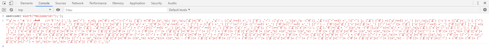
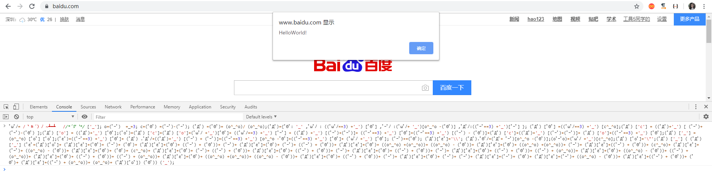
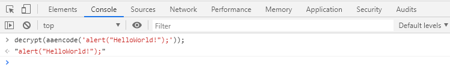

> ## JavaScript 表情包加密

* 阅读完本文后你可能会感觉到你对 JavaScript 的力量一无所知! 
* 下面来看看这是一种什么样的加密方式吧!
* 该加密方式的作者是来自日本的：[Yosuke HASEGAWA](http://utf-8.jp/)
* 他的项目地址：http://utf-8.jp/public/aaencode.html

> #### 我们通过该方法 加密一串 JS 代码: alert("HelloWorld!");

```javascript
function aaencode( text )
{
    var t;
    var b = [
		"(c^_^o)",
		"(ﾟΘﾟ)",
		"((o^_^o) - (ﾟΘﾟ))",
		"(o^_^o)",
		"(ﾟｰﾟ)",
		"((ﾟｰﾟ) + (ﾟΘﾟ))",
		"((o^_^o) +(o^_^o))",
		"((ﾟｰﾟ) + (o^_^o))",
		"((ﾟｰﾟ) + (ﾟｰﾟ))",
		"((ﾟｰﾟ) + (ﾟｰﾟ) + (ﾟΘﾟ))",
		"(ﾟДﾟ) .ﾟωﾟﾉ",
		"(ﾟДﾟ) .ﾟΘﾟﾉ",
		"(ﾟДﾟ) ['c']",
		"(ﾟДﾟ) .ﾟｰﾟﾉ",
		"(ﾟДﾟ) .ﾟДﾟﾉ",
		"(ﾟДﾟ) [ﾟΘﾟ]"
        ];
	var r = "ﾟωﾟﾉ= /｀ｍ´）ﾉ ~┻━┻   //*´∇｀*/ ['_']; o=(ﾟｰﾟ)  =_=3; c=(ﾟΘﾟ) =(ﾟｰﾟ)-(ﾟｰﾟ); "; 
	
	if( /ひだまりスケッチ×(365|３５６)\s*来週も見てくださいね[!！]/.test( text ) ){
		r += "X=_=3; ";
		r += "\r\n\r\n    X / _ / X < \"来週も見てくださいね!\";\r\n\r\n";
	}
    r += "(ﾟДﾟ) =(ﾟΘﾟ)= (o^_^o)/ (o^_^o);"+
        "(ﾟДﾟ)={ﾟΘﾟ: '_' ,ﾟωﾟﾉ : ((ﾟωﾟﾉ==3) +'_') [ﾟΘﾟ] "+
        ",ﾟｰﾟﾉ :(ﾟωﾟﾉ+ '_')[o^_^o -(ﾟΘﾟ)] "+
        ",ﾟДﾟﾉ:((ﾟｰﾟ==3) +'_')[ﾟｰﾟ] }; (ﾟДﾟ) [ﾟΘﾟ] =((ﾟωﾟﾉ==3) +'_') [c^_^o];"+
        "(ﾟДﾟ) ['c'] = ((ﾟДﾟ)+'_') [ (ﾟｰﾟ)+(ﾟｰﾟ)-(ﾟΘﾟ) ];"+
        "(ﾟДﾟ) ['o'] = ((ﾟДﾟ)+'_') [ﾟΘﾟ];"+
        "(ﾟoﾟ)=(ﾟДﾟ) ['c']+(ﾟДﾟ) ['o']+(ﾟωﾟﾉ +'_')[ﾟΘﾟ]+ ((ﾟωﾟﾉ==3) +'_') [ﾟｰﾟ] + "+
        "((ﾟДﾟ) +'_') [(ﾟｰﾟ)+(ﾟｰﾟ)]+ ((ﾟｰﾟ==3) +'_') [ﾟΘﾟ]+"+
        "((ﾟｰﾟ==3) +'_') [(ﾟｰﾟ) - (ﾟΘﾟ)]+(ﾟДﾟ) ['c']+"+
        "((ﾟДﾟ)+'_') [(ﾟｰﾟ)+(ﾟｰﾟ)]+ (ﾟДﾟ) ['o']+"+
        "((ﾟｰﾟ==3) +'_') [ﾟΘﾟ];(ﾟДﾟ) ['_'] =(o^_^o) [ﾟoﾟ] [ﾟoﾟ];"+
        "(ﾟεﾟ)=((ﾟｰﾟ==3) +'_') [ﾟΘﾟ]+ (ﾟДﾟ) .ﾟДﾟﾉ+"+
        "((ﾟДﾟ)+'_') [(ﾟｰﾟ) + (ﾟｰﾟ)]+((ﾟｰﾟ==3) +'_') [o^_^o -ﾟΘﾟ]+"+
        "((ﾟｰﾟ==3) +'_') [ﾟΘﾟ]+ (ﾟωﾟﾉ +'_') [ﾟΘﾟ]; "+
        "(ﾟｰﾟ)+=(ﾟΘﾟ); (ﾟДﾟ)[ﾟεﾟ]='\\\\'; "+
        "(ﾟДﾟ).ﾟΘﾟﾉ=(ﾟДﾟ+ ﾟｰﾟ)[o^_^o -(ﾟΘﾟ)];"+ 
		"(oﾟｰﾟo)=(ﾟωﾟﾉ +'_')[c^_^o];"+//TODO
        "(ﾟДﾟ) [ﾟoﾟ]='\\\"';"+ 
        "(ﾟДﾟ) ['_'] ( (ﾟДﾟ) ['_'] (ﾟεﾟ+";
    r += "(ﾟДﾟ)[ﾟoﾟ]+ ";
    for( var i = 0; i < text.length; i++ ){
        n = text.charCodeAt( i );
        t = "(ﾟДﾟ)[ﾟεﾟ]+";
		if( n <= 127 ){
			t += n.toString( 8 ).replace( /[0-7]/g, function(c){ return b[ c ] + "+ "; } );
		}else{
			var m = /[0-9a-f]{4}$/.exec( "000" + n.toString(16 ) )[0];
			t += "(oﾟｰﾟo)+ " + m.replace( /[0-9a-f]/gi, function(c){ return b[ parseInt( c,16 ) ] + "+ "; } );
		}
        r += t;

    }
    r += "(ﾟДﾟ)[ﾟoﾟ]) (ﾟΘﾟ)) ('_');";
    return r;
}
```

> #### 是的我们得到了一堆可爱的表情包!!!



```
ﾟωﾟﾉ= /｀ｍ´）ﾉ ~┻━┻   //*´∇｀*/ ['_']; o=(ﾟｰﾟ)  =_=3; c=(ﾟΘﾟ) =(ﾟｰﾟ)-(ﾟｰﾟ); (ﾟДﾟ) =(ﾟΘﾟ)= (o^_^o)/ (o^_^o);(ﾟДﾟ)={ﾟΘﾟ: '_' ,ﾟωﾟﾉ : ((ﾟωﾟﾉ==3) +'_') [ﾟΘﾟ] ,ﾟｰﾟﾉ :(ﾟωﾟﾉ+ '_')[o^_^o -(ﾟΘﾟ)] ,ﾟДﾟﾉ:((ﾟｰﾟ==3) +'_')[ﾟｰﾟ] }; (ﾟДﾟ) [ﾟΘﾟ] =((ﾟωﾟﾉ==3) +'_') [c^_^o];(ﾟДﾟ) ['c'] = ((ﾟДﾟ)+'_') [ (ﾟｰﾟ)+(ﾟｰﾟ)-(ﾟΘﾟ) ];(ﾟДﾟ) ['o'] = ((ﾟДﾟ)+'_') [ﾟΘﾟ];(ﾟoﾟ)=(ﾟДﾟ) ['c']+(ﾟДﾟ) ['o']+(ﾟωﾟﾉ +'_')[ﾟΘﾟ]+ ((ﾟωﾟﾉ==3) +'_') [ﾟｰﾟ] + ((ﾟДﾟ) +'_') [(ﾟｰﾟ)+(ﾟｰﾟ)]+ ((ﾟｰﾟ==3) +'_') [ﾟΘﾟ]+((ﾟｰﾟ==3) +'_') [(ﾟｰﾟ) - (ﾟΘﾟ)]+(ﾟДﾟ) ['c']+((ﾟДﾟ)+'_') [(ﾟｰﾟ)+(ﾟｰﾟ)]+ (ﾟДﾟ) ['o']+((ﾟｰﾟ==3) +'_') [ﾟΘﾟ];(ﾟДﾟ) ['_'] =(o^_^o) [ﾟoﾟ] [ﾟoﾟ];(ﾟεﾟ)=((ﾟｰﾟ==3) +'_') [ﾟΘﾟ]+ (ﾟДﾟ) .ﾟДﾟﾉ+((ﾟДﾟ)+'_') [(ﾟｰﾟ) + (ﾟｰﾟ)]+((ﾟｰﾟ==3) +'_') [o^_^o -ﾟΘﾟ]+((ﾟｰﾟ==3) +'_') [ﾟΘﾟ]+ (ﾟωﾟﾉ +'_') [ﾟΘﾟ]; (ﾟｰﾟ)+=(ﾟΘﾟ); (ﾟДﾟ)[ﾟεﾟ]='\\'; (ﾟДﾟ).ﾟΘﾟﾉ=(ﾟДﾟ+ ﾟｰﾟ)[o^_^o -(ﾟΘﾟ)];(oﾟｰﾟo)=(ﾟωﾟﾉ +'_')[c^_^o];(ﾟДﾟ) [ﾟoﾟ]='\"';(ﾟДﾟ) ['_'] ( (ﾟДﾟ) ['_'] (ﾟεﾟ+(ﾟДﾟ)[ﾟoﾟ]+ (ﾟДﾟ)[ﾟεﾟ]+(ﾟΘﾟ)+ (ﾟｰﾟ)+ (ﾟΘﾟ)+ (ﾟДﾟ)[ﾟεﾟ]+(ﾟΘﾟ)+ ((ﾟｰﾟ) + (ﾟΘﾟ))+ (ﾟｰﾟ)+ (ﾟДﾟ)[ﾟεﾟ]+(ﾟΘﾟ)+ (ﾟｰﾟ)+ ((ﾟｰﾟ) + (ﾟΘﾟ))+ (ﾟДﾟ)[ﾟεﾟ]+(ﾟΘﾟ)+ ((o^_^o) +(o^_^o))+ ((o^_^o) - (ﾟΘﾟ))+ (ﾟДﾟ)[ﾟεﾟ]+(ﾟΘﾟ)+ ((o^_^o) +(o^_^o))+ (ﾟｰﾟ)+ (ﾟДﾟ)[ﾟεﾟ]+((ﾟｰﾟ) + (ﾟΘﾟ))+ (c^_^o)+ (ﾟДﾟ)[ﾟεﾟ]+(ﾟｰﾟ)+ ((o^_^o) - (ﾟΘﾟ))+ (ﾟДﾟ)[ﾟεﾟ]+(ﾟΘﾟ)+ (ﾟΘﾟ)+ (c^_^o)+ (ﾟДﾟ)[ﾟεﾟ]+(ﾟΘﾟ)+ (ﾟｰﾟ)+ ((ﾟｰﾟ) + (ﾟΘﾟ))+ (ﾟДﾟ)[ﾟεﾟ]+(ﾟΘﾟ)+ ((ﾟｰﾟ) + (ﾟΘﾟ))+ (ﾟｰﾟ)+ (ﾟДﾟ)[ﾟεﾟ]+(ﾟΘﾟ)+ ((ﾟｰﾟ) + (ﾟΘﾟ))+ (ﾟｰﾟ)+ (ﾟДﾟ)[ﾟεﾟ]+(ﾟΘﾟ)+ ((ﾟｰﾟ) + (ﾟΘﾟ))+ ((ﾟｰﾟ) + (o^_^o))+ (ﾟДﾟ)[ﾟεﾟ]+(ﾟΘﾟ)+ ((o^_^o) - (ﾟΘﾟ))+ ((ﾟｰﾟ) + (o^_^o))+ (ﾟДﾟ)[ﾟεﾟ]+(ﾟΘﾟ)+ ((ﾟｰﾟ) + (ﾟΘﾟ))+ ((ﾟｰﾟ) + (o^_^o))+ (ﾟДﾟ)[ﾟεﾟ]+(ﾟΘﾟ)+ ((o^_^o) +(o^_^o))+ ((o^_^o) - (ﾟΘﾟ))+ (ﾟДﾟ)[ﾟεﾟ]+(ﾟΘﾟ)+ ((ﾟｰﾟ) + (ﾟΘﾟ))+ (ﾟｰﾟ)+ (ﾟДﾟ)[ﾟεﾟ]+(ﾟΘﾟ)+ (ﾟｰﾟ)+ (ﾟｰﾟ)+ (ﾟДﾟ)[ﾟεﾟ]+(ﾟｰﾟ)+ (ﾟΘﾟ)+ (ﾟДﾟ)[ﾟεﾟ]+(ﾟｰﾟ)+ ((o^_^o) - (ﾟΘﾟ))+ (ﾟДﾟ)[ﾟεﾟ]+((ﾟｰﾟ) + (ﾟΘﾟ))+ (ﾟΘﾟ)+ (ﾟДﾟ)[ﾟεﾟ]+((ﾟｰﾟ) + (o^_^o))+ (o^_^o)+ (ﾟДﾟ)[ﾟoﾟ]) (ﾟΘﾟ)) ('_');
```

> #### 然而这些表情包可没有你想象的那么可爱，他也同样具有杀伤力!!!



> #### 他对应的解密方法为

```javascript
function decrypt (text) {
	var evalPreamble = "(\uFF9F\u0414\uFF9F) ['_'] ( (\uFF9F\u0414\uFF9F) ['_'] (";
	var decodePreamble = "( (\uFF9F\u0414\uFF9F) ['_'] (";
	var evalPostamble = ") (\uFF9F\u0398\uFF9F)) ('_');";
	var decodePostamble = ") ());";

	// strip beginning/ending space.
	text = text.replace(/^\s*/, "").replace(/\s*$/, "");

	// returns empty text for empty input.
	if (/^\s*$/.test(text)) {
		return "";
	}
	// check if it is encoded.
	if (text.lastIndexOf(evalPreamble) < 0) {
		throw new Error("Given code is not encoded as aaencode.");
	}
	if (text.lastIndexOf(evalPostamble) != text.length - evalPostamble.length) {
		throw new Error("Given code is not encoded as aaencode.");
	}

	var decodingScript = text.replace(evalPreamble, decodePreamble)
							 .replace(evalPostamble, decodePostamble);
	return eval(decodingScript);
}
```

