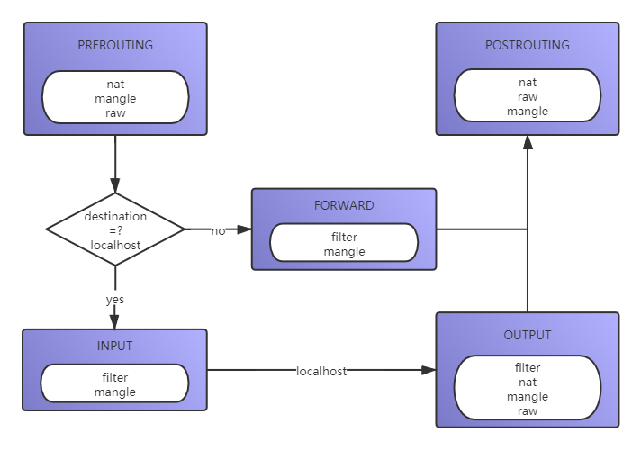

> iptables 的三张表

| 表名   | 链                                              | 作用                                                         |
| ------ | ----------------------------------------------- | ------------------------------------------------------------ |
| filter | INPUT、FORWARD、OUTPUT                          | 过滤数据包 内核模块：iptables_filter                         |
| nat    | PREROUTING、POSTROUTING、OUTPUT                 | 用于网络地址转换（IP、端口） 内核模块：iptable_nat           |
| mangle | PREROUTING、POSTROUTING、INPUT、OUTPUT、FORWARD | 修改数据包的服务类型、TTL、并且可以配置路由实现QOS内核模块：iptable_mangle(别看这个表这么麻烦，咱们设置策略时几乎都不会用到它) |
| raw    | OUTPUT、PREROUTING                              | 决定数据包是否被状态跟踪机制处理 内核模块：iptable_raw       |



> iptables 规则组成

* 数据包控制
  * `ACCEPT` 允许数据包通过
  * `DROP` 直接丢弃数据包，不给任何回应信息
  * `REJECT` 拒绝数据包通过，必要时会给数据发送端一个响应的信息
* 数据包改写
  * `SNAT` 发起端的数据包改写（发送）
  * `DNAT` 目标端的数据包改写（接收）
* 信息记录
  * `LOG` 在 `/var/log/messages` 文件中记录日志信息，然后将数据包传递给下一条规则

> 查询表数据

```shell
# 参数
# -t  要操作的表默认 filter
#	  table to manipulate (default: `filter')
# -n  输出地址和端口
#     numeric output of addresses and ports
# -L  以列表形式展示
#     List the rules in a chain or all chains
iptables -t filter -nL
```

> 添加表数据

```shell
# -I 			插入一条规则
# -A			追加一条规则
# -s <ip>		指定源地址
# INPUT 		在 INPUT 这条链上插入
# -p tcp 		指定tcp协议
# --dport 80 	指定端口
# -j ACCEPT 	指定处理方式（允许数据包通过）

### ---- 指令块

# 允许那个端口访问
iptables -I INPUT -p tcp --dport 80 -j ACCEPT
# 指定端口段
iptables -I INPUT -p tcp --dport 10:22 -j ACCEPT
# 接收其他机器发来的 ping 
iptables -I INPUT -p icmp -j ACCEPT
# 给所有其他的协议都拒绝
iptables -A INPUT -j REJECT
# 允许本机访问 lo
iptables -I INPUT -i lo -j ACCEPT
# 给外出包放行
iptables -I INPUT -m state --state ESTABLISHED,RELATED -j ACCEPT

### ---- 

# 再拒绝了所有其他包的情况下，允许某一台机器访问某一个端口
iptables -I INPUT -p tcp -s 192.110.110.110 --dport 80 -j ACCEPT
# 允许指定网段的访问我们的服务
iptables -A INPUT -s 192.110.110.0/24 -j ACCEPT

# 拉黑一个ip
iptables -I INPUT -s 129.204.81.5 -j DROP
```

> 删除表数据

```shell
iptables -D INPUT -p tcp --dport 80 -j ACCEPT
# 删除input的第6条规则,规则从1开始别删除错了
iptables -D INPUT 6
# 清空 filter表INPUT所有规则
iptables -F INPUT
# 清空表中的所有规则 def: filter
iptables -F
```

> iptables 匹配包的状态
>
> 指定要匹配包的的状态，当前有4种状态可用：INVALID，ESTABLISHED，NEW和RELATED。

* `INVALID `
  * 意味着这个包没有已知的流或连接与之关联，也可能是它包含的数据或包头有问题。
* `ESTABLISHED`
  * 意思是包是完全有效的，而且属于一个已建立的连接，这个连接的两端都已经有数据发送。
* `NEW`
  * 表示包将要或已经开始建立一个新的连接，或者是这个包和一个还没有在两端都有数据发送的连接有关。
* `RELATED`
  * 说明包正在建立一个新的连接，这个连接是和一个已建立的连接相关的。
  * 比如，FTP data transfer，ICMP error 和一个TCP或UDP连接相关。注意NEW状态并不在试图建立新连接的TCP包里寻找SYN标记，因此它不应该不加修改地用在只有一个防火墙或在不同的防火墙之间没有启用负载平衡的地方。

> iptables 配置文件

```shell
# 将目前的 iptables 的配置导出成文件
iptables-save > /etc/sysconfig/iptables
# 将该文件中的配置导入到 iptables 中并生效
iptables-restore < /etc/sysconfig/iptables
```

> 也可以通过配置文件配置哪些ip有哪些端口的访问权限
>
> 在 *filter 段中添加

```shell
# Generated by iptables-save v1.6.1 on Tue Jul 21 10:05:54 2020
*filter
:INPUT ACCEPT [1580647:217518668]
:FORWARD DROP [0:0]
:OUTPUT ACCEPT [1713072:241411778]
:DOCKER - [0:0]
:DOCKER-ISOLATION-STAGE-1 - [0:0]
:DOCKER-ISOLATION-STAGE-2 - [0:0]
:DOCKER-USER - [0:0]
-A INPUT -i lo -j ACCEPT
-A INPUT -p icmp -j DROP
-A FORWARD -j DOCKER-USER
-A FORWARD -j DOCKER-ISOLATION-STAGE-1
-A FORWARD -o docker0 -m conntrack --ctstate RELATED,ESTABLISHED -j ACCEPT
-A FORWARD -o docker0 -j DOCKER
-A FORWARD -i docker0 ! -o docker0 -j ACCEPT
-A FORWARD -i docker0 -o docker0 -j ACCEPT
-A DOCKER-ISOLATION-STAGE-1 -i docker0 ! -o docker0 -j DOCKER-ISOLATION-STAGE-2
-A DOCKER-ISOLATION-STAGE-1 -j RETURN
-A DOCKER-ISOLATION-STAGE-2 -o docker0 -j DROP
-A DOCKER-ISOLATION-STAGE-2 -j RETURN
-A DOCKER-USER -j RETURN

#定义白名单变量名
-N whitelist
#设置白名单ip段
-A whitelist -s 110.110.110.0 -j ACCEPT
-A whitelist -s 110.110.110.1 -j ACCEPT

-A INPUT -m state --state RELATED,ESTABLISHED -j ACCEPT
-A INPUT -p icmp -j whitelist
-A INPUT -i lo -j ACCEPT

#开放http/https端口外界访问
-A INPUT -p tcp -m state --state NEW -m tcp --dport 80 -j ACCEPT
-A INPUT -m state --state NEW -m tcp -p tcp --dport 8443 -j ACCEPT
-A INPUT -m state --state NEW -m tcp -p tcp --dport 443 -j ACCEPT

#系统远程连接及数据库端口规定白名单ip才可访问
-A INPUT -p tcp -m state --state NEW -m tcp --dport 22 -j whitelist
-A INPUT -p tcp -m state --state NEW -m tcp --dport 1521 -j whitelist
-A INPUT -p tcp -m state --state NEW -m tcp --dport 8080 -j whitelist
-A INPUT -p tcp -m state --state NEW -m tcp --dport 3306 -j whitelist

# 这两条的意思是在INPUT表和FORWARD表中拒绝所有其他不符合上述任何一条规则的数据包。
-A INPUT -j REJECT --reject-with icmp-host-prohibited
-A FORWARD -j REJECT --reject-with icmp-host-prohibited

COMMIT
# Completed on Tue Jul 21 10:05:54 2020
# Generated by iptables-save v1.6.1 on Tue Jul 21 10:05:54 2020
*nat
:PREROUTING ACCEPT [389876:14940139]
:INPUT ACCEPT [169458:8577820]
:OUTPUT ACCEPT [201586:12836367]
:POSTROUTING ACCEPT [201586:12836367]
:DOCKER - [0:0]
-A PREROUTING -m addrtype --dst-type LOCAL -j DOCKER
-A OUTPUT ! -d 127.0.0.0/8 -m addrtype --dst-type LOCAL -j DOCKER
-A POSTROUTING -s 172.17.0.0/16 ! -o docker0 -j MASQUERADE
-A DOCKER -i docker0 -j RETURN
COMMIT
```

> 追加指令

```shell
# 当所用的云服务器是按量付费时，就需要限制流量使用量以避免大额的流量费。
# 如下两行命令，即可启动流量配额上限设置：
$ iptables -A OUTPUT -p tcp -m quota --quota 1024000 -j ACCEPT
$ iptables -A OUTPUT -p tcp -j DROP

# 禁止服务器访问特定网站
# 如果网址域名中包括了字符串 "github"，则会被 iptables 直接拒绝
$ iptables -A INPUT -m string --algo kmp --string "github" -j DROP

# connlimit 限制每一个客户端ip的并发连接数。
# connlimit-above n 设置并发个数
$ iptables -I INPUT -p tcp -syn -dport 80 -m commlimit -connlimit-above 100 -j REJECT

# 配置 icmp 协议在 1 分钟以内只允许 10 次
#(满足一分钟10次就放行)
iptables -A INPUT -p icmp -m icmp -m limit --limit 1/m --limit-burst 10 -j ACCEPT
#(其他没有匹配到上一条规则的全部拦截)
iptables -A INPUT -p icmp -j DROP

#拦截工作日工作时间不能上qq
iptables -I FORWARD -s 10.10.0.0/24 -m string --string "qq.com" -m time --timestart 8:15 --timestop 20:30 --days Mon,Tue,Wed,Thu,Fri,Sat -j DROP
```

> SNAT DNAT 没有实际的操作过先不记录了


> https://wangchujiang.com/linux-command/c/iptables.html
