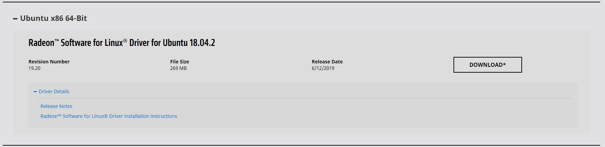
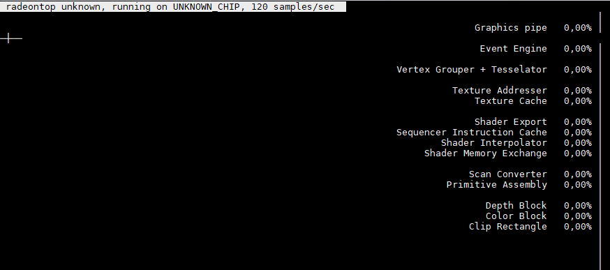

> ## Ubuntu 安装 AMD GPU 驱动

> #### 环境申明

* Ubuntu18.04
* AMD-RX580 显卡

> #### AMD 官网下载驱动

```http
https://www.amd.com/en/support
```



> #### 将驱动上传到 Ubuntu 系统并解压

```shell
$ cd ~/Downloads
$ tar -Jxvf amdgpu-pro-YY.XX-NNNNNN.tar.xz
$ cd ~/Downloads/amdgpu-pro-YY.XX-NNNNNN
```

> #### 开始安装 AMD 显卡驱动

```shell
$ ./amdgpu-pro-install -y
```

> 安装 radeontop 显示 AMD GPU 使用情况

```shell
$ apt install radeontop

$ radeontop
```

