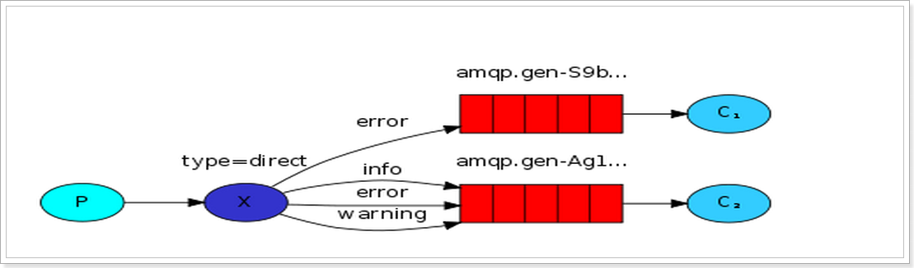
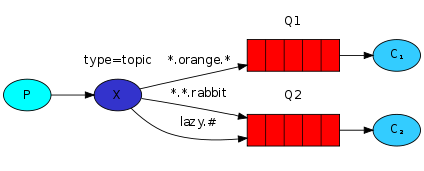

> ## RabbitMQ 三种 Exchange 模式


> 生产者 **`fanout`**

```java
private static final String EXCHANGE_NAME = "test_exchange_fanout";

Connection connection = ConnectionUtil.getConnection();
Channel channel = connection.createChannel();

// 声明交换机
channel.exchangeDeclare(EXCHANGE_NAME, "fanout"); //指定分发类型为fanout

// 发送消息
String msg = "hello rebbitmq";
channel.basicPublish(EXCHANGE_NAME, "", null, msg.getBytes());
System.out.println("发送消息：" + msg);
```

> 消费者

```java
private static final String SMS_QUEUE_NAME = "queue_name";
private static final String EXCHANGE_NAME = "test_exchange_fanout";

// 获取链接对象
Connection connection = ConnectionUtil.getConnection();
// 创建渠道
Channel channel = connection.createChannel();

// 声明队列
channel.queueDeclare(SMS_QUEUE_NAME, false, false, false, null);
channel.queueBind(SMS_QUEUE_NAME, EXCHANGE_NAME, "");

Consumer consumer = new DefaultConsumer(channel) {
    @Override
    public void handleDelivery(String consumerTag, Envelope envelope, AMQP.BasicProperties properties, byte[] body) throws IOException {
        String msg = new String(body, "UTF-8");
        System.out.println("reciver1 msg :" + msg);

        // 手动回执消息
        channel.basicAck(envelope.getDeliveryTag(), false);
    }
};
channel.basicConsume(SMS_QUEUE_NAME, false, consumer);
```

---



> 生产者 **`direct`**

```java
private static final String EXCHANGE_NAME = "test_exchange_direct";

Connection connection = ConnectionUtil.getConnection();

Channel channel = connection.createChannel();

// 声明交换机
channel.exchangeDeclare(EXCHANGE_NAME, "direct"); //指定分发类型为direct

// 发送消息
String msg = "hello direct";
// 指定路由key
String routingKey = "info";

channel.basicPublish(EXCHANGE_NAME, routingKey, null, msg.getBytes());
System.out.println("发送消息：" + msg);
```

> 消费者

```java
private static final String SMS_QUEUE_NAME = "sms_queue_name";
private static final String EXCHANGE_NAME = "test_exchange_direct";

Connection connection = ConnectionUtil.getConnection();

Channel channel = connection.createChannel();

// 声明队列
channel.queueDeclare(SMS_QUEUE_NAME, false, false, false, null);

channel.basicQos(1);

// 指定路由key
// 绑定队列到交换机
channel.queueBind(SMS_QUEUE_NAME, EXCHANGE_NAME, "info");// 绑定路由key
channel.queueBind(SMS_QUEUE_NAME, EXCHANGE_NAME, "error");// 绑定路由key
channel.queueBind(SMS_QUEUE_NAME, EXCHANGE_NAME, "warning");// 绑定路由key

Consumer consumer = new DefaultConsumer(channel) {
    @Override
    public void handleDelivery(String consumerTag, Envelope envelope, AMQP.BasicProperties properties, byte[] body) throws IOException {
        String msg = new String(body, "UTF-8");
        System.out.println("reciver1 msg :" + msg);

        try {
            Thread.sleep(2000);
        } catch (InterruptedException e) {
            e.printStackTrace();
        } finally {
            // 手动回执消息
            channel.basicAck(envelope.getDeliveryTag(), false);
        }
    }
};
channel.basicConsume(SMS_QUEUE_NAME, false, consumer);
```

---



> 生产者**`topic`**

```java
Connection connection = ConnectionUtil.getConnection();

Channel channel = connection.createChannel();

final String EXCHANGE_NAME = "test_exchange_topic";

// 声明交换机
channel.exchangeDeclare(EXCHANGE_NAME, "topic"); //指定分发类型为topic

// 发送消息
String msg = "RebbitMQ";
// topic指定路由key
channel.basicPublish(EXCHANGE_NAME, "goods.add", null, msg.getBytes());
```

> 消费者`1`

```java
Connection connection = ConnectionUtil.getConnection();
Channel channel = connection.createChannel();

channel.basicQos(1);

final String SMS_QUEUE_NAME = "queue_name_topic_1";
final String EXCHANGE_NAME = "test_exchange_topic";

// 声明队列
channel.queueDeclare(SMS_QUEUE_NAME, false, false, false, null);

// 绑定路由key
// 绑定队列到交换机
channel.queueBind(SMS_QUEUE_NAME, EXCHANGE_NAME, "goods.#");// topic模式

Consumer consumer = new DefaultConsumer(channel) {
    @Override
    public void handleDelivery(String consumerTag, Envelope envelope, AMQP.BasicProperties properties, byte[] body) throws IOException {
        String msg = new String(body, "UTF-8");
        System.out.println("reciver1 msg :" + msg);
        channel.basicAck(envelope.getDeliveryTag(), false);
    }
};

channel.basicConsume(SMS_QUEUE_NAME, false, consumer);
```

> 消费者`2`

```java
Connection connection = ConnectionUtil.getConnection();
Channel channel = connection.createChannel();

channel.basicQos(1);

final String SMS_QUEUE_NAME = "queue_name_topic_2";
final String EXCHANGE_NAME = "test_exchange_topic";

// 声明队列
channel.queueDeclare(SMS_QUEUE_NAME, false, false, false, null);

// 绑定路由key
// 绑定队列到交换机
channel.queueBind(SMS_QUEUE_NAME, EXCHANGE_NAME, "goods.add");// topic模式

Consumer consumer = new DefaultConsumer(channel) {
    @Override
    public void handleDelivery(String consumerTag, Envelope envelope, AMQP.BasicProperties properties, byte[] body) throws IOException {
        String msg = new String(body, "UTF-8");
        System.out.println("reciver2 msg :" + msg);
        channel.basicAck(envelope.getDeliveryTag(), false);
    }
};

channel.basicConsume(SMS_QUEUE_NAME, false, consumer);
```

| 符号 | 描述     |
| ---- | -------- |
| #    | 任意字符 |
| *    | 一个字符 |

