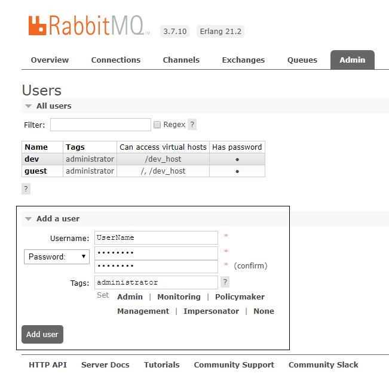
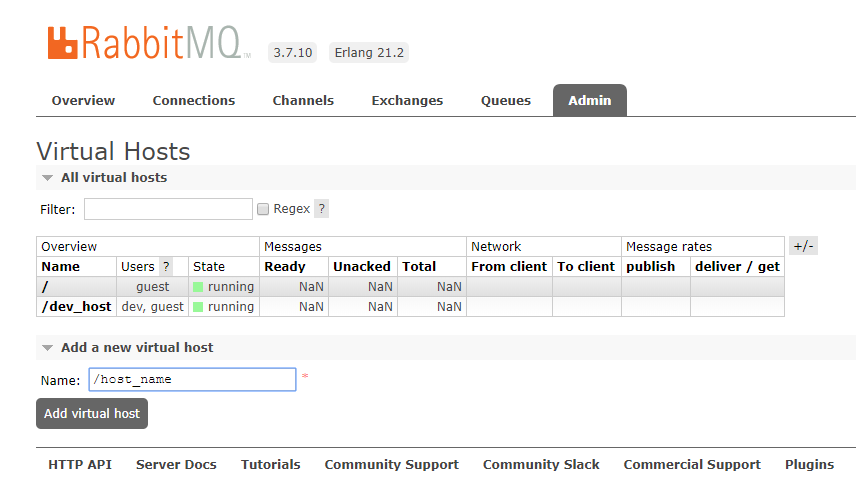
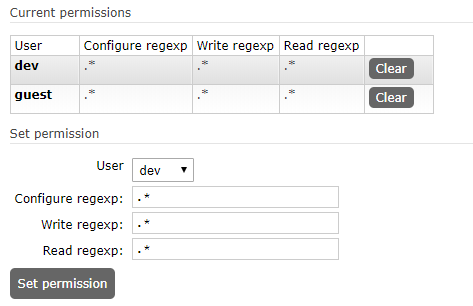

> ## RabbitMQ User Manager

> 安装成功`访问` : `http://localhost:15672/`

> RabbitMQ 默认登录用户
>
> | 账号  | 密码  |
> | ----- | ----- |
> | guest | guest |

> 添加用户

> 添加一个 RabbitMQ 容器

> 命名一般已: `/` 开头

> 添加后点击: `/host_name` 在打开的页面中添加用户

