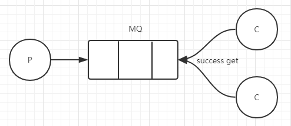

> ## RabbitMQ work



> ##### 等消费者消费完成后再去拿消息

> ​	现在有 2 个消费者，所有的偶数的消息都是繁忙的，而奇数则是轻松的。按照轮询的方式，偶数的任务交给了第一个消费者，所以一直在忙个不停。奇数的任务交给另一个消费者，则立即完成任务，然后闲得不行。
>
> ​	为了解决这个问题，我们使用`basicQos( prefetchCount = 1)`方法，来限制RabbitMQ只发不超过 1 条的消息给同一个消费者。当消息处理完毕后，有了反馈ack，才会进行第二次发送。(也就是说需要手动反馈给Rabbitmq )还有一点需要注意，使用公平分发，必须关闭自动应答，改为手动应答。

> 生产者

```java
Connection connection = AmqpUtils.getConnection();

Channel channel = connection.createChannel();

channel.queueDeclare(SIMPLE_QUEUE, false, false, false, null);

channel.basicQos(1);

for (int i = 0; i < 1000 ; i++) {
    String msg = "hello world rabbitmq :: " + i;

    channel.basicPublish("", TEST_SIMPLE_QUEUE, null, msg.getBytes());
}
channel.close();
connection.close();
```

> channel.basicQos(1); :: 限制发送给同一个消费者不得超过一条消息

> 消费者

```java
// 创建连接
Connection connection = AmqpUtils.getConnection();

// 创建频道
Channel channel = connection.createChannel();

channel.basicQos(1);

Consumer consumer = new DefaultConsumer(channel) {
    @Override
    public void handleDelivery(String consumerTag, Envelope envelope, AMQP.BasicProperties properties, byte[] body)
        throws IOException {
        if ("seleep".equals(name)) {
            try {
                Thread.sleep(100);
            } catch (InterruptedException e) {}
        }

        String message = new String(body, "UTF-8");
        System.out.println(" [x] Received '" + message + "' :: " + name);
        channel.basicAck(envelope.getDeliveryTag(), false);
    }
};
channel.basicConsume(TEST_SIMPLE_QUEUE, false, consumer);
```

> String basicConsume(String var1, boolean var2, Consumer var3); :: var2 自动应答 ( 自动获取 )

> channel.basicAck(envelope.getDeliveryTag(), false); :: 手动应答

---

#### Message durability（消息持久化）

- 我们已经了解了如何确保即使消费者死亡，任务也不会丢失。但是`如果RabbitMQ服务器停止`，我们的任务仍将会丢失。当RabbitMQ退出或者崩溃，将会丢失队列和消息。为了保证消息不被丢失，我们必须把“队列”和“消息”设为持久化。

```java
  // 设置消息持久化
  boolean durable = true;
  channel.queueDeclare("test_work_queue", durable, false, false, null);
```

- 如果直接将程序里面的false改成true程序会出现异常

```java
  channel error; protocol method: #method<channel.close>(reply-code=406, reply-text=PRECONDITION_FAILED - inequivalent arg 'durable' for queue 'test_queue_work'
```

- RabbitMQ不允许使用不同的参数设定重新定义已经存在的队列，并且会向尝试如此做的程序返回一个错误。一个快速的解决方案就是声明一个不同名字的队列，比如task_queue。