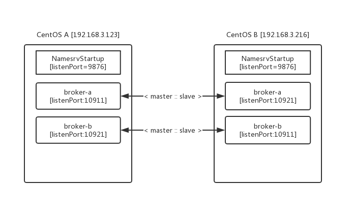
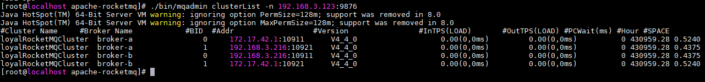

> ## 02-RocketMQ-clusterList.md



> 两台服务器中分别安装好RocketMQ

* 创建存储rocketmq数据的目录

```shell
# 192.168.3.236
mkdir -p /data/rocketmq/store/{rootdir-a-m,commitlog-a-m,rootdir-b-s,commitlog-b-s}
# 192.168.3.237
mkdir -p /data/rocketmq/store/{rootdir-b-m,commitlog-b-m,rootdir-a-s,commitlog-a-s}
```

>  **conf目录下配置文件：**
>
>  **2m-2s-async：**2master，2slave，异步复制数据，其中有配置文件：

```shell
[root@localhost 2m-2s-async]# pwd
/usr/local/apache-rocketmq/conf/2m-2s-async
[root@localhost 2m-2s-async]# ll
total 24
-rw-r--r--. 1 root root 929 Mar  1 02:37 broker-a_cp.properties
-rw-r--r--. 1 root root 845 Mar  1 02:47 broker-a.properties
-rw-r--r--. 1 root root 922 Feb 28 02:55 broker-a-s.properties
-rw-r--r--. 1 root root 929 Feb 28 02:55 broker-b.properties
-rw-r--r--. 1 root root 922 Mar  1 02:53 broker-b-s_cp.properties
-rw-r--r--. 1 root root 470 Mar  1 02:55 broker-b-s.properties
```

* 编辑第`CentOS A`master配置文件broker-a.properties

```shell
#集群名称
brokerClusterName=loyalRocketMQCluster
#broker名称
brokerName=broker-a
#brokerId，0表示broker是master,大于0表示是slave
brokerId=0
#删除文件时间点，默认凌晨 4点
deleteWhen=04
# Broker 对外服务的监听端口
listenPort=10911
#nameServer地址，分号分割
namesrvAddr=192.168.3.236:9876;192.168.3.237:9876
# 删除文件时间点，默认凌晨 4点
deleteWhen=04
#文件保留时间，默认 48 小时
fileReservedTime=72
#broker角色 异步master
brokerRole=ASYNC_MASTER
# 刷盘方式 ASYNC_FLUSH 异步刷盘
flushDiskType=ASYNC_FLUSH
#存储路径
storePathRootDir=/data/rocketmq/store/rootdir-a-m
storePathCommitLog=/data/rocketmq/store/commitlog-a-m
# 是否允许 Broker 自动创建Topic
autoCreateTopicEnable=true
# 是否允许 Broker 自动创建订阅组
autoCreateSubscriptionGroup=true
```

* 编辑`CentOS A`master（broker-b）的slave配置文件:broker-b-s.properties

```shell
brokerClusterName=loyalRocketMQCluster
# slave的brokerName必须与master的名称一样
brokerName=broker-b
listenPort=10921
namesrvAddr=192.168.3.236:9876;192.168.3.237:9876
# brokerId大于0表示slave
brokerId=1
deleteWhen=04
fileReservedTime=72
# 从服务
brokerRole=SLAVE
storePathRootDir=/data/rocketmq/store/rootdir-b-s
storePathCommitLog=/data/rocketmq/store/commitlog-b-s
autoCreateTopicEnable=true
autoCreateSubscriptionGroup=true
flushDiskType=ASYNC_FLUSH
```

* 编辑`CentOS B`主机上的RocketMQ配置文件，在2m-2s-asyn目录下

```shell
#broker-b.properties
brokerClusterName=loyalRocketMQCluster
brokerName=broker-b
brokerIP1=192.168.3.237
brokerId=0
listenPort=10911
namesrvAddr=192.168.3.236:9876;192.168.3.237:9876
deleteWhen=04
fileReservedTime=72
brokerRole=ASYNC_MASTER
storePathRootDir=/data/rocketmq/store/rootdir-b-m
storePathCommitLog=/data/rocketmq/store/commitlog-b-m
autoCreateTopicEnable=true
autoCreateSubscriptionGroup=true
flushDiskType=ASYNC_FLUSH
```

```shell
# broker-a-s.properties
brokerClusterName=loyalRocketMQCluster
brokerName=broker-a
listenPort=10921
namesrvAddr=192.168.3.236:9876;192.168.3.237:9876
brokerId=1
deleteWhen=04
fileReservedTime=72
brokerRole=SLAVE
storePathRootDir=/data/rocketmq/store/rootdir-a-s
storePathCommitLog=/data/rocketmq/store/commitlog-a-s
autoCreateTopicEnable=true
autoCreateSubscriptionGroup=true
flushDiskType=ASYNC_FLUSH
```

* 分别启动两服务，先启动namesrv再启动broker

```shell
#在192.168.3.236 RocketMQ安装目录下：
#启动名服务器
nohup sh bin/mqnamesrv &
#启动broker-a
nohup sh bin/mqbroker -c conf/2m-2s-async/broker-a.properties >/dev/null 2>&1 &
#启动broker-b的slave
nohup sh bin/mqbroker -c conf/2m-2s-async/broker-b-s.properties >/dev/null 2>&1 &
```

```shell
#在192.168.3.237 RocketMQ安装目录下：
#启动名服务器
nohup sh bin/mqnamesrv &
#启动broker-b
nohup sh bin/mqbroker -c conf/2m-2s-async/broker-b.properties >/dev/null 2>&1 &
#启动broker-a的slave
nohup sh bin/mqbroker -c conf/2m-2s-async/broker-a-s.properties >/dev/null 2>&1 &
```

> 查询集群状态



> 添加`RocketMQ`控制台

1. 在`github`上找到:: [rocketmq-externals > rocketmq-console](https://github.com/apache/rocketmq-externals)
2. 编译项目获得`jar`包(rocketmq-console-ng-1.0.0.jar)
3. 运行`jar`包并且访问项目

```shell
# 运行jar包，指定端口及名称服务器集群地址
nohup java -jar ./rocketmq-console-ng-1.0.0.jar --server.port=8080 --rocketmq.config.namesrvAddr=ip:9876,ip:9876 &
```

> ##### 注意:: 

1. `master` 和 `slave` 的 `brokerName` 需要配置一致
2. `listenPort`连个`broker`服务端口值最好像差`10`个数
3. 在多个`NamesrvStartup` 时 `RocketMQ In Java`
   1. 需要用`;`分割`producer.setNamesrvAddr("192.168.3.236:9876;192.168.3.123:9876");`

