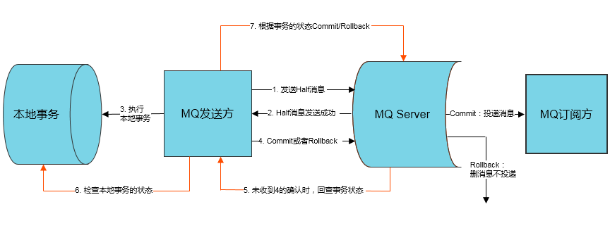
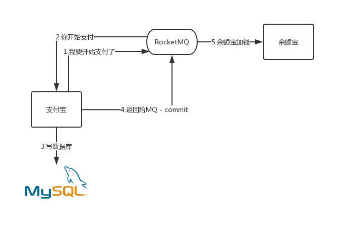
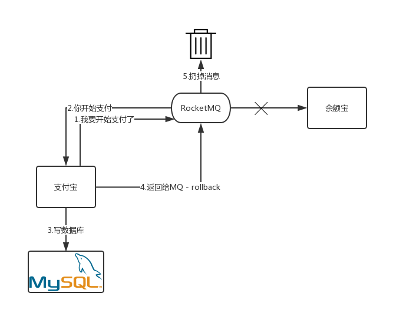
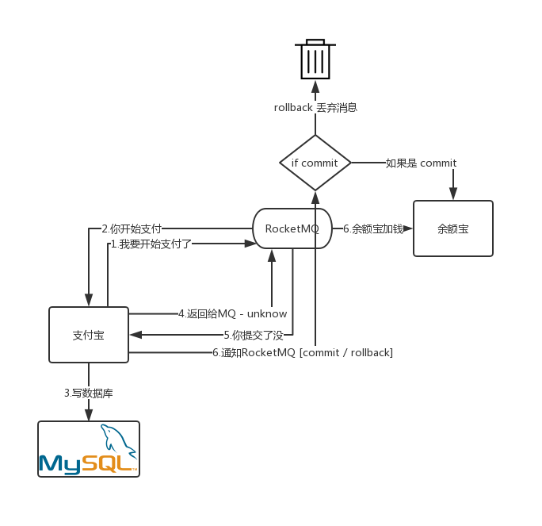

> ## 03-RocketMQ-TransactionMessage.md

> #### 官方提供



> #### 一分为三

> ##### 支付宝给余额宝转账 :: 正常状态



> ##### 支付宝给余额宝转账 :: 回滚事务



> ##### 支付宝余额宝转账 :: 其他逻辑状态



> #### 业务代码 ( 向 RocketMQ 发送, 事务消息 )

> ##### 生成者 ( 发送方 )

```java
public class DefaultTransactionMessageProducer {

	public static final String ID = "UserId";
	private static final String SEND_MSG = "exception ok";
	
    public static void main(String[] args) {
		try {
			final TransactionMQProducer producer = new TransactionMQProducer("transaction");
			producer.setNamesrvAddr("192.168.3.123:9876");
			producer.start();

			final ConcurrentHashMap<String, String> localTrans = new ConcurrentHashMap<>();

			producer.setTransactionListener(new TransactionListener() {
				public LocalTransactionState executeLocalTransaction(Message msg, Object arg) {
					System.out.println("start transaction consumer");
					try {
						String stringMsg = new String(msg.getBody(), RemotingHelper.DEFAULT_CHARSET);
						if ("exception".equals(stringMsg)) {
							throw new RuntimeException();
						}
						if ("commit".equals(stringMsg)) {
							localTrans.put(ID, "可以提交");
							System.out.println("localTrans.put(ID, 可以提交)");
							return LocalTransactionState.COMMIT_MESSAGE;
						} else {
							localTrans.put(ID, "不确定 : " + SEND_MSG);
							System.out.println("localTrans.put(ID, 不确定)");
							return LocalTransactionState.UNKNOW;
						}
					} catch (Exception e) {
						localTrans.put(ID, "出现异常回滚掉");
						System.out.println("localTrans.put(ID, 出现异常回滚掉)");
						return LocalTransactionState.ROLLBACK_MESSAGE;
					}
				}

				public LocalTransactionState checkLocalTransaction(MessageExt msg) {
					String status = localTrans.get(ID);
					System.out.println("回查本地事务:status:" + status);

					// TODO 获取数据, 回查判断

					if (status.contains("ok")) {
						System.out.println("回查本地 :: 可以提交");
						return LocalTransactionState.COMMIT_MESSAGE;
					}
					return LocalTransactionState.ROLLBACK_MESSAGE;
				}
			});

			Message msg = new Message("loyalTest", "*", SEND_MSG.getBytes());

			SendResult sendResult = producer.sendMessageInTransaction(msg, "");
			System.out.println(sendResult);

			TimeUnit.MICROSECONDS.sleep(1000);

			Runtime.getRuntime().addShutdownHook(new Thread(new Runnable() {
				public void run() {
					System.out.println("producer.shutdown()");
					producer.shutdown();
				}
			}));
		} catch (MQClientException e1) {
			// TODO Auto-generated catch block
			e1.printStackTrace();
		} catch (InterruptedException e) {
			// TODO Auto-generated catch block
			e.printStackTrace();
		}
	}

}
```

> 消费者 ( 订阅方 )

```java
public class DefaultTransactionMessageConsumer {

	public static final String ID = "UserId";

	public static void main(String[] args) throws Exception {
		DefaultMQPushConsumer consumer = new DefaultMQPushConsumer("transaction");

		consumer.setNamesrvAddr("192.168.3.123:9876");

		consumer.setConsumeFromWhere(ConsumeFromWhere.CONSUME_FROM_FIRST_OFFSET);
		consumer.subscribe("loyalTest", "*");

		consumer.registerMessageListener(new MessageListenerOrderly() {
			private Random random = new Random();

			@Override
			public ConsumeOrderlyStatus consumeMessage(List<MessageExt> msgs, ConsumeOrderlyContext context) {
				// 设置自动提交
				context.setAutoCommit(true);
				for (MessageExt msg : msgs) {
					System.out.println("SUCCESS :发送短信通知成功!: " + new String(msg.getBody()));
				}
				try {
					// 模拟业务处理
					TimeUnit.SECONDS.sleep(random.nextInt(5));
				} catch (Exception e) {
					e.printStackTrace();
					return ConsumeOrderlyStatus.SUSPEND_CURRENT_QUEUE_A_MOMENT;
				}
				return ConsumeOrderlyStatus.SUCCESS;
			}
		});
		consumer.start();
		System.out.println("consumer start ! ");
	}

}
```

