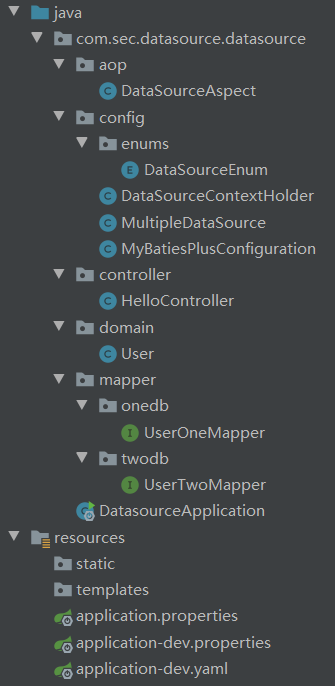

> ## SpringBoot-MyBatyisPlus 多数据源切换

* 实现功能为通 aop 控制不同包下面的类采用不同的数据库
  * 在 `mapper.one` 包中的数据库采用 `one_db`
  * 在 `mapper.two` 包总的数据库采用 `two_db`
  * `使用` `单引号` 包起来的地方是动态更改的

> #### 导入相关依赖

```xml
<dependency>
    <groupId>com.baomidou</groupId>
    <artifactId>mybatis-plus-boot-starter</artifactId>
    <version>3.2.0</version>
</dependency>
<dependency>
    <groupId>com.alibaba</groupId>
    <artifactId>druid-spring-boot-starter</artifactId>
    <version>1.1.21</version>
</dependency>
<dependency>
    <groupId>org.springframework.boot</groupId>
    <artifactId>spring-boot-starter-aop</artifactId>
</dependency>
<dependency>
    <groupId>org.projectlombok</groupId>
    <artifactId>lombok</artifactId>
    <optional>true</optional>
</dependency>
<dependency>
    <groupId>org.springframework.boot</groupId>
    <artifactId>spring-boot-starter-web</artifactId>
</dependency>
```

> 在配置文件中配置数据源

```properties
##onedb
spring.datasource.druid.`one`.driver-class-name=com.mysql.cj.jdbc.Driver
spring.datasource.druid.`one`.url=jdbc:mysql://localhost:3306/db_one?characterEncoding=utf8&useSSL=false&serverTimezone=GMT%2B8
spring.datasource.druid.`one`.username=username
spring.datasource.druid.`one`.password=password

##twodb
spring.datasource.druid.`two`.driver-class-name=com.mysql.cj.jdbc.Driver
spring.datasource.druid.`two`.url=jdbc:mysql://localhost:3306/db_two?characterEncoding=utf8&useSSL=false&serverTimezone=GMT%2B8
spring.datasource.druid.`two`.username=username
spring.datasource.druid.`two`.password=password
```

> 配置 MyBatisPlus 相关

```yaml
mybatis-plus:
  mapper-locations: classpath:/mapper/**/*Mapper.xml
  typeAliasesPackage: com.sec.datasource.*.domain
  global-config:
    refresh:  true
    db-config:
      id-type: auto
      field-strategy: ignored
      capital-mode: true
      logic-delete-value: 1
      logic-not-delete-value: 0
      db-type: mysql
  configuration:
    map-underscore-to-camel-case: true
    cache-enabled: false
    jdbc-type-for-null: 'null'
```

> #### 在 `config` 包下配置 MyBatisPlus 数据源

```java
@Configuration
@MapperScan("`com.sec.datasource.datasource.mapper`")
public class MyBatiesPlusConfiguration {

    @Bean(name = "`one`")
    @ConfigurationProperties(prefix = "spring.datasource.druid.`one`" )
    public DataSource `one`() {
        return DruidDataSourceBuilder.create().build();
    }

    @Bean(name = "`two`")
    @ConfigurationProperties(prefix = "spring.datasource.druid.`two`" )
    public DataSource `two`() {
        return DruidDataSourceBuilder.create().build();
    }

    /**
     * 动态数据源配置
     * @return
     */
    @Bean
    @Primary
    public DataSource multipleDataSource(@Qualifier("`one`") DataSource `onedb`, @Qualifier("`two`") DataSource `twodb`) {
        MultipleDataSource multipleDataSource = new MultipleDataSource();
        Map< Object, Object > targetDataSources = new HashMap<>();
        targetDataSources.put(DataSourceEnum.ONE_DB.getValue(), `onedb`);
        targetDataSources.put(DataSourceEnum.TWO_DB.getValue(), `twodb`);
        //添加数据源
        multipleDataSource.setTargetDataSources(targetDataSources);
        //设置默认数据源
        multipleDataSource.setDefaultTargetDataSource(`onedb`);
        return multipleDataSource;
    }

    @Bean("sqlSessionFactory")
    public SqlSessionFactory sqlSessionFactory() throws Exception {
        MybatisSqlSessionFactoryBean sqlSessionFactory = new MybatisSqlSessionFactoryBean();
        sqlSessionFactory.setDataSource(multipleDataSource(`one`(), `two`()));

        MybatisConfiguration configuration = new MybatisConfiguration();
        configuration.setJdbcTypeForNull(JdbcType.NULL);
        configuration.setMapUnderscoreToCamelCase(true);
        configuration.setCacheEnabled(false);
        sqlSessionFactory.setConfiguration(configuration);
        // todo 需要在这里配置多数据源情况下扫描的 Mapper
        sqlSessionFactory.setMapperLocations(new PathMatchingResourcePatternResolver().getResources("classpath:mapper/**/*Mapper.xml"));
        return sqlSessionFactory.getObject();
    }

}
```

> 其他辅助类

```java
public class DataSourceContextHolder {

    private static final ThreadLocal<String> contextHolder = new InheritableThreadLocal<>();

    public static void setDataSource(DataSourceEnum db){
        contextHolder.set(db.getValue());
    }

    public static String getDataSource(){
        return contextHolder.get();
    }

    public static void clear(){
        contextHolder.remove();
    }

}
```

```java
public class MultipleDataSource extends AbstractRoutingDataSource {

    @Override
    protected Object determineCurrentLookupKey() {
        return DataSourceContextHolder.getDataSource();
    }

}
```

> 将已有数据库定义成枚举方便调用

```java
@Getter
public enum DataSourceEnum {

    `ONE_DB`("`one_db`"),
    `TWO_DB`("`two_db`");

    private String value;

    DataSourceEnum(String value){this.value=value;}

}
```

> #### 编写 aop 逻辑进行数据源切换

```java
@Slf4j
@Aspect
@Order(-1)
@Component
public class DataSourceAspect {

    @Pointcut("execution(* `com.sec.datasource.datasource.mapper.onedb`.*.*(..))")
    private void `onedb`Aspect() {
    }

    @Pointcut("execution(* `com.sec.datasource.datasource.mapper.twodb`.*.*(..))")
    private void `twodb`Aspect() {
    }

    @Before("`onedb`Aspect()")
    public void `onedb`() {
        log.info("select to datasource `one`");
        DataSourceContextHolder.setDataSource(DataSourceEnum.`ONE_DB`);
    }

    @Before("`twodb`Aspect()")
    public void `twodb`() {
        log.info("select to datasource `two`");
        DataSourceContextHolder.setDataSource(DataSourceEnum.`TWO_DB`);
    }

    @After("`onedb`Aspect() || `twodb`Aspect()")
    public void doAfter(){
        DataSourceContextHolder.clear();
    }

}
```

> ##### 下面就是在 mapper 包中编写逻辑 controller 调用测试了



> Demo 在我的 Gitee 中可以看得到