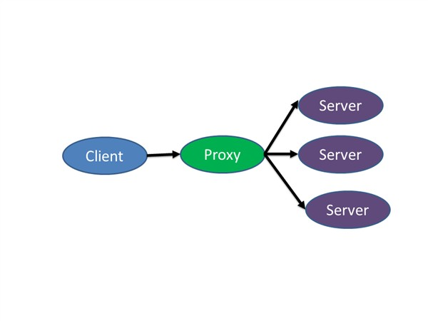
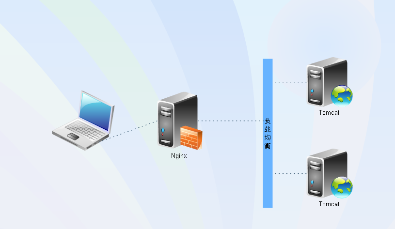

> ### Nginx Hello World

### 常见的web server（web服务器）

常用web服务器有Apache、Nginx、IIS

- Apache仍然是世界上用的最多的Web服务器，市场占有率达60%左右；它的优势在开源代码开放，可以运行在几乎所有的Unix、Linux、Windows系统平台上；缺点在于消耗的内存也比其他的web服务器要高。
- Nginx是一款轻量级的Web 服务器/反向代理服务器及电子邮件（IMAP/POP3）代理服务器，由俄罗斯的程序设计师Igor Sysoev所开发，其特点是占有内存少，并发能力强，事实上nginx的并发能力确实在同类型的网页服务器中表现较好。
- IIS是一种web服务组件，其中包括Web服务器、FTp服务器、NNTP服务器和SMTP服务器，分别用于网页浏览、文件传输、新闻服务和邮件发送等方面，它使得在网络上发送信息成为一件很容易的事。但IIS只能运行在Windows平台。

### Web 服务器与应用服务器的区别是什么

严格意义上Web服务器只负责处理HTTP协议，只能发送静态页面的内容如图片、css、js等。而JSP，ASP，PHP等动态内容需要通过CGI、FastCGI、ISAPI等接口交给其他程序去处理。这个其他程序就是应用服务器，应用服务器包括Tomcat、WebLogic、JBoss等。应用服务器一般也支持HTTP协议，因此界限没这么清晰。但是应用服务器的HTTP协议部分仅仅是支持，一般不会做特别优化，所以很少有见Tomcat直接暴露给外面，而是和Nginx、Apache等配合，只让Tomcat处理JSP和Servlet部分。

### nginx简介

Nginx ("engine x")是一个高性能的HTTP和反向代理服务器，也是一个IMAP/POP3/SMTP代理服务器。Nginx是由Igor Sysoev 为俄罗斯访问量第二的Rambler.ru站点开发的，它已经在该站点运行超过四年多了。Igor将源代码以类BSD许可证的形式发布。自Nginx 发布四年来，Nginx已经因为它的稳定性、丰富的功能集、示例配置文件和低系统资源的消耗而闻名了。目前国内各大门户网站已经部署了Nginx，如新浪、网易、腾讯



### 下载

官网:[http://nginx.org/][1]

官方文档:[http://nginx.org/en/docs/][2]

下载:[http://nginx.org/en/download.html][3]


### 为什么选择Nginx

Nginx 是一个高性能Web和反向代理服务器, 它具有有很多非常优越的特性:

 - **在高连接并发的情况下，Nginx是Apache服务器不错的替代品** Nginx在美国是做虚拟主机生意的老板们经常选择的软件平台之一. 能够支持高达 50,000 个并发连接数的响应
 - **Nginx作为负载均衡服务器** 
 - **作为邮件代理服务器** Nginx 同时也是一个非常优秀的邮件代理服务器
 - **Nginx 是一个安装** 非常的简单, 配置文件 非常简洁（还能够支持perl语法）, Bugs 非常少的服务器: Nginx 启动特别容易, 并且几乎可以做到7*24不间断运行，即使运行数个月也不需要重新启动. 你还能够 不间断服务的情况下进行软件版本的升级.


### Nginx使用

#### nginx目录说明

Nginx 安装目录中主要包括了以下5（不同的操作系统安装完成后的目录不一样）个文件夹：

1. conf：存放配置文件
2. html：可调用的html网页文件
3. logs：记录日志文件
4. bin：Nginx服务器主程序
5. temp：运行时产生的临时文件

- conf 目录存放这nginx的所有配置文件，其中`nginx.conf` 文件是 Nginx 服务器的主配置文件
- html 目录下就存放了两个 html文件，分别是：
  1. index.html （运行成功时显示的界面）
  2. 50x.html （出错时显示的界面，如503错误.）
- logs 顾名思义，存放Nginx 服务器的日志文件。服务器没有启动时，这个文件夹是空的。一般启动后，会有两个文件：
  1. access.log （访问日志文件）
  2. error.log （错误日志文件）
- bin（windows安装没有该文件夹只有nginx.exe文件）：其中只有一个nginx文件，这就是 Nginx 服务器的主程序了。

`注意：不能同时启动多个nginx进程，否则可能会导致修改了配置文件不生效的情况！`

#### 常用命令

 - **nginx -s stop** 快速关闭Nginx，可能不保存相关信息，并迅速终止web服务。
 - nginx -s quit 平稳关闭Nginx，保存相关信息，有安排的结束web服务。
 - **nginx -s reload** 因改变了Nginx相关配置，需要重新加载配置而重载。
 - nginx -s reopen 重新打开日志文件。
 - nginx -c filename   为 Nginx 指定一个配置文件，来代替缺省的。
 - **nginx -t**            不运行，仅仅测试配置文件。nginx
   将检查配置文件的语法的正确性，并尝试打开配置文件中所引用到的文件。
 - nginx -v            显示 nginx 的版本。
 - nginx -V            显示 nginx 的版本，编译器版本和配置参数。


#### http反向代理配置

`注`：conf / nginx.conf 是 nginx 的默认配置文件。你也可以使用 nginx -c 指定你的配置文件

nginx.conf


```java
#设定实际的服务器列表 
upstream my_server{
    server 127.0.0.1:8080;
}

#http虚拟主机服务器配置
server {
    #监听80端口，80端口是知名端口号，用于HTTP协议
    listen       80;
    
    #定义使用www.xx.com访问
    server_name  www.helloworld.com;
    
    #首页
    index index.html
    
    #指向webapp的目录
	root D:\01_Workspace\Project\github\zp\SpringNotes\spring‐security\springshiro\
src\main\webapp;
    
    #编码格式
    charset utf-8;
    
    #代理配置参数
    proxy_connect_timeout 180;
    proxy_send_timeout 180;
    proxy_read_timeout 180;
    proxy_set_header Host $host;
    proxy_set_header X-Forwarder-For $remote_addr;

    #反向代理的路径（和upstream绑定），location 后面设置映射的路径
    location / {
        proxy_pass http://my_server;
    } 

    # 所有静态文件由nginx直接读取不经过tomcat
    location ~ .*\.(js|bbb|txt){
    	root D:\Tools‐work\apache‐tomcat‐7.0.82\webapps\lxit‐020‐1703‐sevlet;
    	expires 30d;
    }

    #设定查看Nginx状态的地址
    location /NginxStatus {
        stub_status           on;
        access_log            on;
        auth_basic            "NginxStatus";
        # auth_basic_user_file  conf/htpasswd;
        allow	127.0.0.1;
    }

    #禁止访问 .htxxx 文件
    location ~ /\.ht {
        deny all;
    }
    
    #错误处理页面（可选择性配置）
    #error_page   404              /404.html;
    #error_page   500 502 503 504  /50x.html;
    #location = /50x.html {
    #    root   html;
    #}
    
    #include vhost/*.conf; # 分割配置文件，方便管理
}
```

1.启动 tomcat，`注意`启动绑定的端口一定要和nginx中的 upstream 设置的端口保持一致。

2.更改 host：在 C:\Windows\System32\drivers\etc 目录下的host文件中添加一条 DNS 记录

```java
127.0.0.1 www.helloworld.com
```
3.修改nginx配置文件执行nginx -s reload命令，重新加载nginx配置文件

```
nginx -s reload
```

4.在浏览器中访问 www.helloworld.com

#### 负载均衡配置

负载均衡原理：客户端向反向代理(nginx)发送请求，接着反向代理(nginx)根据某种负载机制转发请求至目标服务
器(这些服务器都运行着相同的应用)，并把获得的内容返回给客户端，期中，代理请求可能根据配置被发往不同的
服务器。



上一个例子中，代理仅仅指向一个服务器。但是，网站在实际运营过程中，多半都是有多台服务器运行着同样的app，这时需要使用负载均衡来分流。

```java
#设定负载均衡的服务器列表
upstream my_server {
    #weigth参数表示权值，权值越高被分配到的几率越大
    server 192.168.1.11:80   weight=5;
    server 192.168.1.12:80   weight=1;
    server 192.168.1.13:80   weight=6;
}
```

负载均衡四种配置方式

1、轮询

轮询是upstream的默认分配方式，即每个请求按照时间顺序轮流分配到不同的后端服务器，如果某个后端服务器down掉后，能自动剔除。

```java
    upstream backend {
        server 192.168.1.101:8888;
        server 192.168.1.102:8888;
        server 192.168.1.103:8888;
    }
```

2、weight 

轮询的加强版，即可以指定轮询比率，weight和访问几率成正比，主要应用于后端服务器异质的场景下。

```java
    upstream backend {
        server 192.168.1.101 weight=1;
        server 192.168.1.102 weight=2;
        server 192.168.1.103 weight=3;
    }
```

3、ip_hash

每个请求按照访问ip（即Nginx的前置服务器或者客户端IP）的hash结果分配，这样每个访客会固定访问一个后端服务器

```java
    upstream backend {
        ip_hash;
        server 192.168.1.101:7777;
        server 192.168.1.102:8888;
        server 192.168.1.103:9999;
    }
```

4、fair 

fair顾名思义，公平地按照后端服务器的响应时间（rt）来分配请求，响应时间短即rt小的后端服务器优先分配请求。如果需要使用这种调度算法，必须下载Nginx的upstr_fair模块。

```java
    upstream backend {
        server 192.168.1.101;
        server 192.168.1.102;
        server 192.168.1.103;
        fair;
    }
```

5、url_hash

目前用consistent_hash替代url_hash
与ip_hash类似，但是按照访问url的hash结果来分配请求，使得每个url定向到同一个后端服务器，主要应用于后端服务器为缓存时的场景下。

```java
    upstream backend {
        server 192.168.1.101;
        server 192.168.1.102;
        server 192.168.1.103;
        hash $request_uri;
        hash_method crc32;
    }
```

**注意：**当负载调度算法为ip_hash时，后端服务器在负载均衡调度中的状态不能是weight和backup

### nginx健康检查

upstream节点配置

```nginx
upstream my_server {
	server 127.0.0.1:8888 weight=1 max_fails=1 fail_timeout=30s; #max_fails = 3 为允许失败的次数，默认值为1。 这是对后端节点做健康检查。
	server 127.0.0.1:8288 weight=1 max_fails=1 fail_timeout=30s; #fail_timeout = 30s 当max_fails次失败后，暂停将请求分发到该后端服务器的时间
}
```

server 节点配置

```nginx
server {
		listen       80;
		server_name  www.helloworld.com;		
		#首页
		index index.html

		#编码格式
		charset utf-8;

		#代理配置参数
		proxy_connect_timeout 10; # 设置连接超时时间
		proxy_send_timeout 10;
		proxy_read_timeout 10;
		proxy_set_header Host $host;
		proxy_set_header X-Forwarder-For $remote_addr;
		#反向代理的路径（和upstream绑定），location 后面设置映射的路径
		location / {
			proxy_pass http://my_server;
		}
	}
```


#### nginxStatus

```javas
Active connections: 4
server accepts handled requests 4 4 3
Reading: 0 
Writing: 2
Waiting: 2
```

 - active connections 活跃的连接数量4
 - server accepts handled requests总共处理了4个连接 , 成功创建4次握手, 总共处理了3个请求
 - reading  读取客户端的连接数0
 - writing 响应数据到客户端的数量
 - waiting 开启 keep-alive 的情况下,这个值等于 active – (reading+writing), 意思就是 Nginx 已经处理完正在等候下一次请求指令的驻留连接

### 分布式架构系统的演变

一个成熟的系统并不是一开始就设计的非常完善，也不是一开始就具有高性能，高可用，安全性等特性，而是随着用户的增加和业务功能的扩展逐步完善。在这过程中 开发模式，技术架构都会发生重大变化，而针对不同业务特征的系统会有各自的侧重点，像淘宝这类网站要解决的事海量商品搜索 下单支付等问题。像腾讯 要解决数亿级别用户的实施消息传输等。每种业务都有自己不同的系统架构。以Java Web 为例 搭建简单的电商系统，从系统来看系统演变的历史，要注意的是 接下来模型的演示。关注数据量 访问量，网站结构的变化。

加入系统具备功能： 用户，商品  交易

**最初始阶段，单体架构：**


网站的初期，经常在单机上跑所有的程序，把所有的软件和应用部署在同一台机子上，这样就完成了一个简单系统的搭建。初期讲究的是效率。

**阶段二。 应用服务器和数据库服务器分离**

随着网站的上线，访问量的增加，服务器负载变高。在服务器还没有超载的时候，重新规划，提上网站性能，加入代码层面已经没办法提升了，在不提高单台机子性能下，增加机子是一个比较好的方式，投入产出比非常高，在这个阶段把web服务器和数据库服务器分开，这样不仅提高单机负载，也能提高容灾能力


**阶段三 应用服务器集群，应用服务器负载均衡。**

随着时间推移，网站访问量继续增加，单台服务器已经无法满足需求，假如数据库服务器没有达到瓶颈，我们可以增加应用服务器，通过应用服务器集群将用户的请求分流到各个服务器上，从而提高负载能力。此时服务器间没有直接交互，都是通过数据库各自对外交互


系统架构演变到此阶段，新的问题慢慢也会出现

1. 用户请求谁来转发，如何转发？

2. 用户每次方位到的服务器不一样，那么session如何处理？


**阶段四，数据库压力变大， 数据库实行读写分离**

架构演变到这里并不是终点。我们通过上面的方式把应用层的性能提升了，但是数据库的负载过大，且单点安全问题，怎么提高数据库性能，且保证安全，有了前面的思路 我们照猫画虎。 但是假如我们单纯的把数据库一分为二，然后对于数据库请求，分别负载到两台机子上， 那么新的问题又来了，数据库数据不统一的问题，所以我们先采用读写分离的方式


这个新的架构又要面临新的问题和挑战

1. 主从数据库之间数据同步， 可以使用mysql自带的 master-slave 方式实现主从
2. 因对数据源的选择，采用第三方数据库中间件 例如 mycat

**阶段五 使用搜索引擎环节度数据库的压力**

数据库做读库的话，尝试对模糊查询效率并不好，像电商类的网站搜索是非常核心的功能，几遍做了读写分离这个问题也不能有效解决，那么这个时候就需要引入搜索引擎，使用搜索引擎能大大提高查询效率，但同时也有问题，比如索引的维护


**阶段六 引入缓存机制环节数据库压力（比如热点数据 ）**

随着访问量的持续增加，逐渐出现许多用户访问同一部分数据的情况，对这些热点数据没必要每次都查询数据库，我们可以使用缓存技术比如 memcache redis 来作为应用层缓存，另外某些场景下 我们对用户的某些ip的访问频率做限制，那么放在内存中又不合适，放在数据库总太麻烦，这时候可以使用NoSql的方式比如 mongDB来代替传统数据库


**阶段七， 数据库的水平和垂直拆分**

网站演进的过程中， 用户 商品 交易的数据还在同一个数据库中，尽管采取了 缓存 读写分离的方式，但是数据库的压力持续增加，数据库的瓶颈仍是一个很大的问题，因此我们考虑对数据垂直拆分和水平拆分

垂直拆分： 把数据库中不同业务数据拆分到不同的数据库中


水平拆分： 把同一个表中的数据拆分到两个甚至更多的数据库中，水平拆分的原因 某些业务数据量已经达到单个数据库瓶颈，这时还可以采取拆分表到多个数据库中


**阶段八 应用拆分**

随着业务的发展，越来多应用压力大。工程规模 随着业务的发展，越来多应用压力大。。这个时候就可以考虑讲 应用拆分，按照领域模型我们的用户、商品交易拆分成多个子系统 我们的用户、商品交易拆分成多个子系统


这样拆分后，可能会有一些相同的代码，如 用户操作，商品查询等， 所以会导致每个系统都会有用户查询访问相关操作，这些相同的操作一定要抽离出来，否者就是坑，所有通过走服务化方式解决


那么服务拆分后，各个服务之间如何通信，通过RPC技术 ，比如 webservice hessian http RMI 等等

前期通过这些技术很好的解决问题，但是互联网的发展是持续不断地，所以架构演变和优化还在继续。。。

