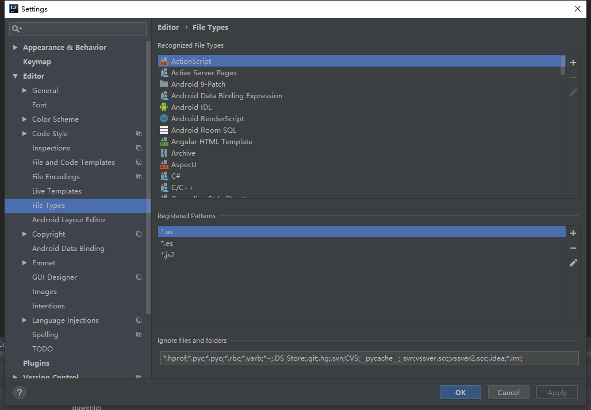

# IntelliJ IDEA下使用SVN

##### 操作( SVN入门可以去[菜鸟教程](http://www.runoob.com/svn/svn-tutorial.html) )：

* ##### 熟练使用SVN对文件 的跟新和提交

* ##### 对IntelliJ IDEA的特定配置文件的忽略

### 熟练使用SVN对文件 的跟新和提交

| 图标 | 描述                         |
| ---- | ---------------------------- |
| ↙    | 将IDEA中的代码跟新           |
| ✔    | 将本地代码提交到SVN Server   |
| 🕓    | 查看SVN的提交记录            |
| 后退 | 从SVN Server中覆盖掉本地代码 |

### 对IntelliJ IDEA的特定配置文件的忽略

###### 打开右上角的：file > settings > editor > file types > ignore files and folders

###### 在input中添加表达式通过 ; 号进行分割