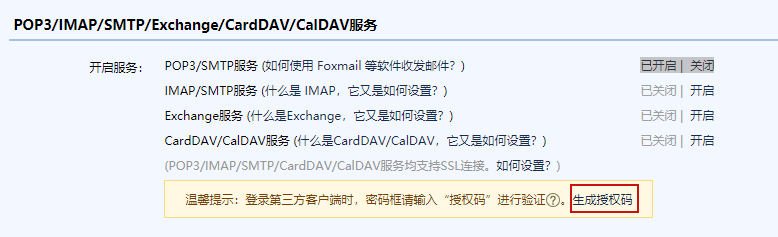

> ### Spring 发送 Email

​	开发中经常会遇到发送邮件进行用户验证，或者其它推送信息的情况，本文基于spring，完成邮件的发送，主要支持普通文本邮件的发送，html文本邮件的发送，带附件的邮件发送，没有实现群发、多个附件发送等需求。如果需要可以参照如下源代码进行修改完成。

1. POM文件配置

```xml
<dependencies>
    <dependency>
        <groupId>org.springframework</groupId>
        <artifactId>spring-context</artifactId>
        <version>4.1.6.RELEASE</version>
    </dependency>
    <dependency>
        <groupId>org.springframework</groupId>
        <artifactId>spring-context-support</artifactId>
        <version>4.1.6.RELEASE</version>
    </dependency>
    <dependency>
        <groupId>javax.mail</groupId>
        <artifactId>mail</artifactId>
        <version>1.4.7</version>
    </dependency>
</dependencies>
```

2. spring 配置

```xml
<!-- Production implementation of the JavaMailSender interface, supporting 
        both JavaMail MimeMessages and Spring SimpleMailMessages -->
<bean id="mailSender" class="org.springframework.mail.javamail.JavaMailSenderImpl">
    <property name="host" value="smtp.gmail.com" />
    <property name="port" value="587" />
    <property name="username" value="<!-- Provide your Gmail ID -->" />
    <property name="password" value="<!-- Provide your Gmail Password -->" />
	<!-- MyTest
		<property name="host" value="smtp.qq.com" />
		<property name="port" value="587" />
		<property name="username" value="2491920818@qq.com" />
		<property name="password" value="mfpuberiroeldidj" />	
	-->
    
    <!-- The name of the property, following JavaBean naming conventions -->
    <property name="javaMailProperties">
        <props>
            <prop key="mail.transport.protocol">smtp</prop>
            <prop key="mail.smtp.auth">true</prop>
            <prop key="mail.smtp.starttls.enable">true</prop>
            <prop key="mail.debug">true</prop>
        </props>
    </property>
</bean>
```

> Provide your Gmail Password 在哪里设置呢: 打开 QQ 邮箱: 设置 > 账号



3. 编写邮件发送接口

```java
/**
 * 功能: 邮件发送接口.<br/>
 * date: 2015年8月24日 上午9:53:05 <br/>
 *
 * @author joseph
 * @version
 */
public interface MailSenderSrv {
    /**
     * 功能: 发普通邮件，msgBody是普通的文本.<br/>
     * date: 2015年8月24日 上午9:57:19 <br/>
     *
     * @author joseph
     * @param toAddress
     * @param fromAddress
     * @param subject
     * @param msgBody
     */
    void sendEmail(String toAddress, String fromAddress, String subject, String msgBody);

    /**
     * 功能: 发html邮件或者普通邮件，msgBody是html文本或者普通文本.<br/>
     * MimeMessage 消息发送.<br/>
     * date: 2015年8月24日 上午9:57:19 <br/>
     *
     * @author joseph
     * @param toAddress
     * @param fromAddress
     * @param subject
     * @param msgBody
     * @throws MessagingException
     */
    void sendHtmlEmail(String toAddress, String fromAddress, String subject, String htmlBody) throws MessagingException;

    /**
     * 功能: 发html邮件或者普通邮件，msgBody是html文本或者普通文本，带附件.<br/>
     * MimeMessage 消息发送.<br/>
     * date: 2015年8月24日 上午9:57:19 <br/>
     *
     * @author joseph
     * @param toAddress
     * @param fromAddress
     * @param subject
     * @param msgBody
     * @throws MessagingException
     * @throws FileNotFoundException
     */
    void sendHtmlEmail(String toAddress, String fromAddress, String subject, String htmlBody, String filePath)
            throws MessagingException, FileNotFoundException;

    /**
     * 功能: 发html邮件或者普通邮件，msgBody是html文本或者普通文本，带附件.<br/>
     * MimeMessage 消息发送.<br/>
     * date: 2015年8月24日 上午9:57:19 <br/>
     *
     * @author joseph
     * @param toAddress
     * @param fromAddress
     * @param subject
     * @param htmlBody
     * @param filePath
     * @param fileName
     * @throws MessagingException
     * @throws FileNotFoundException
     */
    void sendHtmlEmail(String toAddress, String fromAddress, String subject, String htmlBody, String filePath,
            String fileName) throws MessagingException, FileNotFoundException;
}
```

4. 实现类

```java
/**
 * 功能: 邮件发送实现.<br/>
 * date: 2015年8月24日 上午10:07:01 <br/>
 *
 * @author joseph
 * @version
 */
@Service("mailSenderSrv")
public class MailSenderSrvImpl implements MailSenderSrv {

    @Autowired
    private JavaMailSender mailSender;

    /**
     * @see com.wisdombud.wisdomhr.common.srv.MailSenderSrv#sendEmail(java.lang.String,
     *      java.lang.String, java.lang.String, java.lang.String)
     */

    @Override
    public void sendEmail(String toAddress, String fromAddress, String subject, String msgBody) {
        SimpleMailMessage simpleMailMessage = new SimpleMailMessage();
        simpleMailMessage.setFrom(fromAddress);
        simpleMailMessage.setTo(toAddress);
        simpleMailMessage.setSubject(subject);
        simpleMailMessage.setText(msgBody);
        mailSender.send(simpleMailMessage);
    }

    /**
     * @throws MessagingException
     * @see com.wisdombud.wisdomhr.common.srv.MailSenderSrv#sendHtmlEmail(java.lang.String,
     *      java.lang.String, java.lang.String, java.lang.String)
     */

    @Override
    public void sendHtmlEmail(String toAddress, String fromAddress, String subject, String htmlBody)
            throws MessagingException {
        MimeMessage message = mailSender.createMimeMessage();
        MimeMessageHelper helper = new MimeMessageHelper(message, "UTF-8");
        helper.setTo(toAddress);
        helper.setFrom(fromAddress);
        helper.setText(htmlBody, true);
        helper.setSubject(subject);

        mailSender.send(message);

    }

    /**
     * @throws MessagingException
     * @throws FileNotFoundException
     * @see com.wisdombud.wisdomhr.common.srv.MailSenderSrv#sendHtmlEmail(java.lang.String,
     *      java.lang.String, java.lang.String, java.lang.String,
     *      java.lang.String)
     */

    @Override
    public void sendHtmlEmail(String toAddress, String fromAddress, String subject, String htmlBody, String filePath)
            throws MessagingException, FileNotFoundException {
        MimeMessage message = mailSender.createMimeMessage();
        MimeMessageHelper helper = new MimeMessageHelper(message, true, "UTF-8");
        helper.setTo(toAddress);
        helper.setFrom(fromAddress);
        helper.setText(htmlBody, true);
        helper.setSubject(subject);
        File file = new File(filePath);
        if (!file.exists()) {
            throw new FileNotFoundException("找不到附件：" + filePath);
        }
        helper.addAttachment(file.getName(), file);
        mailSender.send(message);
    }

    /**
     * @throws MessagingException
     * @throws FileNotFoundException
     * @see com.wisdombud.wisdomhr.common.srv.MailSenderSrv#sendHtmlEmail(java.lang.String,
     *      java.lang.String, java.lang.String, java.lang.String,
     *      java.lang.String)
     */

    @Override
    public void sendHtmlEmail(String toAddress, String fromAddress, String subject, String htmlBody, String filePath,
            String fileName) throws MessagingException, FileNotFoundException {
        MimeMessage message = mailSender.createMimeMessage();
        MimeMessageHelper helper = new MimeMessageHelper(message, true, "UTF-8");
        helper.setTo(toAddress);
        helper.setFrom(fromAddress);
        helper.setText(htmlBody, true);
        helper.setSubject(subject);
        File file = new File(filePath);
        if (!file.exists()) {
            throw new FileNotFoundException("找不到附件：" + filePath);
        }
        helper.addAttachment(fileName, file);
        mailSender.send(message);
    }
}
```

> junit 测试

```java
public class MailSrvTest extends AbstractTransactionContextTest {
    @Autowired
    private MailSenderSrv srv;

    @Test
    public void testTextMail() {
    	String from = "2491920818@qq.com";
        String to = "2491920818@qq.com";
        String subject = "测试主题";
        String text = "测试内容";

        this.mailSenderSrv.sendEmail(to, from, subject, text);
    }

    @Test
    public void testHtmlMail() {
        String from = "test@163.com";
        String to = "test@163.com";
        String subject = "测试主题";
        String text = "<html><a href=\"www.baidu.com\">百度</a></html>";
        try {
            this.srv.sendHtmlEmail(to, from, subject, text);
        } catch (MessagingException e) {
            // TODO Auto-generated catch block
            e.printStackTrace();
        }
    }

    @Test
    public void testHtmlMailWithAttach() {
        String from = "test@163.com";
        String to = "test@163.com";
        String subject = "测试主题";
        String text = "<html><a href=\"www.baidu.com\">百度</a></html>";
        String filePath = "d://1.sql";
        try {
            this.srv.sendHtmlEmail(to, from, subject, text, filePath);
        } catch (MessagingException e) {
            // TODO Auto-generated catch block
            e.printStackTrace();
        } catch (FileNotFoundException e) {
            // TODO Auto-generated catch block
            e.printStackTrace();
        }
    }

    @Test
    public void testHtmlMailWithAttachAndName() {
        String from = "test@163.com";
        String to = "test@163.com";
        String subject = "测试主题";
        String text = "<html><a href=\"www.baidu.com\">百度</a></html>";
        String filePath = "d://1.sql";
        String fileName = "haha.sql";
        try {
            this.srv.sendHtmlEmail(to, from, subject, text, filePath, fileName);
        } catch (MessagingException e) {
            // TODO Auto-generated catch block
            e.printStackTrace();
        } catch (FileNotFoundException e) {
            // TODO Auto-generated catch block
            e.printStackTrace();
        }
    }

}
```

