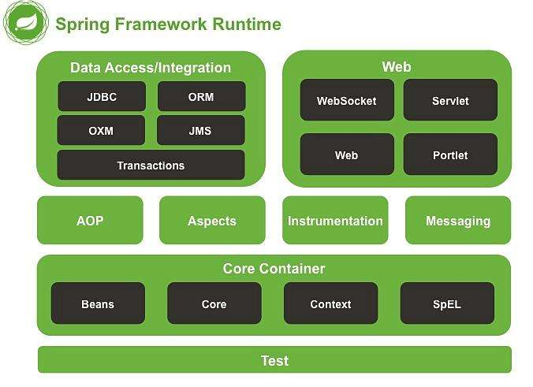

> ### SpringAOP的三种方式

1. 定义类实现接口 [ MethodBeforeAdvice AND AfterReturningAdvice ]
2. 通过配置文件声明自定义方法为 Before After
3. 通过注解来声明



> 使用 Spring aop 标签需要在beans标签中添加属性

```xml
<beans xmlns="http://www.springframework.org/schema/beans"
	xmlns:xsi="http://www.w3.org/2001/XMLSchema-instance"
	xmlns:aop="http://www.springframework.org/schema/aop"
	xsi:schemaLocation="http://www.springframework.org/schema/beans 
		http://www.springframework.org/schema/beans/spring-beans.xsd
		http://www.springframework.org/schema/aop 
		http://www.springframework.org/schema/aop/spring-aop.xsd">
```

---

> ### 定义类实现接口

```java
public class Before implements MethodBeforeAdvice {
    
	/**
	 * @param method      : 被执的行方法
	 * @param args        : 方法参数
	 * @param target      : 被执行的目标对象
	 */
	public void before(Method method, Object[] args, Object target) throws Throwable {
		System.out.println("before:" + target.getClass().getName() + ":" + method.getName() + "(args.length=" + args.length + ")");
	}

}
```

```java
public class AfterReturning implements AfterReturningAdvice {

	/**
	 * @param returnValue : 被执行方法的返回值
	 * @param method      : 被执的行方法
	 * @param args        : 方法参数
	 * @param target      : 被执行的目标对象
	 */
	public void afterReturning(Object returnValue, Method method, Object[] args, Object target) throws Throwable {
		System.out.println("afterReturning:" + target.getClass().getName() + ":" + method.getName() + "(args.length:" + args.length + "):return" + returnValue);
	}

}
```

> Spring 配置文件

```xml
<?xml version="1.0" encoding="UTF-8"?>
<beans xmlns="http://www.springframework.org/schema/beans"
	xmlns:xsi="http://www.w3.org/2001/XMLSchema-instance"
	xmlns:aop="http://www.springframework.org/schema/aop"
	xsi:schemaLocation="http://www.springframework.org/schema/beans 
		http://www.springframework.org/schema/beans/spring-beans.xsd
		http://www.springframework.org/schema/aop 
		http://www.springframework.org/schema/aop/spring-aop.xsd">
    
    <bean id="userServiceImpl" class="com.znsd.spring.aop.service.impl.UserServiceImpl"></bean>
    <bean id="before" class="com.znsd.spring.aop.action.Before"></bean>
    <bean id="afterReturning" class="com.znsd.spring.aop.action.AfterReturning"></bean>

   	<!-- execution(* com.znsd.spring.aop.service.impl.UserServiceImpl.insert(..)) : 
   			第一个*表示: 匹配所以方法返回值
   			package.className.method(args:[..]表示匹配全部参数)
   	-->
    <aop:config proxy-target-class="true">
    	<aop:pointcut expression="execution(* com.znsd.spring.aop.service.impl.UserServiceImpl.insert(..))" id="pointcutName"/>
    	<aop:advisor advice-ref="before" pointcut-ref="pointcutName"/>
    	<aop:advisor advice-ref="afterReturning" pointcut-ref="pointcutName"/>
    </aop:config>

</beans>
```

---

> ### 通过配置文件声明自定义方法为 Before After

```java
public class BeforeAndAfter {

	public void before () {
		System.out.println("BeforeAndAfter:before()");
	}
	
	public void after () {
		System.out.println("BeforeAndAfter:after()");
	}
    
    public void after() {
		System.out.println("com.znsd.spring.aop.BeforeExample.after()");
	}

	public void afterThrowing() {
		System.out.println("com.znsd.spring.aop.BeforeExample.afterThrowing()");
	}
	
	public Object around (ProceedingJoinPoint point) throws Throwable {
        System.out.println("around(ProceedingJoinPoint):before");
        
		Object proceed = point.proceed();
        
		System.out.println("around(ProceedingJoinPoint):after");
		return proceed;
	}
	
}
```

> Spring 配置文件

```xml
<?xml version="1.0" encoding="UTF-8"?>
<beans xmlns="http://www.springframework.org/schema/beans"
	xmlns:xsi="http://www.w3.org/2001/XMLSchema-instance"
	xmlns:aop="http://www.springframework.org/schema/aop"
	xsi:schemaLocation="http://www.springframework.org/schema/beans 
		http://www.springframework.org/schema/beans/spring-beans.xsd
		http://www.springframework.org/schema/aop 
		http://www.springframework.org/schema/aop/spring-aop.xsd">
       
    <bean id="beforeAndAfter" class="com.znsd.spring.aop.action.BeforeAndAfter"></bean>
   
    <aop:config proxy-target-class="true">
    	<aop:aspect ref="beforeAndAfter">
    		<aop:pointcut expression="execution(* com.znsd.spring.aop.service.impl.*.*(..))" id="pointcut"/>
    		
            <!-- 前置通知 -->
			<aop:before method="before" pointcut-ref="userServiceAspect" />
			
			<!-- 后置通知 -->
			<aop:after method="after" pointcut-ref="userServiceAspect" />
			
			<!-- 返回后通知 -->
			<aop:after-returning method="afterReturning" pointcut-ref="userServiceAspect" />
			
			<!-- 异常通知 -->
			<aop:after-throwing method="afterThrowing" pointcut-ref="userServiceAspect" />
			
			<!-- 环绕通知 -->
			<aop:around method="around" pointcut-ref="userServiceAspect"/>
            
    	</aop:aspect>
    </aop:config>

</beans>
```

1. <aop:aspect ref="`beforeAndAfter`"> : 含有切入方法的类
2. <aop:pointcut expression="execution(* com.znsd.spring.aop.service.impl.*.*(..))" id="pointcut"/> 
   1. expression : 指定作用于那些类与方法: execution > 表达式
   2. id : 为这些类与方法定义一个标识符
3. <aop:before method="before" pointcut-ref="pointcut"/> 
   1. method : 指定切入的方法
   2. pointcut : 切入到那些类中( 类方法标识符 )

| 名称                               | 说明             |
| ---------------------------------- | ---------------- |
| 前置通知(Befor advice)             | 方法执行前       |
| 返回后通知(After returning advice) | 方法成`功执`行后 |
| 抛出异常后通知(After throwing)     | 抛出异常后       |
| 后置通知(After(finally) advice)    | 方法执行后       |
| 环绕通知(Around Advice)            | 方法执行前后     |

> 注意: 返回后通知(After returning advice) 与 后置通知(After(finally) advice) 方法是有一点点区别的!

---

> ### 通过注解来声明

1. 定义切面类
2. 将类配置 bean
3. 在 Spring 配置文件中声明切面使用注解形式

```java
@Aspect
public class AspectDemo {

	@Pointcut("execution(* com.znsd.spring.service.impl.UserServiceImpl.transfer(..))")
	public void point() {// <aop:pointcut expression="execution()" id="point"/>
	}
	
	@Before("point()")
	public void before() {// <aop:before method="before" pointcut-ref="point" />
		System.out.println("com.znsd.spring.aop.AspectDemo.before()");
	}
	
	@After("point()")
	public void after() {
		System.out.println("com.znsd.spring.aop.AspectDemo.after()");
	}

	@Around("point()")
	public Object around (ProceedingJoinPoint point) throws Throwable {
		Object[] args = point.getArgs();
		Object target = point.getTarget();
		
        System.out.println("around.bean");
		
		Object result = point.proceed();// 执行后续切面过程
		
		System.out.println("around.end");
		return result;
	}
	
}
```

> Spring 配置文件

```xml
<?xml version="1.0" encoding="UTF-8"?>
<beans xmlns="http://www.springframework.org/schema/beans"
	xmlns:xsi="http://www.w3.org/2001/XMLSchema-instance"
	xmlns:context="http://www.springframework.org/schema/context"
	xmlns:aop="http://www.springframework.org/schema/aop"
	xsi:schemaLocation="http://www.springframework.org/schema/beans 
				http://www.springframework.org/schema/beans/spring-beans.xsd
				http://www.springframework.org/schema/context 
				http://www.springframework.org/schema/context/spring-context-4.3.xsd
				http://www.springframework.org/schema/aop 
				http://www.springframework.org/schema/aop/spring-aop-4.3.xsd">

	<!-- 声明切面用注解实现 -->
	<aop:aspectj-autoproxy />

	<!-- 将切面类配置 -->
	<bean class="com.znsd.spring.aop.AspectDemo" />

	<!-- 声明包扫描的路径 -->
	<context:component-scan base-package="com.znsd.spring.dao" />
	<context:component-scan base-package="com.znsd.spring.service" />

</beans>

```

| 注解    | 含义               |
| ------- | ------------------ |
| @Aspect | 表示该类是一个切面 |
| @Before | 开始调用的方法     |
| @After  | 执行后调用         |
| @Around | 执行前后调用       |

> AOP 术语

| 名称                    | 说明                                                         |
| ----------------------- | ------------------------------------------------------------ |
| 切面(Aspect)            | 一个关注点的模块化,这个关注点可能会横切多个对象              |
| 连接点(Joinpoint)       | 程序执行过程中的某个特定点                                   |
| 通知(Advice)            | 在切面的某个特定的连接点上执行的动作                         |
| 切入点(Pointcut)        | 匹配连接点的断言,在AOP中通知和切入点表达式关联               |
| 引入(Introduction)      | 在不修改类代码的前提下,为类添加新的方法和和属性              |
| 目标对象(Target Object) | 被一个或多个切面所通知的对象                                 |
| AOP代理(AOP Proxy)      | AOP框架创建的对象,用来实现切面契约(aspect contract)(包括通知方法执行等功能) |
| 织入(weaving)           | 把切面链接到其他应用程序类型或者对象上，并创建一个被通知的对象，分为：编译时织入、类加载时织入、执行时织入 |

> AspectJ

1. 安装 AspectJ 插件
2. 新建 AspectJ 项目
3. 编写 AspectJ 文件(开始切面)
4. 执行被切面的方法

> 编写 AspectJ 文件(开始切面)

```java
package com.znsd.spring.aop;

public aspect AspectJ {

	pointcut aspectJBefore() : execution(public void com.znsd.spring.aop.UserDaoImpl.isExists(..));
	
	before() : aspectJBefore() {
		System.out.println("isExists() : before()");
	}
	
}

```

> 执行被切面的方法

```java
public static void main(String[] args) {
		UserDaoImpl dao = new UserDaoImpl();
		dao.isExists("isExists");
}
/** 输出结果: 
        isExists() : before()
        isExists
*/
```

---

> ### execution 说明

> **execution(modifier_pattern ret_type_pattern type_pattern.id_pattern(..))**

| 标识符                   | 含义                                                 |
| ------------------------ | ---------------------------------------------------- |
| execution()              | 表达式的主体                                         |
| 第一个"*"符号            | 表示返回值的类型任意                                 |
| package.className.method | AOP 所代理的 方法                                    |
| 包名后面的“..”           | 表示当前包及子包                                     |
| 第二个“*”                | 表示类名，*即所有类                                  |
| .*(..)                   | 表示任何方法名，括号表示参数，两个点表示任何参数类型 |

> 官方提供的直接例子

| 表示符                                            | 含义                                                         |
| ------------------------------------------------- | ------------------------------------------------------------ |
| execution(public * *(..))                         | 执行任何公共方法                                             |
| execution(* set*(..))                             | 名称以"set"开头的任何方法的执行                              |
| execution(* com.xyz.service.AccountService.*(..)) | 执行`AccountService`接口定义的任何方法                       |
| execution(* com.xyz.service.*.*(..))              | 执行服务包中定义的任何方法                                   |
| execution(* com.xyz.service..*.*(..))             | 执行服务包或子包中定义的任何方法                             |
| within(com.xyz.service.*)                         | 服务包中的任何连接点(仅在Spring AOP中执行方法)               |
| within(com.xyz.service..*)                        | 服务包或子包中的任何连接点(仅在Spring AOP中执行方法)         |
| this(com.xyz.service.AccountService)              | 代理实现`AccountService`接口的任何连接点(仅在Spring AOP中执行方法) |

> 'this'更常用于绑定形式： - 请参阅以下有关如何在建议体中提供代理对象的建议。

>  目标对象实现`AccountService`接口的任何连接点（仅在Spring AOP中执行方法）：

```
target(com.xyz.service.AccountService)
```

> 'target'更常用于绑定形式： - 请参阅以下有关如何在建议体中提供目标对象的建议。
>
> 任何连接点（仅在Spring AOP中执行的方法），它接受一个参数，并且在运行时传递的参数是`Serializable`：

```
args(java.io.Serializable)
```

> 'args'更常用于绑定形式： - 请参阅以下有关如何在建议体中提供方法参数的建议。

>  请注意，此示例中给出的切入点不同于`execution(* *(java.io.Serializable))`：如果在运行时传递的参数是Serializable，则args版本匹配，如果方法签名声明了单个参数类型，则执行版本匹配`Serializable`。

> 目标对象具有`@Transactional`注释的任何连接点（仅在Spring AOP中执行方法） ：

```
@target(org.springframework.transaction.annotation.Transactional)
```

> '@target'也可以用于绑定形式： - 请参阅以下有关如何在建议体中提供注释对象的建议。
>
> 任何连接点（仅在Spring AOP中执行方法），其中目标对象的声明类型具有`@Transactional`注释：

```java
@within(org.springframework.transaction.annotation.Transactional)
```

> '@within'也可以用于绑定形式： - 请参阅以下有关如何在建议体中提供注释对象的建议。
>
> 任何连接点（仅在Spring AOP中执行方法），其中执行方法具有 `@Transactional`注释：

```
@annotation(org.springframework.transaction.annotation.Transactional)
```

> '@annotation'也可以用于绑定形式： - 请参阅以下有关如何在建议体中提供注释对象的建议。
>
>  任何连接点（仅在Spring AOP中执行的方法），它接受一个参数，并且传递的参数的运行时类型具有`@Classified`注释：

```java
@args(com.xyz.security.Classified)
```

> **'@ args'也可以用于绑定形式： - 请参阅以下有关如何在建议体中提供注释对象的建议。**    
>
> 名为的Spring bean上的任何连接点（仅在Spring AOP中执行方法） `tradeService`：

```java
bean(tradeService)
```

> 具有与通配符表达式匹配的名称的Spring bean上的任何连接点（仅在Spring AOP中执行方法）`*Service`：

```java
bean(*Service)
```


> ### 被困惑的 exception

```java
Exception in thread "main" java.lang.ClassCastException: com.sun.proxy.$Proxy2 cannot be cast to com.znsd.spring.aop.service.impl.UserServiceImpl
	at com.znsd.spring.aop.test.Test.main(Test.java:12)
```

> 若遇见以上异常: 需在 Spring 配置文件中配置 `<aop:config proxy-target-class="true" />`