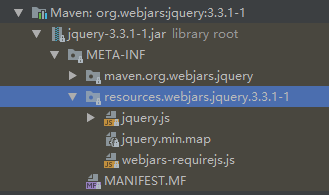
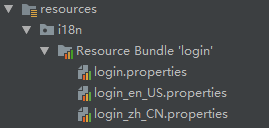

> #### SpringBoot web rest crud

> 添加资源映射: org.springframework.boot.autoconfigure.web.servlet.WebMvcAutoConfiguration

```java
@Override
public void addResourceHandlers(ResourceHandlerRegistry registry) {
    if (!this.resourceProperties.isAddMappings()) {
        logger.debug("Default resource handling disabled");
        return;
    }
    Duration cachePeriod = this.resourceProperties.getCache().getPeriod();
    CacheControl cacheControl = this.resourceProperties.getCache()
        .getCachecontrol().toHttpCacheControl();
    if (!registry.hasMappingForPattern("/webjars/**")) {
        customizeResourceHandlerRegistration(registry
			.addResourceHandler("/webjars/**")
            .addResourceLocations("classpath:/META-INF/resources/webjars/")
            .setCachePeriod(getSeconds(cachePeriod))
            .setCacheControl(cacheControl));
    }
    String staticPathPattern = this.mvcProperties.getStaticPathPattern();
    if (!registry.hasMappingForPattern(staticPathPattern)) {
        customizeResourceHandlerRegistration(
            registry.addResourceHandler(staticPathPattern)
            .addResourceLocations(getResourceLocations(
                this.resourceProperties.getStaticLocations()))
            .setCachePeriod(getSeconds(cachePeriod))
            .setCacheControl(cacheControl));
    }
}

/** 配置欢迎页面 */
@Bean
public WelcomePageHandlerMapping welcomePageHandlerMapping(
    ApplicationContext applicationContext) {
    return new WelcomePageHandlerMapping(
        new TemplateAvailabilityProviders(applicationContext),
        applicationContext, getWelcomePage(),
        this.mvcProperties.getStaticPathPattern());
}
```

> `line:7` 该对象可以设置静态资源的一些配置, 比如缓存时间org.springframework.boot.autoconfigure.web.ResourceProperties

```java
@ConfigurationProperties(prefix = "spring.resources", ignoreUnknownFields = false)
public class ResourceProperties {}
```

> `line:10` `/webjars/** ` 下的所有请求去 `classpath:/META-INF/resources/webjars/` 找资源

> 通过 [webjars](https://www.webjars.org/) 的方式引入 jquery 静态资源 : pom.xml

```xml
<!-- 通过 webjars 导入 jquery 静态资源 -->
<dependency>
    <groupId>org.webjars</groupId>
    <artifactId>jquery</artifactId>
    <version>3.3.1-1</version>
</dependency>
```



> 访问 jquery 的路径 : http://localhost:8080/webjars/jquery/3.3.1-1/jquery.js

> `line:18` “/**” 访问当前项目的任何资源
>
> ```java
> "classpath:/META-INF/resources/", 
> "classpath:/resources/",
> "classpath:/static/", 
> "classpath:/public/",
> "/" : 当前项目的根路径
> ```

> 欢迎页； 静态资源文件夹下的所有index.html页面；被"/**"映射
> localhost:8080/   找index页面

> 所有的 **/favicon.ico  都是在静态资源文件下找；

---

> #### 模板引擎
>
> JSP、Velocity、Freemarker、Thymeleaf
>
> SpringBoot推荐的Thymeleaf；

> 引入 thymeleaf 的场景启动器

```xml
<dependency>
    <groupId>org.springframework.boot</groupId>
    <artifactId>spring-boot-starter-thymeleaf</artifactId>
</dependency>
```

> 必要情况下配置

```properties
spring.thymeleaf.prefix=classpath:/templates/
spring.thymeleaf.suffix=.html
spring.thymeleaf.mode=HTML
```

> 在 html 页面中添加 Thymeleaf 的命名空间

```html
<html lang="en" xmlns:th="http://www.thymeleaf.org">
```

> 简单的语法使用

```html
<div th:text="${info}"></div><!-- 从作用域中取出 Info -->

<!-- 带有 th:each 的标签会被迭代 -->
<div th:utext="${u}" th:each="u:${users}"></div>

<!-- [[]] == text | [()] == utext -->
<li th:each="u:${users}">[[${u}]]</li>
```

> Simple expressions:（表达式语法）

```properties
Variable Expressions: ${...}：获取变量值；OGNL；
 1）、获取对象的属性、调用方法
 2）、使用内置的基本对象：
		#ctx : the context object.
		#vars: the context variables.
		#locale : the context locale.
		#request : (only in Web Contexts) the HttpServletRequest object.
		#response : (only in Web Contexts) the HttpServletResponse object.
		#session : (only in Web Contexts) the HttpSession object.
		#servletContext : (only in Web Contexts) the ServletContext object.
		${session.foo}
 3）、内置的一些工具对象：
 		Selection Variable Expressions: *{...}：选择表达式：和${}在功能上是一样；
        补充：配合 th:object="${session.user}：
        <div th:object="${session.user}">
            <p>Name: <span th:text="*{firstName}">Sebastian</span>.</p>
            <p>Surname: <span th:text="*{lastName}">Pepper</span>.</p>
            <p>Nationality: <span th:text="*{nationality}">Saturn</span>.</p>
		</div>
		Message Expressions: #{...}：获取国际化内容
		Link URL Expressions: @{...}：定义URL；
		@{/order/process(execId=${execId},execType='FAST')}
		Fragment Expressions: ~{...}：片段引用表达式
		<div th:insert="~{commons :: main}">...</div>
		
Literals（字面量）
	Text literals: 'one text' , 'Another one!' ,…
	Number literals: 0 , 34 , 3.0 , 12.3 ,…
	Boolean literals: true , false
	Null literal: null
	Literal tokens: one , sometext , main ,…
Text operations:（文本操作）
	String concatenation: +
	Literal substitutions: |The name is ${name}|
Arithmetic operations:（数学运算）
	Binary operators: + , - , * , / , %
	Minus sign (unary operator): -
Boolean operations:（布尔运算）
	Binary operators: and , or
	Boolean negation (unary operator): ! , not
Comparisons and equality:（比较运算）
	Comparators: > , < , >= , <= ( gt , lt , ge , le )
	Equality operators: == , != ( eq , ne )
Conditional operators:条件运算（三元运算符）
	If-then: (if) ? (then)
	If-then-else: (if) ? (then) : (else)
	Default: (value) ?: (defaultvalue)
Special tokens:
	No-Operation: _ 
```

#### 1、公共页面抽取

使用方法

```
1、抽取公共片段
<!--footer.html-->
<div id="footid" th:fragment="copy">xxx</div>
2、引入公共片段
<!--test.html-->
<div th:insert=~{footer::copy}></div>
~{templatename::selector} 模板名::选择器  footer::#footid
~{templatename::fragmentname} 模板名::片段名称 footer::copy
行内写法可以加~{xx::xx} 标签体可以 xx::xx
```

**三种引用方式**

**th:insert** :加个外层标签 +1

**th:replace** :完全替换 1

**th:include**：就替换里面的内容 -1

---

> 扩展 SpringMVC 配置

```java
/**
 * 扩展 SpringMVC 配置
 *  1. 定义类 实现 WebMvcConfigurer 配置环境
 *  2. 使用 @Configuration 来修饰该类
 *  3. 重写 WebMvcConfigurer 中的方法使用方法入参来往 SpringMVC 中添加配置
 *  4. 若想全面接管 SpringMVC 的配置可以使用 @EnableWebMvc 进行修饰
 */
@Configuration
public class SpringMVCAddConfig implements WebMvcConfigurer {

    @Override
    public void addViewControllers(ViewControllerRegistry registry) {
        // 浏览器发送[znsd]请求直接映射到[hello]页面
        registry.addViewController("/znsd").setViewName("hello");
    }

}
```

> SpringBoot 作国际化

>  编写国际化配置文件: properties



> 配置资源路径
>
> ```yaml
> spring.messages.basename=i18n.login
> ```

> SpringBoot 已经默认给我们配置了 LocaleResolver
>
> ```java
> @Bean
> @ConditionalOnMissingBean
> @ConditionalOnProperty(prefix = "spring.mvc", name = "locale")
> public LocaleResolver localeResolver() {
> 	if (this.mvcProperties.getLocaleResolver() ==
>         WebMvcProperties.LocaleResolver.FIXED) {
> 		return new FixedLocaleResolver(this.mvcProperties.getLocale());
> 	}
> 	AcceptHeaderLocaleResolver localeResolver = 
>         new AcceptHeaderLocaleResolver();
> 	
> 	localeResolver.setDefaultLocale(this.mvcProperties.getLocale());
> 	
> 	return localeResolver;
> }
> ```
>
> 作点击切换语言可以自定义 LocaleResolver
>
> ```java
> /**
>  * 自定义国际化组件
>  */
> public class MyLocaleResolver implements LocaleResolver {
> 
>     @Override
>     public Locale resolveLocale(HttpServletRequest request) {
>         String l = request.getParameter("l");
>         Locale locale = Locale.getDefault();
>         if(!StringUtils.isEmpty(l)){
>             String[] split = l.split("_");
>             locale = new Locale(split[0],split[1]);
>         }
>         return locale;
>     }
> 
>     @Override
>     public void setLocale(HttpServletRequest request, HttpServletResponse response, Locale locale) {}
> }
> ```
>
> > 然后再将组件添加到容器中
>
> ```java
> /**
>  * 给容器中添加 localeResolver 组件
>  * @return
>  */
> @Bean
> public MyLocaleResolver localeResolver () {
> 	return new MyLocaleResolver();
> }
> ```

> 在页面进行取值: 使用`#{}`

```html
<input type="text" th:placeholder="#{login.username}">

[[#{login.remember}]]
```

> #### start 登录

> 开发期间模板引擎页面修改以后，要实时生效

1. 禁用模板引擎的缓存
   1. 禁用缓存 `spring.thymeleaf.cache=false`
2. 页面修改完成以后 `ctrl+f9` ：重新编译；

```html
<!-- 获取登录错误消息 -->
<p th:if="${ not #strings.isEmpty(msg)}" th:text="${msg}" style="color: red;"></p>
```

