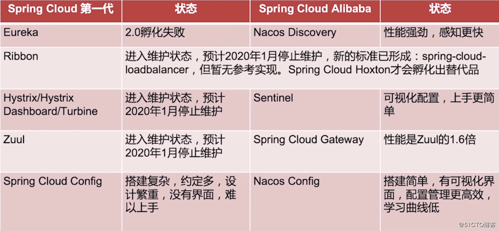
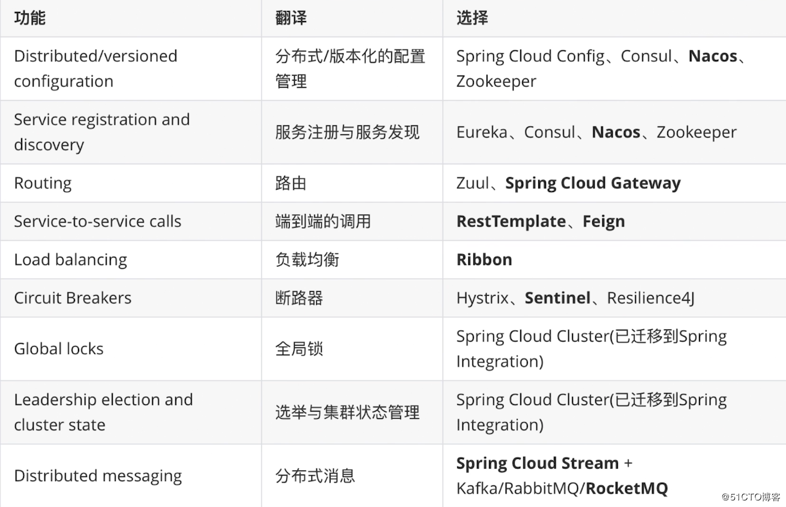
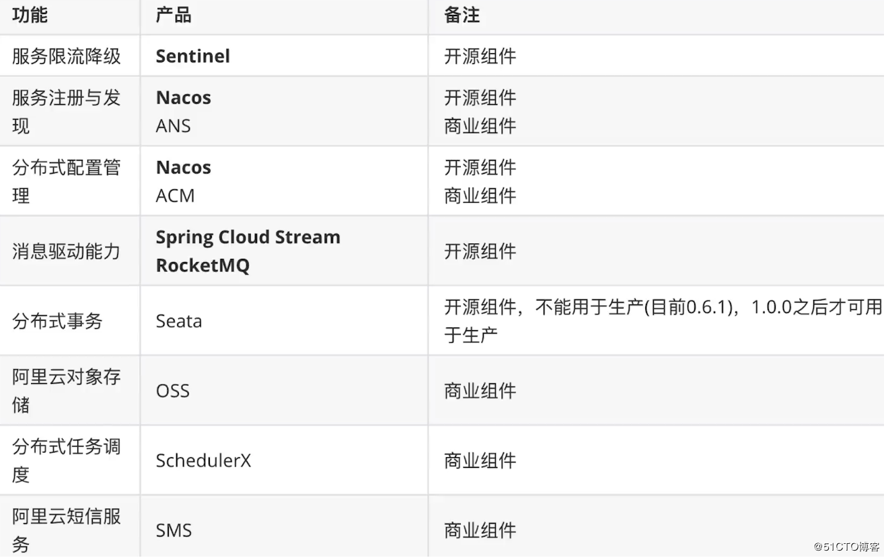
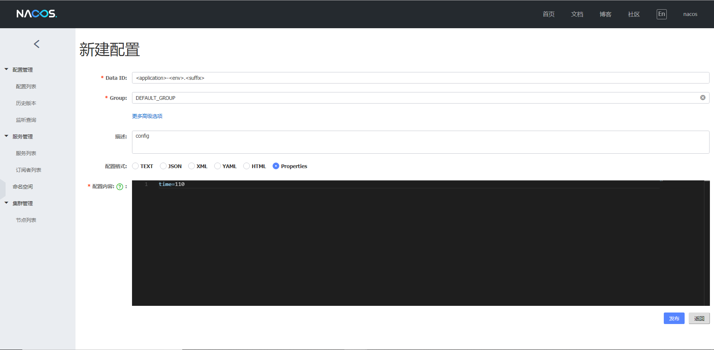

> ## SpringCloudAlibaba-服务注册与服务调用和动态配置文件

> 在入门 SpringCloudAlibaba 时在网上有喷这门技术的有对技术保持敬畏的下面推荐几篇文章很有意思

* （[坑爹项目「spring-cloud-alibaba」，我们也来一个](https://juejin.im/post/5ca723696fb9a05e20221c78)）https://juejin.im/post/5ca723696fb9a05e20221c78
* （[Spring Cloud Alibaba到底坑不坑？](https://www.cnblogs.com/didispace/p/10675601.html)）https://www.cnblogs.com/didispace/p/10675601.html 
* （[说说我为什么看好Spring Cloud Alibaba](http://blog.didispace.com/spring-cloud-alibaba-significance/)）http://blog.didispace.com/spring-cloud-alibaba-significance/

> ##### 下面是我从网上找来的一些 SpringCloud 和 SpringCloudAlibaba 技术栈的不同







> 先来启动 SpringCloudAlibaba 的注册中心 Nacos 这个很简单可以参照 nacos 官网进行

```html
https://nacos.io/zh-cn/docs/quick-start.html
```

> 编写一个服务提供者

> 首先需要导入相关依赖

```xml
<properties>
    <java.version>1.8</java.version>
    <spring-cloud.version>Greenwich.SR2</spring-cloud.version>
    <spring-cloud-alibaba.version>2.1.0.RELEASE</spring-cloud-alibaba.version>
</properties>

<dependencies>
    <dependency>
        <groupId>org.springframework.boot</groupId>
        <artifactId>spring-boot-starter-web</artifactId>
    </dependency>

    <dependency>
        <groupId>org.springframework.boot</groupId>
        <artifactId>spring-boot-configuration-processor</artifactId>
        <optional>true</optional>
    </dependency>
    <dependency>
        <groupId>org.projectlombok</groupId>
        <artifactId>lombok</artifactId>
        <optional>true</optional>
    </dependency>
    <dependency>
        <groupId>org.springframework.boot</groupId>
        <artifactId>spring-boot-starter-test</artifactId>
        <scope>test</scope>
    </dependency>
    <dependency>
        <groupId>com.alibaba.cloud</groupId>
        <artifactId>spring-cloud-starter-alibaba-nacos-discovery</artifactId>
    </dependency>
    <dependency>
        <groupId>org.springframework.boot</groupId>
        <artifactId>spring-boot-starter-actuator</artifactId>
    </dependency>
</dependencies>

<dependencyManagement>
    <dependencies>
        <dependency>
            <groupId>org.springframework.cloud</groupId>
            <artifactId>spring-cloud-dependencies</artifactId>
            <version>${spring-cloud.version}</version>
            <type>pom</type>
            <scope>import</scope>
        </dependency>
        <dependency>
            <groupId>com.alibaba.cloud</groupId>
            <artifactId>spring-cloud-alibaba-dependencies</artifactId>
            <version>${spring-cloud-alibaba.version}</version>
            <type>pom</type>
            <scope>import</scope>
        </dependency>
    </dependencies>
</dependencyManagement>
```

> 在配置文件中指定服务注册中心

```properties
server.port=8081
spring.application.name=nacos-server-provider
spring.cloud.nacos.discovery.server-addr=127.0.0.1:8848
management.endpoints.web.exposure.include=*
```

> 在启动类中添加注解并编写一个基础服务

```java
@SpringBootApplication
@EnableDiscoveryClient
public class NacosserverApplication {
    public static void main(String[] args) {
        SpringApplication.run(NacosserverApplication.class, args);
    }

    @Data
    @RestController
    class EchoController {
        @Value("${server.port}")
        private String port;
        @GetMapping(value = "/echo/{string}")
        public String echo(@PathVariable String string) {
            return string + "(" + port + ")";
        }
    }
}
```

> 下面我们编写服务消费者

* 导入和服务提供者相同的依赖如果选择 Feign 来作服务直接的交互就导入 Feign 的依赖

```xml
<dependency>
    <groupId>org.springframework.cloud</groupId>
    <artifactId>spring-cloud-starter-openfeign</artifactId>
</dependency>
```

* 配置注册中心

```properties
server.port=8082
spring.application.name=nacos-server-caller
spring.cloud.nacos.discovery.server-addr=127.0.0.1:8848
management.endpoints.web.exposure.include=*
```

* 在入口程序添加注解并注入bean

```java
/**
 * 如果使用 Feign 来进行调用需要添加 @EnableFeignClients 否则不需要
 */
@EnableFeignClients
@SpringBootApplication
@EnableDiscoveryClient
public class NacosserverclientApplication {

    public static void main(String[] args) {
        SpringApplication.run(NacosserverclientApplication.class, args);
    }

    @Bean
    @LoadBalanced
    public RestTemplate restTemplate() {
        return new RestTemplate();
    }

}
```

> 编写 Controller 进行服务消费

```java
@RestController
public class TestController {

    @Autowired
    private RestTemplate restTemplate;

    @GetMapping(value = "/echo-rest/{str}")
    public String rest(@PathVariable String str) {
        return "rest::" + restTemplate.getForObject("http://nacos-server-provider/echo/" + str, String.class);
    }

    @Autowired(required = true)
    private NacosServerProvider nacosServerProvider;

    @GetMapping(value = "/echo-feign/{str}")
    public String feign(@PathVariable String str) {
        return nacosServerProvider.echo(str);
    }

}
```

> NacosServerProvider 接口

```java
@Repository
@FeignClient(name = "nacos-server-provider")
public interface NacosServerProvider {

    @GetMapping("/echo/{str}")
    String echo(@PathVariable("str") String str);

}
```

> Nacos 的这个下线功能很有意思


* 他只是在逻辑层面上对服务进行了下线
* 也就是说当服务消费者向服务提供者发起请求时不会选择下线了的服务

> #### 通过 Nacos 来对服务的配置进行动态加载

> 直接基于以上代码进行更改在服务提供者中添加依赖

```xml
<dependency>
    <groupId>com.alibaba.cloud</groupId>
    <artifactId>spring-cloud-starter-alibaba-nacos-config</artifactId>
</dependency>
```

> 在 resources 目录下创建 bootstrap.yml 文件并添加配置

```yaml
spring:
  application:
    name: nacos-server-provider
  cloud:
    nacos:
      config:
        server-addr: 127.0.0.1:8848
        # 踩坑默认为 properties
        file-extension: yaml
```

> 在配置文件类中添加 @RefreshScope 注解

```java
@Data
@RestController
@RefreshScope
public class EchoController {
    @Value("${server.port}")
    private String port;
    // ${<配置文件中的key>:<配置文件中没有key时的默认值>} 默认情况下如果key没有找到就会在初始化时报错
    @Value("${time:10}")
    private String time;

    @GetMapping(value = "/echo/{string}")
    public String echo(@PathVariable String string) {
        return string + "(" + port + "):[time:" + time +"]";
    }
}
```

> 在 Nacos 中添加配置文件



* DataID 的值为： <bootstrap文件中配置的项目名>-<项目环境>.<配置文件类型>
* 然后在Nacos配置文件中修改值就会刷新到项目中了